---
editor_options:
  markdown:
    wrap: 72
---

```{r echo=FALSE}
yml_content <- yaml::read_yaml("chapterauthors.yml")
author <- yml_content[["introduction-postgresql-postgis"]][["author"]]
```

# Introduction to PostgreSQL and PostGIS {#introduction-postgresql-postgis}

Written by
```{r results='asis', echo=FALSE}
cat(author)
```

## Lab Overview {.unnumbered}

In this lab, you will be introduced to a Free and Open Source Software (FOSS) and widely-used database management system known as PostgreSQL. You will learn how to set up your own database, connect to an enterprise database, and write Structured Query Language (SQL) queries both from the command line and a popular postgres server admin graphical user interface. The software used in this lab includes PostgreSQL, psql, pgAdmin, and QGIS.

------------------------------------------------------------------------

## Learning Objectives {.unnumbered}

- Distinguish between PostgreSQL server, PostGIS database, and layer views
- Practice executing SQL queries on an enterprise PostGIS database from various software interfaces
- Export layer views from a PostGIS database in QGIS and ArcGIS Pro
sdf
------------------------------------------------------------------------

## Deliverables {#lab1-deliverables .unnumbered}

<input type="checkbox" unchecked> Create a simple map of UBC Vancouver campus using at least five layers from the ubcv database (30 points)</input>

Try querying a layer or two and showing only a subset of the total features. Symbolize each layer however you want in either QGIS or ArcGIS Pro. The goal here is to practice changing symbologies and creating a professional layout. At a minimum, your map should have:

- At least five layers symbolized from the ubcv database
- Informative title based on the layers you chose (do not use "UBC Vancouver Campus" as your title)
- North arrow
- Scale bar or other representation of scale
- Your name and date
- Projected in NAD83(CSRS) Canada Atlas Lambert (EPSG:3979)

------------------------------------------------------------------------

## Data {.unnumbered}

All data for this lab are accessible via the UBC PostgreSQL server. Instructions for connecting to the server are given in the tasks below.

------------------------------------------------------------------------

## Task 1: Set up pgAdmin and Connect to the UBC PostgreSQL server {.unnumbered}

**Step 1:** Ensure that you are authenticated through UBC myVPN. If you are at UBC, use your dedicated ethernet port or connect via the ubcprivate wireless network. If you are away from campus, you will need to first connect to the UBC myVPN service using Cisco AnyConnect Secure Mobility Client. Only authenticated users with a Campus Wide Login (CWL) and connected to the UBC myVPN may access the UBC PostgreSQL server.

**Step 2:** Start pgAdmin 4. This software is a management tool for PostgreSQL databases, hence "pg". 

**Step 3:** Upon starting pgAdmin, you will be prompted to set a master password. This is an important step as this master password will be used to encrypt all other passwords you use to connect to various server databases. DO NOT USE THE SAME PASSWORD AS YOU WILL USE FOR ANY DATABASE!

```{r 01-master-password, out.width= "75%", echo = FALSE}
    knitr::include_graphics("images/01-pgadmin-master-password.png")
```

**Step 4:** From the pgAdmin dashboard, click "Add New Server".

```{r 01-pgadmin-dashboard, out.width= "75%", echo = FALSE}
    knitr::include_graphics("images/01-pgadmin-dashboard.png")
```

**Step 5:** Name the connection "UBC PostgreSQL Server". Click the "Connection" tab, enter FRST-PostgreSQL.ead.ubc.ca for the Host Name, change the Username to "student", and then enter the password that has been shared with the class. Leave everything else as the default, but you can choose to save the password if you want. Click "Save". If the password is correct, then pgAdmin should automatically connect to the server and you will see it listed in the Browser, just expand "Servers".

```{r 01-pgadmin-new-server-connection, out.width= "75%", echo = FALSE}
    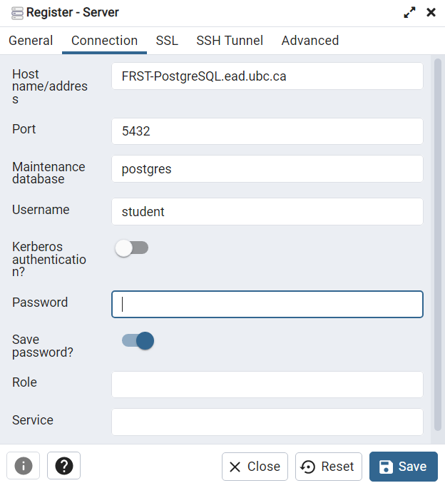
```

Although the connection was automatic this time, each time you start pgAdmin, you will need to reconnect to the server after entering your master password. This is as simple as double-clicking the server name from the server list or right-click and select "Connect Server".

```{r 01-pgadmin-connect, out.width= "90%", echo = FALSE}
    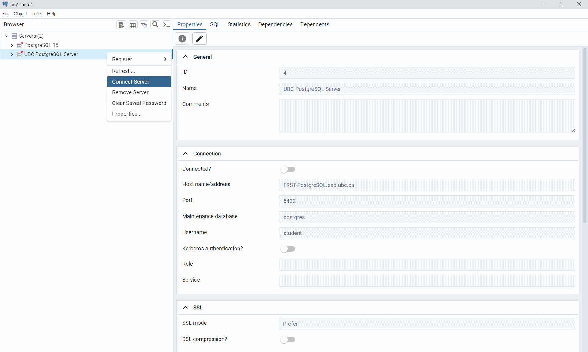
```

**Step 6:** From the Browser pane on the left, expand the ubcv connection, then expand "Schemas", then expand "public", then expand "Tables" to view all the tables in the ubcv database. 

**Step 7:** Right-click on a table and then select "View/Edit Data" > "All Rows". pgAdmin will create an SQL query and then show the result. This is one way to view the attribute table from pgAdmin.

```{r 01-pgadmin-ubcv-buildings, out.width= "90%", echo = FALSE}
    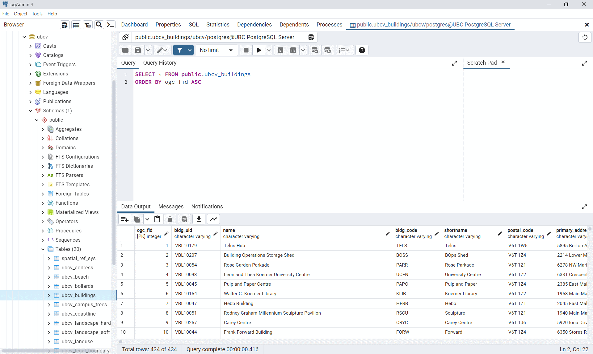
```

**Step 8:** You can also execute your own SQL query. Right-click on a table and select "Query Tool". At the top, you can write any SQL query you want then click the Run button that looks like a triangle from the top ribbon. pgAdmin will return the resulting table below.

```{r 01-pgadmin-ubcv-query, out.width= "90%", echo = FALSE}
    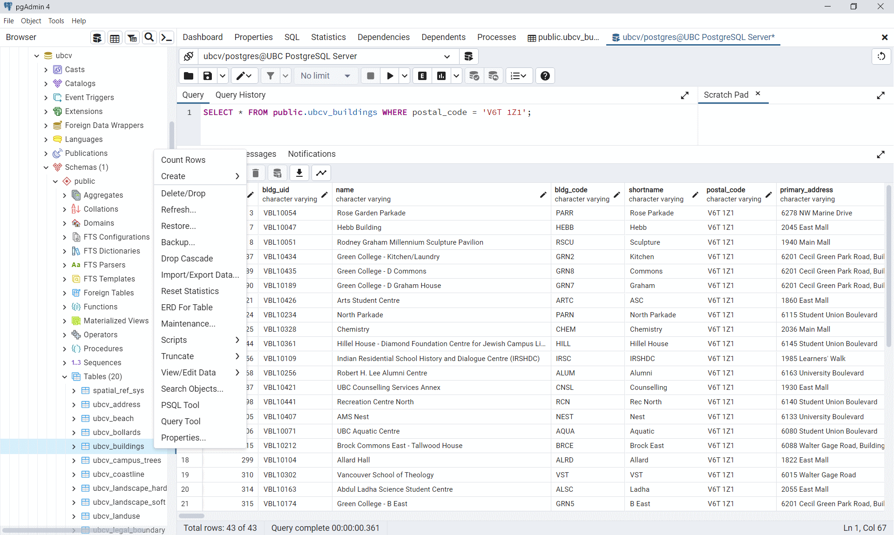
```

------------------------------------------------------------------------

## Task 2: Explore with QGIS {.unnumbered}

**Step 1:** Open QGIS. From the Browser pane on the left, right-click "PostgreSQL" and select "New Connection".

```{r 01-qgis-postgres-connection, out.width= "75%", echo = FALSE}
    knitr::include_graphics("images/01-qgis-postgres-connection.png")
```

**Step 2:** In your Browser pane, you should now see the ubcv database connection. Expand it to see the available public schema, then expand that to see all available tables that have geometries. You can double-click any of these or click-and-drag into your empty project to view them.

```{r 01-qgis-browser-ubcv, out.width= "75%", echo = FALSE}
    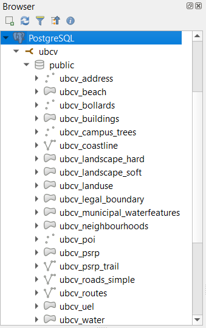
```

**Step 3:** Spend some time exploring the data. Open the attribute tables. View the properties and metadata. What is the EPSG code for the Coordinate Reference System (CRS) for these data?

At this point, keep in mind that all the data still live on the postgres server. You may have already seen the other databases on the server. If you want to view the data in those databases, you will need to create a new database connection for each database that you want to connect to. Feel free to explore the data in the other databases, noting that what is available at any given time may be different from what you see in the screenshots in this lab. The UBC PostgreSQL server hosts many databases that are used for research and teaching!

**Step 4:** You can also execute SQL queries in QGIS directly from the PostGIS database. From the Browser pane, right-click any available table in the PostGIS database and then select "Execute SQL...". In the dialogue window that opens, you will see a default SQL query that will return the first 10 features (tuples) of the selected relation.

```{r 01-qgis-query, out.width= "75%", echo = FALSE}
    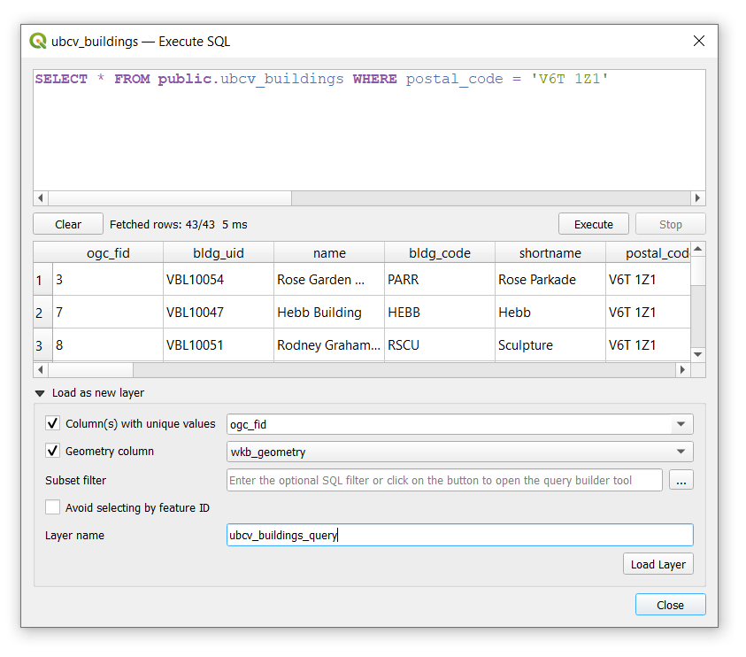
```

**Step 5:** Write an SQL query to return some subset of the data then click the "Execute" button. QGIS will return a preview of the attribute table for the query. From here, you can export this as a layer to view the result in the map. Expand "Load as a new layer" and then toggle on "Column(s) with unique values" and ensure the field is set to "ogc_fid", this is the primary key for the table in PostGIS. Toggle on "Geometry column" and ensure the field is set to "wbk_geometry", this is the "Well Known Binary" format used to represent features in PostGIS. Finally, change the "Layer name" to something to distinguish your query from others and then click "Load layer" and then "Close". The result of the SQL query should now appear as a layer in your QGIS map.

Note that the layer you just created does not actually exist outside your QGIS project. If you navigate into the properties of this layer, you will see the Source is simply a reference to the data that are still stored on the postgres server. This can be a really efficient way to handle data without unnecessarily copying it to a new file!

```{r 01-qgis-query-properties, out.width= "75%", echo = FALSE}
    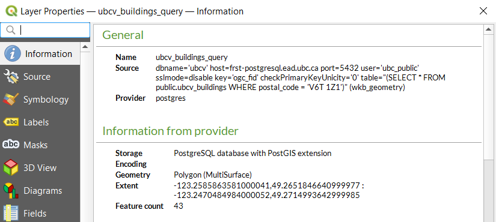
```

**Step 5:** You can export any table in the PostGIS database to your local computer by right-clicking the table name in the PostGIS database and then selecting "Export Layer" > "To File...". From the new dialogue window, you can configure the output file however you want. You can do the same for the query layer by right-clicking the query layer created in Step 5 and selecting "Export" > "Save Features As...".

------------------------------------------------------------------------

## Task 3: Explore with ArcGIS Pro {.unnumbered}

**Step 1:** Start ArcGIS Pro and create a new project.

**Step 2:** From the top ribbon, navigate to the "Insert" tab, then click "Connections", and from the drop-down menu, select "New Database Connection". Enter the database connection details in the same way that you did in the prior tasks. Once you have correctly entered the correct credentials, ArcGIS Pro will do a "soft" connection to the server to retrieve the available databases. From the "Database" drop-down menu, select "ubcv" and then click "OK".

```{r 01-arcgispro-postgres-connection, out.width= "75%", echo = FALSE}
    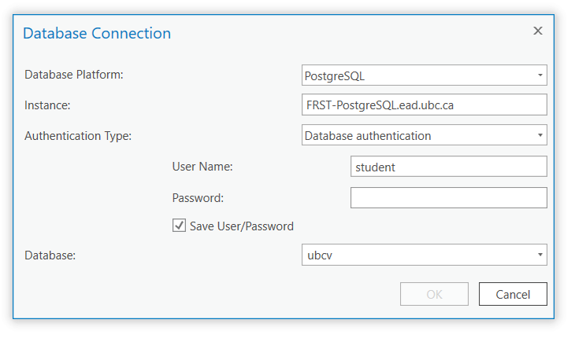
```

**Step 3:** From the top ribbon, navigate to the "Map" tab, then click "Add Data". From the dialogue window that opens, expand "Databases", and you will see your local project geodatabase that was created when you initiated the project and the newly added postgres server. Click the postgres server connection to view the tables and then add a layer to your map.

```{r 01-arcgispro-postrges-catalog, out.width= "75%", echo = FALSE}
    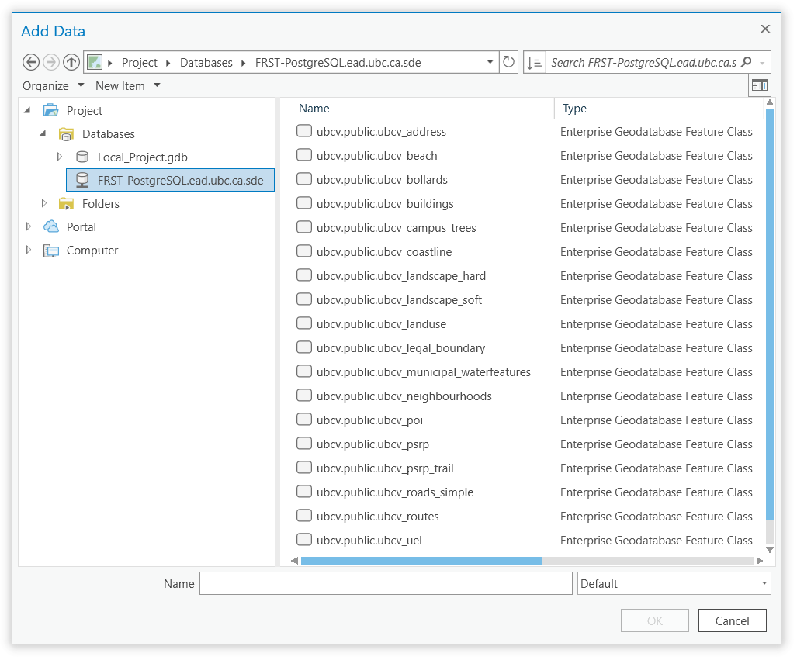
```

**Step 4:** Once you have added a layer to your map, right-click it in your Contents pane and open the properties. Again, like the query layer you created in QGIS, you will see this layer is a dynamic reference to the data on the PostGIS database.

```{r 01-arcgispro-buildings-properties, out.width= "75%", echo = FALSE}
    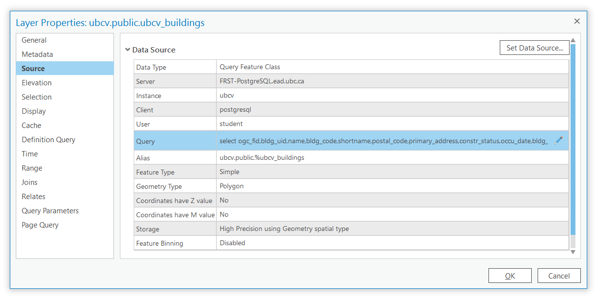
```

**Step 5:** Under Data Source, there is a Query field that includes a generic SQL query statement. Click the pencil icon on the right to open the Edit Query Layer dialogue window. This window is similar to the qeury window you used in QGIS. Enter the same query you used in Task 2 then click "Validate". If the query is valid, ArcGIS Pro will allow you to click "Next". Leave the "Let ArcGIS Pro discover spatial properties for this layer" toggled on. The next window will allow you to select the Unique Identifier Field(s), just like in QGIS. This should automatically have selected "ogc_fid" and automatically identified the geometry type, so you can leave everything as-is and click "Finish". 

```{r 01-arcgispro-buildings-query, out.width= "75%", echo = FALSE}
    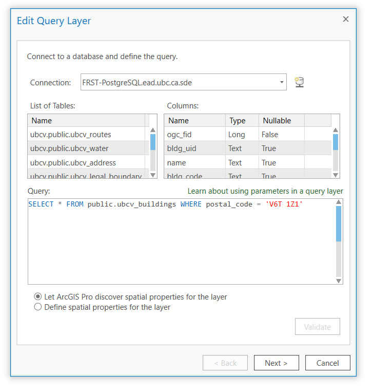
```

You will be returned to the Properties dialogue of the layer you added in your map, but you should see that the Query field has now been updated. Click "OK" to exit the properties and the layer in the map should now only be showing the features that match your query.

------------------------------------------------------------------------

## Task 4: Explore with psql Shell  {.unnumbered}

**Step 1:** From your Windows search bar, search for "psql" and open the SQL Shell (psql) application. This will open a command prompt and allow you to interact with the PostgreSQL server directly using mostly SQL statements. 

The prompt should say `Server [localhost]:`. Type "FRST-PostgreSQL.ead.ubc.ca" and then hit "Enter" on your keyboard.

The prompt should then say `Database [postgres]:`. Type "ubcv" and then press "Enter" on your keyboard.

The prompt should then say `Port [5432]:`. This is the default port that the PostgreSQL server uses. Press "Enter" on your keyboard to accept the default port.

The prompt should then say `Username [postgres]:`. Type "student" and then press "Enter" on your keyboard.

The prompt should then ask you for the password, `Password for user student:`. Type the password that was shared with the class and then press "Enter" on your keyboard.

If everything is successful, then you should see `ubcv=>`, which indicates you can now enter either psql commands or SQL statements. (See screenshot below)

```{r 01-psql-postgres-connection, out.width= "90%", echo = FALSE}
    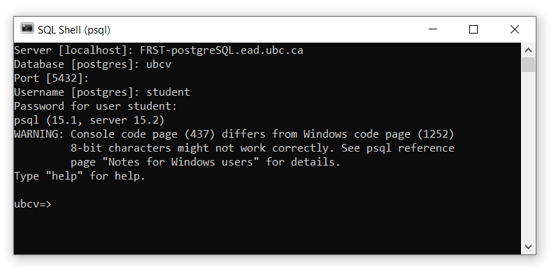
```

**Step 2:** List all the available databases on the postgres server with the `\l` command. If your psql window is too small, you might see `-- More --`. Just continue to press "Enter" to list more tables. You can change to any of these databases by using the `\c [database name]` command like `\c postgres`.

**Step 3:** List the tables in the ubcv database with the `\dt` command. You can view a full list of psql commands and their useage with the `\?` command.

```{r 01-psql-list-tables, out.width= "90%", echo = FALSE}
    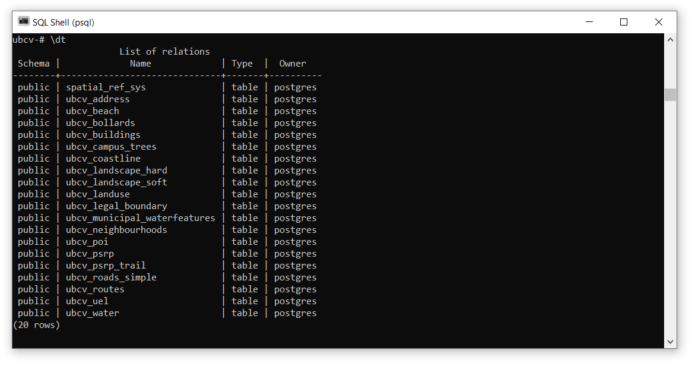
```

**Step 4:** List all the fields for any table with the `\d [table name]` command. For example,  `\d ubcv_buildings`.

```{r 01-psql-list-fields, out.width= "90%", echo = FALSE}
    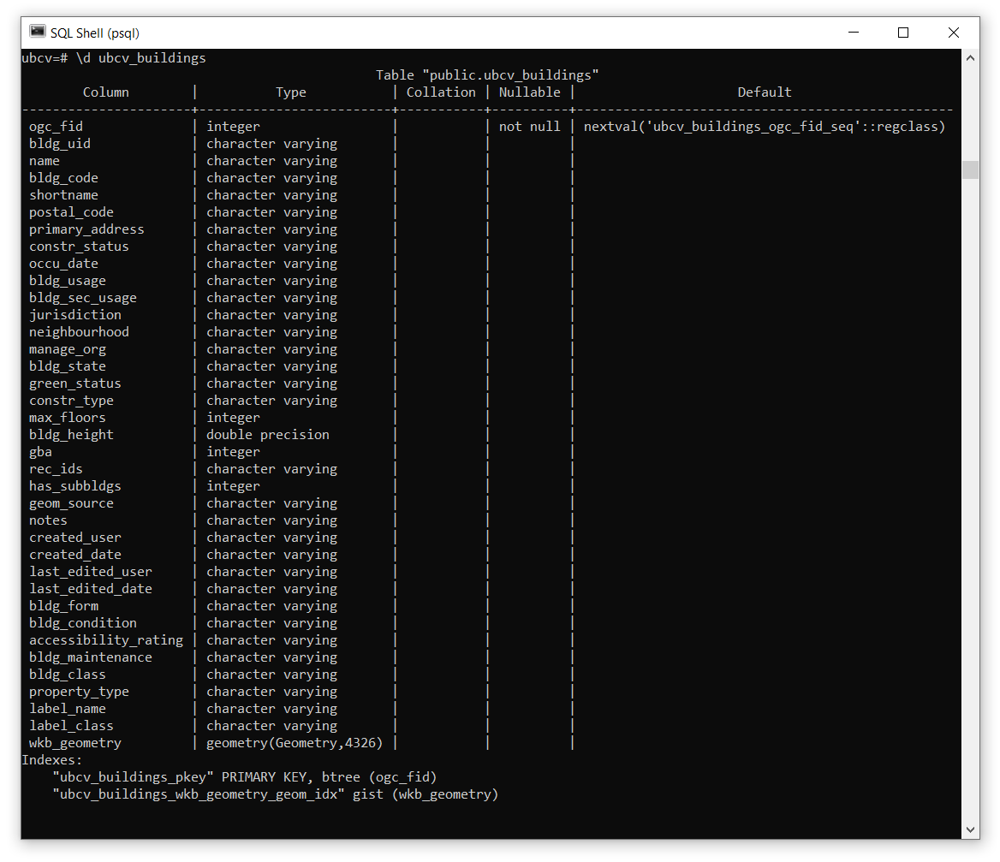
```

**Step 5:** In addition to using psql commands you can also execute SQL statements directly in the console. For example, type `SELECT COUNT(*) FROM ubcv_buildings;` to get a count of all the rows in a table. Notice that `SELECT` statements return tables, the table below has one row and one field.

```{r 01-psql-count, out.width= "90%", echo = FALSE}
    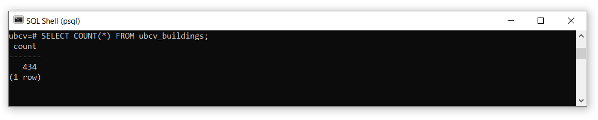
```

**Step 6:** You can get the unique values of any field by using the `DISTINCT` keyword. For example, `SELECT DISTINCT green_status FROM ubcv_buildings;`. Note that in this returned table, the blank space below "REAP Bronze" is a valid empty value for this field.

```{r 01-psql-distinct, out.width= "90%", echo = FALSE}
    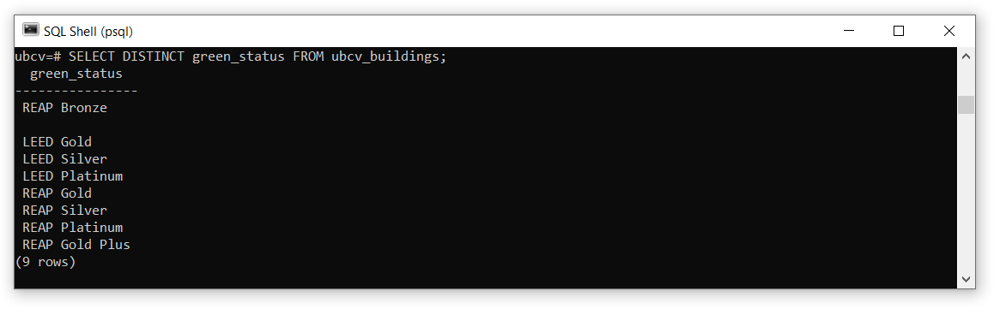
```

**Step 7:** You can execute the SQL query like you did in the previous tasks, but the psql console is not ideal for wielding large tables with many fields and the formatting will not be very readable. So it is best to return only the fields that you actually need to inspect. For example, `SELECT name, bldg_usage, constr_type, postal_code FROM ubcv_buildings WHERE postal_code = 'V6T 1Z1';`.

```{r 01-psql-select, out.width= "90%", echo = FALSE}
    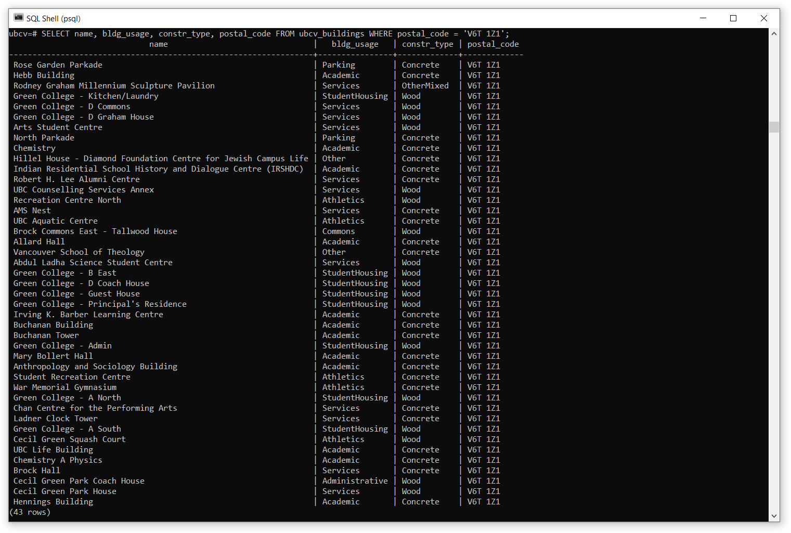
```

Some useful psql commands:

- `\l` List all databases on the current PostgreSQL server
- `\c` [database name] Connect or switch to any database on the PostgreSQL server
- `\dt` List tables in the current database
- `\?` List all psql commands
- `\q` Quit the SQL Shell

------------------------------------------------------------------------

## Summary {.unnumbered}

You should now have a working knowledge of PostGIS databases, PostgreSQL servers, and how to connect and manage them from pgAdmin, QGIS, and ArcGIS Pro. You will continue to practice and extend these skills as nearly all data used in later labs will be accessed via the UBC PostgreSQL server.

Return to the **[Deliverables](#lab1-deliverables)** section to check off everything you need to submit for credit in the course management system.
