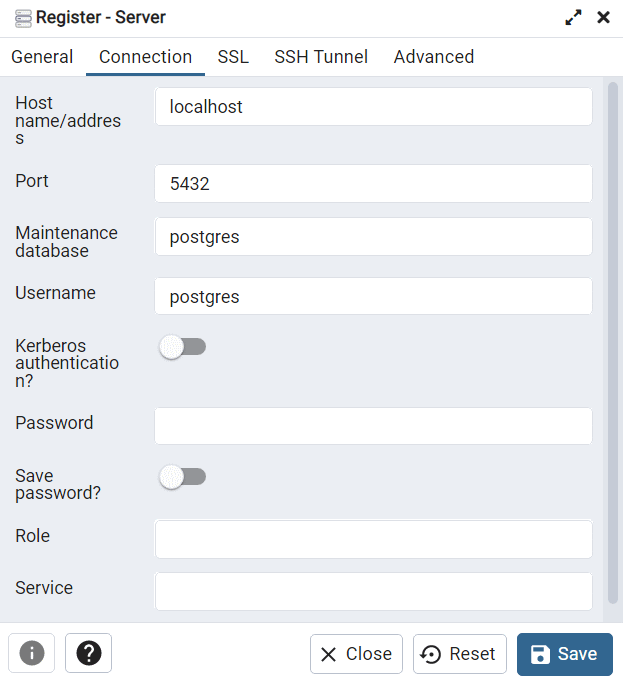
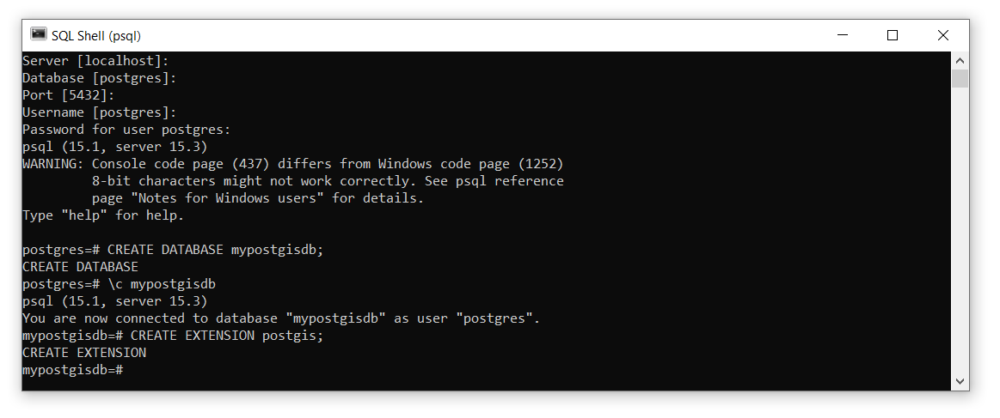
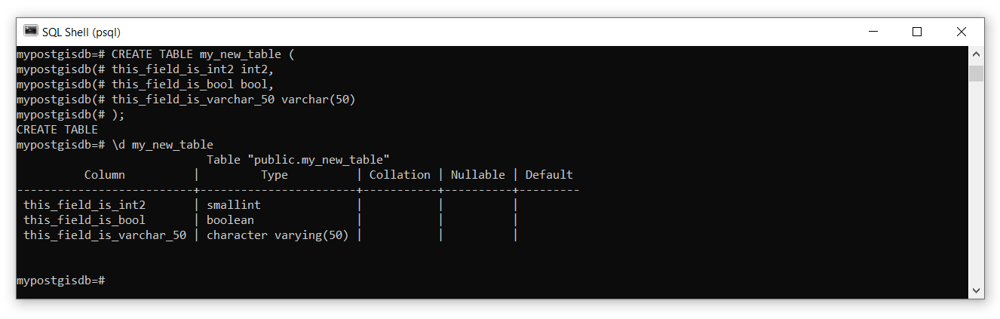
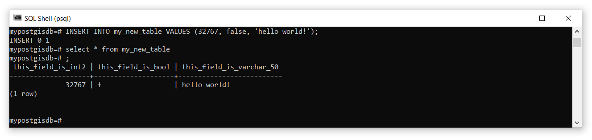
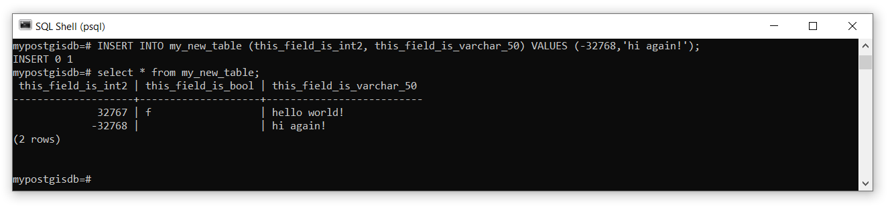
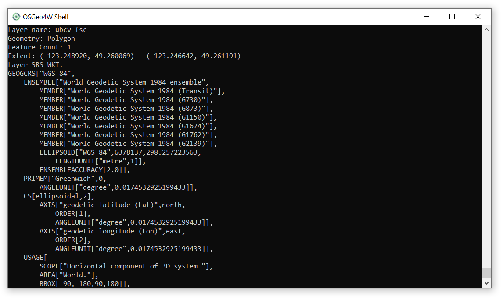
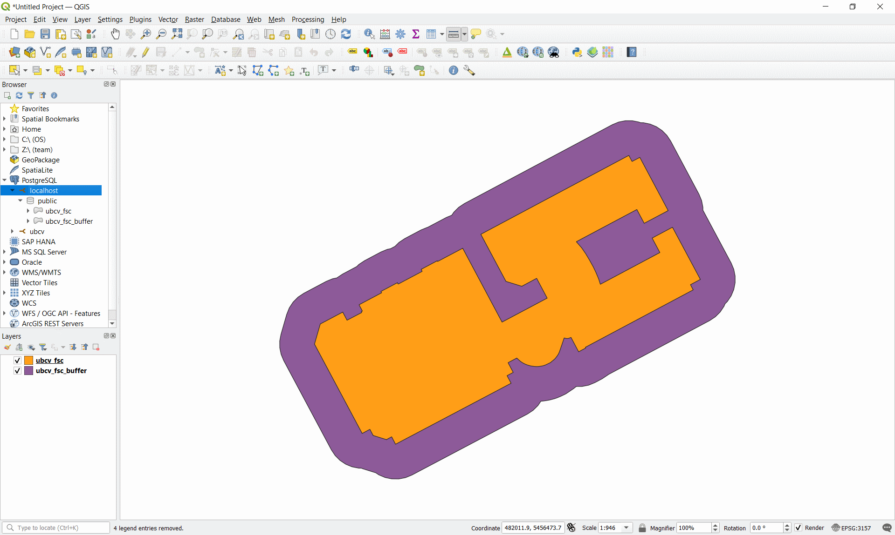
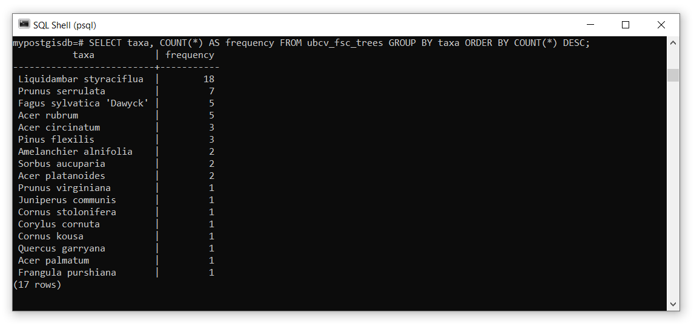
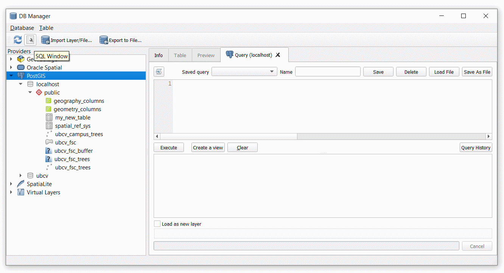
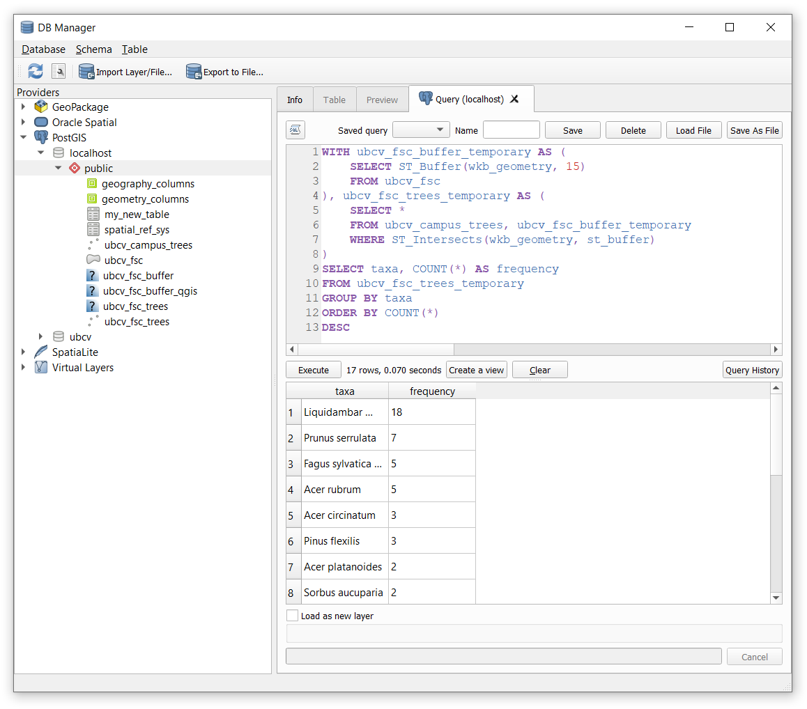

```{r echo=FALSE}
yml_content <- yaml::read_yaml("chapterauthors.yml")
author <- yml_content[["manage-relational-database"]][["author"]]
```
# Analyze a Relational Database {#analyze-relational-database}

Written by
```{r results='asis', echo=FALSE}
cat(author)
```

## Lab Overview {-}

In this lab you will learn how to create, manage, and analyze your own relational database. You will continue to practice with the tools that you learned in the prior lab: pgAdmin, QGIS, ArcGIS Pro, and psql. You will also be introduced to the Geospatial Data Abstraction Library (GDAL) and some of the handy programs that are available from this software library for managing data. You will learn more advanced Structured Query Language (SQL) statements that will allow you join tables, insert and update data, and analyze data in a relational database.

------------------------------------------------------------------------

## Learning Objectives {-}

- Create and host your own PostgreSQL server with a PostGIS database
- Apply best practices for handling, organizing, and managing data
- Import geospatial data using the Geospatial Data Abstraction Library (GDAL)
- Practice joining and relating tables
- Practice inserting and updating data
- Analyze geospatial data in a relational database using SQL and PostGIS

------------------------------------------------------------------------

## Deliverables {-}

- Dump SQL file from Task 2
- SQL statement (just the text) from Task 4

------------------------------------------------------------------------

## Data {-}

All data for this lab are accessible via the UBC PostgreSQL server. Instructions for connecting to the server are given in the tasks below. We will be using data from the `ubcv` database.

------------------------------------------------------------------------

## Task 1: Host your own PostgreSQL Server {.unnumbered}

**Step 1:** Open pgAdmin.

**Step 2:** From the Browser pane on the left, right-click Servers and then select "Register" > "Server...". We are going to add another server, but this time, it will be hosted on your local machine.

**Step 3:** Name the server "localhost" then click the "Connection" tab and set the "Host Name/Address" also as "localhost". Enter a password for the server and leave everything else as the default. When finished, click "Save". The new localhost server should now appear in your Browser. You can expand it, navigate through Databases, postgres, Schemas, public, and Tables to find that it is indeed empty. 

```{r 01-pgadmin-localhost-connection, out.width= "50%", echo = FALSE}
    
```

**Step 4:** Open the psql shell. 

If you are already connected to the UBC PostgreSQL server, you can switch this connection to the localhost server you just made in pgAdmin with the following command: `\c "dbname=postgres host=localhost port=5432 user=postgres"`. You will then be prompted to enter your password. 

Alternatively, you can open a new psql terminal window. The prompt should say `Server [localhost]:`. Press "Enter" on your keyboard to accept localhost as the server host name. 

The prompt should then say `Database [postgres]:`. This is the default name of the database that was created when you hosted the server from pgAdmin. Press "Enter" on your keyboard to accept postgres as the database to connect to. 

The prompt should then say `Port [5432]:`. This is the default port that the PostgreSQL server uses. Press "Enter" on your keyboard to accept the default port.

The prompt should then say `Username [postgres]:`. This is the default username that you created when you set up the PostgreSQL server in pgAdmin. Press "Enter" on your keyboard to accept the postgres username. 

The prompt should then ask you for your password, `Password for user postgres:`. Type your password and then press "Enter" on your keyboard.

If everything is successful, then you should see `postgres=#`, which indicates you can now enter either psql commands or SQL statements. Note that the hashtag `#` indicates that you are connected to the current database with the "SUPERUSER" role, which is essentially the highest admin privilege.

------------------------------------------------------------------------

## Task 2: Create a PostGIS Database {.unnumbered}

**Step 1:** Create a new database called "mypostgisdb" with the following SQL command `CREATE DATABASE mypostgisdb;`. It is important to always escape SQL statements with a semi-colon otherwise psql will interpret your input as spanning multiple lines! If you forget the semi-colon, you can always just type it in the console and hit "Enter" on your keyboard and psql will interpret this as a two-line statement.

**Step 2:** Connect to your new database by using the psql command `\c mypostgisdb`. Note that this is NOT an SQL statement, so there is no need to escape the command with a semi-colon. Your console should now say `mypostgisdb=#`, which indicates you are now connected.

**Step 3:** Currently this is just a plain-vanilla PostgreSQL relational database that cannot handle spatial data. In order to convert this to a PostGIS database, we need to enable the PostGIS extension using the following SQL: `CREATE EXTENSION postgis;`.

```{r 02-psql-create-mypostgisdb, out.width= "75%", echo = FALSE}
    
```

**Step 4:** Listing the tables `\dt` will reveal the database has a table called "spatial_ref_sys". List the fields of this table with `\d spatial_ref_sys`.

In addition to the field names, you will see there is an index called "spatial_ref_sys_pkey", which is the dedicated field for the primary key for this table, and a constraint check to ensure that srid's are valid only between 1 and 998999. You can test this constraint by trying to insert a new srid value of 0: `INSERT INTO spatial_ref_sys (srid) VALUES (0);`. The returned message,

```
ERROR:  new row for relation "spatial_ref_sys" violates check constraint spatial_ref_sys_srid_check"
DETAIL:  Failing row contains (0, null, null, null, null).
```

DO NOT modify this table with any srids in the valid range otherwise you will need to recreate the PostGIS database!

**Step 5:** Return the first ten rows of the table for the fields "auth_name" and "auth_srid" with `SELECT auth_name,auth_srid FROM spatial_ref_sys LIMIT 10;`. 

This table contains EPSG codes, which are used to easily relate spheroids, datums, and measurement units to geospatial data. You will find these codes used everywhere when you look at metadata and the properties of different data layers. One very commonly used code is EPSG 4326, which references the WGS 1984 datum.

**Step 6:** Write an SQL query to return the proj4text of the WGS 1984 datum from the spatial_ref_sys table.

Now we will create some new data, just to show you how to use some useful SQL keywords. We will start with aspatial data first, then move on to spatial data. You can create a new table in your database with the syntax

```
CREATE TABLE table-name (
colunm-name-1 datatype,
colunm-name-2 datatype,
colunm-name-3 datatype,
...
);
```

Data types are very important and the shorthand notation for these in PostgreSQL are [listed on this web page](https://www.postgresql.org/docs/current/datatype.html) and some commonly used data types are reproduced below with examples. 

``` {r echo = FALSE, warning = FALSE, results = 'asis'}
library(common)
n <- c("int2","int4","int8","bigserial","float4","float8","bool","char(n)","varchar(n)","date")
d <- c("Signed 2-byte integer","Signed 4-byte integer","Signed 8-byte integer","Autoincrementing 8-byte integer","Single prevision floating-point number (4 bytes)","Double precision floating-point number (8 bytes)","Logical Boolean","Fixed length character string where n is the number of permitted characters","Variable length character string where n is the maximum number of permitted characters","Calendar date")
v <- c("-32,768 to 32,767","-2,147,483,648 to 2,147,483,647","-9,223,372,036,854,775,808 to 9,223,372,036,854,775,807","0 to 18,446,744,073,709,551,615",paste0("±10",supsc("38")," with 6 or 7 significant digits"),paste0("±10",supsc("308")," with 15 or 16 significant digits"),"True or False","'Hello world!'","'Hello world!' and 'Hello' and 'world' and '!'","31/12/2000")
df <- data.frame(Name=n,Description=d,Values=v)
library(knitr)
kable(df, caption="Some PostgreSQL data types with example value ranges.")
```

Here is an example of creating a new table with some different data types:

```
CREATE TABLE my_new_table (
this_field_is_int2 int2,
this_field_is_bool bool,
this_field_is_varchar_50 varchar(50)
);
```

```{r 02-psql-mynewtable, out.width= "75%", echo = FALSE}
    
```

You can experiment with creating as many new tables as you want. If you need to delete a table, use the `DROP` keyword like this `DROP TABLE my_new_table;`.

It is good practice to assign a field (multiple fields) as a primary key when you create a table. This is done by simply adding `PRIMARY KEY` after the field definition when you make the table. For example:

```
CREATE TABLE my_new_table (
this_field_is_bigserial bigserial PRIMARY KEY,
this_field_is_int2 int2,
this_field_is_bool bool,
this_field_is_varchar_50 varchar(50)
);
```

The bigserial data type is especially useful for this purpose because it auto-increments as you add rows and can accommodate more than 18 _quintrillion_ rows, that is more than 18 million trillions! You can also create composite primary keys that are comprised of two or more fields to uniquely identify all rows:

```
CREATE TABLE my_new_table ( 
this_field_is_int2 int2,
this_field_is_bool bool,
this_field_is_varchar_50 varchar(50),
PRIMARY KEY(this_field_is_int2, this_field_is_bool)
);
```

**Step 7:** Create a new table of assignments that are due next week. Include course code, assignment name, the percent weighting of the assignment on your final grade in that course, and the due date. Use the appropriate data types for each field and define a primary key.

Now that the table and fields are defined, we will insert some data into the table. Inserting data uses the `INSERT` keyword followed by `VALUES` and then a comma-separated list of the values you want to insert in parentheses. For example:

```
INSERT INTO my_new_table VALUES (32767, false, 'hello world!');
```

```{r 02-psql-insert, out.width= "75%", echo = FALSE}
    
```

If you want to insert a value for specific fields, then specify the field name(s) after the table name:

```
INSERT INTO my_new_table (this_field_is_int2, this_field_is_varchar_50) VALUES (-32768,'hi again!');
```

```{r 02-psql-insert-2, out.width= "75%", echo = FALSE}
    
```

If you make a mistake or need to update a field later, then you use `UPDATE` and `SET` to identify the set of fields that should be updated. You can also test for NULL (empty values) using `IS NULL` or `IS NOT NULL`:

```
UPDATE my_new_table
SET this_field_is_bool = true, this_field_is_varchar_50 = 'whoops!'
WHERE this_field_is_bool IS NULL;
```

```{r 02-psql-update, out.width= "75%", echo = FALSE}
    knitr::include_graphics("images/02-psql-update.PNG")
```

Dates require special handling because if you just try to insert them as strings or otherwise, they are treated as literals. For dates, we need to use the special `TO_DATE` function:

```
INSERT INTO my_new_table (this_field_is_date) VALUES (TO_DATE('31-12-1963', 'DD-MM-YYYY'));
```

**Step 8:** Now fill in your table of assignments by inserting and/or updating the values as needed. 

Once you are satisfied with the state of your table, you will dump your entire PostGIS database to an output SQL file and this will be one of your deliverables for this lab. PostgreSQL features a utility program called `pg_dump` that will take any database and output an SQL statement in a file that can be used to re-create the database. In other words, `pg_dump` is a backup method. This is also really handy if you want to create a local backup of a remote server! If you want more practice, try using it on the UBC PostgreSQL server.

**Step 9:** Open a Windows command prompt (search "command"). Take note of your current working directory, which is probably something like `C:\Users\[your username]`. This is where your database SQL file will be saved to. To dump your database, use the following command: `pg_dump -d mypostgisdb -U postgres -h localhost > mypostgisdb.sql`. You will be prompted to enter your password and then the new file `mypostgisdb.sql` will be saved in your working directory. 

**Step 10:** Check to make sure that you can load the database back into PostgreSQL. In psql, create a new empty database named mypostgisdb_backup. Then, enter the following command from the Windows command prompt: `psql -U postgres -h localhost mypostgisdb_backup < mypostgisdb.sql`. You can now query the postgisdb_backup database to check that it is a copy of your other mypostgisdb database.

------------------------------------------------------------------------

## Task 3: Import Spatial Data Using GDAL {.unnumbered}

Now that you have some basic understanding of viewing and manipulating tables, we are going to look at some ways to import spatial data into your PostGIS database. To do this, we will be working with some utility programs in the Geospatial Data Abstraction Library (GDAL) pronounced "gee-dall". You will probably find the [GDAL documentation pages](https://gdal.org/programs/) very helpful for reference. GDAL is used in ArcGIS, GRASS, SAGA, QGIS, ENVI, Google Earth, and also has [Python bindings](https://gdal.org/api/python_bindings.html) and an [R package with bindings](https://cran.r-project.org/web/packages/rgdal/index.html). In short, GDAL is largely the workhorse behind most open source geospatial software packages.

**Step 1:** Open the OSGeo4W shell by searching for it in Windows. Enter the command `o-help` and inspect all the available programs.

You might notice `psql` can be run from the OSGeo4W shell and `pg_dump` is also there. Some others we will cover in later labs, including `pdal` (Point Data Abstraction Library) pronounced "poodle", which handles LiDAR data, and many of the raster and image manipulation programs. For this lab, we are going to focus on two commonly used vector programs: [ogrinfo](https://gdal.org/programs/ogrinfo.html) and [ogr2ogr](https://gdal.org/programs/ogr2ogr.html).

**Step 2:** Type `ogr2ogr --help` in the console and press "Enter" on your keyboard. Inspect all the flags `-` and arguments for this program.

ogr2ogr is the primary utility program for working with vector data and as you can see, there are a lot of options! To show you some of the power of this little application, we are going to export some data from the UBC PostgreSQL server to our local machine, manipulate it, and then import it to our local PostGIS database.

**Step 3:** ogr2ogr is really useful for converting data between different formats and this is handy for exporting data out of a PostGIS database. Convert the ubcv_campus_trees table from the UBC PostgreSQL server with the following command: 
```
ogr2ogr -f "ESRI Shapefile" ubcv_campus_trees.shp PG:"host=FRST-PostgreSQL.ead.ubc.ca user=student dbname=ubcv password=STUDENT_PASSWORD_HERE" "ubcv_campus_trees"
```

Replace `STUDENT_PASSWORD_HERE` with the password that has been shared with the class. 

This command tells ogr2ogr to connect to the ubcv PostGIS database on the PostgreSQL server `PG:"host=FRST-PostgreSQL.ead.ubc.ca user=student dbname=ubcv password=STUDENT_PASSWORD_HERE"`, grab the table named `"ubcv_campus_trees"`, and then return it to the local machine as an ESRI Shapefile `-f "ESRI Shapefile"`. The file will be saved in your current working directory from the OSGeo4W shell.

**Step 4:** You can also specify an SQL query on the input data. For example, the following command will only return the Forest Sciences Centre polygon from ubcv_buildings: 
```
ogr2ogr -where bldg_code='FSC' -f "ESRI Shapefile" ubcv_FSC.shp PG:"host=FRST-PostgreSQL.ead.ubc.ca user=student dbname=ubcv password=STUDENT_PASSWORD_HERE" "ubcv_buildings"
```

You can write more complex SQL statements with the `-sql` flag instead of `-where`.

**Step 5:** Getting data into a PostGIS database is unremarkably similar as to taking it out. Import the FSC polygon into your **localhost PostGIS database** using the same command as Step 3, but change `"ESRI Shapefile"` to `"PostgreSQL"`, delete `ubcv_campus_trees.shp`, modify the connection parameters for your localhost server, change `"ubcv_campus_trees"` to `ubcv_FSC.shp`, and finally specify that we want these data reprojected into UTM Zone 10N coordinates `-t_srs EPSG:3157`. You will receive no feedback in the terminal if you were successful, but you can check in QGIS, ArcGIS Pro, or by using the ogrinfo program.

ogrinfo is a utility that is able to read a wide-variety of spatial data formats and return metadata for inspection. This program is useful for getting the geometry type of a file, the spatial extent of the features, and the coordinate system or the datum. You can also apply SQL queries and even inspect the attributes of specific features.

**Step 6:** Check that the FSC polygon was successfully added to your PostGIS database with the following command: 

```
ogrinfo PG:"host=localhost user=postgres dbname=mypostgisdb password=YOUR_LOCALHOST_PASSWORD" "ubcv_FSC" -so
```

The screenshot below is a small snippet of what is returned in the OSGeo4W terminal window. As you can see, we have access to the feature count, spatial extent, Spatial Reference System (SRS), and even all the field names and data types if you scroll farther down. The `-so` flag gives us this "summary output".

```{r 02-ogrinfo-fsc, out.width= "75%", echo = FALSE}
    
```

**Step 7:** Repeat this process to import the ubcv_campus_trees.shp you created in Step 3 to your localhost PostGIS database.

------------------------------------------------------------------------

## Task 4: Analyze a PostGIS Database using SQL {.unnumbered}

Now let us have some fun and explore some of the cool spatial processing features of our PostGIS database. PostGIS supports an unfathomable number of [spatial operations](https://postgis.net/docs/reference.html#Spatial_Relationships) that you would ordinarily find in GIS software like QGIS and ArcGIS. This task is merely to give you a taste of what is possible with SQL and PostGIS.

Suppose we want to know what species of trees are planted next to the Forest Sciences Centre at UBC. 

**Step 1:** Open psql and connect to your mypostgisdb database on your localhost PostgreSQL server.

**Step 2:** Buffer the ubcv_fsc polygon with the following SQL statement:

```
SELECT ST_Buffer(wkb_geometry, 15) INTO ubcv_fsc_buffer FROM ubcv_fsc;
```

This statement tells PostGIS to use the buffer function `ST_Buffer`, which requires a geometry field `wkb_geometry` and a buffer distance `15` (meters in our case, because we re-projected the polygon to UTM Zone 10N in the last task), on the FSC polygon `FROM ubcv_fsc`, and then write the resulting buffer to a new table `INTO ubcv_fsc_buffer`.

**Step 3:** Intersect the ubcv_campus_trees with the ubcv_fsc_buffer polygon you just made with the following SQL statement:

```
SELECT * INTO ubcv_fsc_trees FROM ubcv_campus_trees, ubcv_fsc_buffer WHERE ST_Intersects(wkb_geometry, st_buffer);
```

The `ST_Intersects` takes two geometry fields `wkb_geometry` (ubcv_campus_trees) and `st_buffer` (ubcv_fsc_buffer), computes the intersection, and returns the features from the first geometry argument (ubcv_campus_trees) to a new table `INTO ubcv_fsc_trees`.

If you get an error here like this, `ERROR:  ST_Intersects: Operation on mixed SRID geometries (Point, 4326) != (Polygon, 3157)` then you know that you have not correctly changed the projection of the ubcv_campus_trees data when you imported it into your localhost postgres database. Go back to the last task and check Steps 5-7. 

**Step 4:** Open QGIS and then add ubcv_fsc, ubc_fsc_buffer, and ubcv_fsc_trees.wkb_geometry to your map to inspect them.

```{r 02-qgis-fsc-buffer, out.width= "75%", echo = FALSE}
    
```

**Step 5:** Now we will do a simple SQL query to determine the species that are planted around the Forest Sciences Building:

```
SELECT taxa, COUNT(*) AS frequency FROM ubcv_fsc_trees GROUP BY taxa ORDER BY COUNT(*) DESC;
```

This will return the "taxa" column and create a new column called "frequency" that contains values of the `COUNT()` function. The `GROUP BY` statement is needed when we use an aggregation method like `COUNT()`. Finally, the relation is ordered by the aggregation result in descending `DESC` order.

```{r 02-psql-final-analysis, out.width= "75%", echo = FALSE}
    
```

**Step 6:** Modify the statement above to sort the taxa alphabetically.

These last few steps are just to illustrate that you can run the same SQL statements above directly in QGIS.

**Step 7:** Open QGIS. From the top menu toolbar, select "Database" > "DB Manager..." This will open a new window where you can do basically everything you did in this task and the prior task. You can import/export data to whatever format you want, inspect the database, tables, and even preview the spatial features.

```{r 02-qgis-db-manager, out.width= "75%", echo = FALSE}
    
```

**Step 8:** At the top of the DB Manager window there is a small button to open an SQL tab. Click that and then enter the buffer statement again, but modify the output table name so that you do not create a conflict:

```
SELECT ST_Buffer(wkb_geometry, 15) INTO ubcv_fsc_buffer_qgis FROM ubcv_fsc;
```

You should now have a new table in the database now called "ubcv_fsc_buffer_qgis". You can also save the query by giving it a name in the Name field and even output the SQL query to a file. This can be helpful for managing large complex queries. The "Create a view" button 

**Step 9:** Using the `WITH` clause, combine all of our independent queries above into a single query in QGIS that buffers the FSC polygon by 15 m, intersects the buffer with the campus trees, and then reports the number of unique taxa around the building. See the screenshot below.

```{r 02-qgis-complex-sql, out.width= "75%", echo = FALSE}
    
```

The `WITH` clause allows us to create temporary relations that can be referenced by name in subsequent `SELECT` statements. In the case above, "ubcv_fsc_buffer_temporary" is the temporary result from the buffer and "ubcv_fsc_trees_temporary" is the temporary result from intersecting the buffer with the campus trees. 

As you will see, this is slightly different than using the `INTO` method from our prior examples, which creates a new relation in our database. The benefit of `WITH` and `AS` is that the relation is ephemeral and only exists for the moment that the SQL entire statement is executed; no new relation is written into our database.

**Step 10:** Using what you have learned, select one of the other [PostGIS overlay methods](https://postgis.net/docs/reference.html#Overlay_Functions) and then apply it to any two datasets in the `ubcv` database on the UBC PostgreSQL server. You must use the `WITH` clause and you must also use one of the [SQL aggregation functions](https://www.postgresql.org/docs/9.5/functions-aggregate.html). It is not important that your analysis makes sense, but it is important that your entire SQL statement can be executed from either QGIS or psql. Once your are satisfied with your SQL statement, copy and paste it to the assignment submission page on the UBC course management system.

Hint: Check what the geometry column name is called for the layers that you choose to use and enter those exactly as you see them into your overlay function. Make sure that you are using compatible geometries for the overlay method you choose and read the linked documentation above if you have any doubts!

------------------------------------------------------------------------

## Summary {.unnumbered}

PostGIS has many powerful functions for handling geospatial data directly within a PostgreSQL database. These are not always practical for day-to-day use when compared with user-friendly applications like QGIS or ArcGIS Pro. However, you should now appreciate that you can remotely manipulate geospatial data on a server and this opens the possibility of very powerful web-based applications, cloud-based GIS solutions, and automated scripting that requires little visualization. If you are interested in learning more about what others have done, you can check out the [Crunchy Data YouTube channel](https://www.youtube.com/@CrunchyDataPostgres) to see past "PostGIS Day" recordings.
