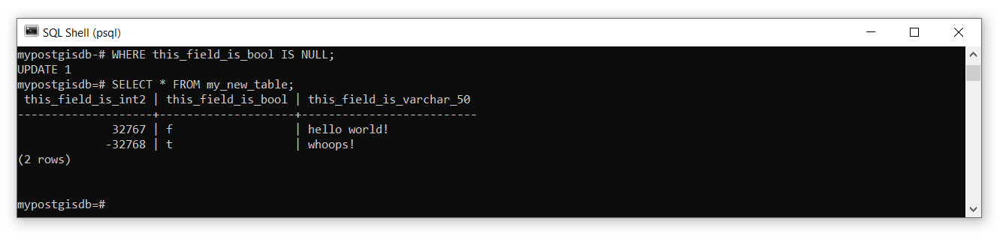

```{r echo=FALSE}
yml_content <- yaml::read_yaml("chapterauthors.yml")
author <- yml_content[["manage-relational-database"]][["author"]]
```
# Analyze a Relational Database {#analyze-relational-database}

Written by
```{r results='asis', echo=FALSE}
cat(author)
```

## Lab Overview {-}

In this lab you will learn how to create, manage, and analyze your own relational database. You will continue to practice with the tools that you learned in the prior lab: pgAdmin, QGIS, ArcGIS Pro, and psql. You will also be introduced to the Geospatial Data Abstraction Library (GDAL) and some of the handy programs that are available from this software library for managing data. You will learn more advanced Structured Query Language (SQL) statements that will allow you join tables, insert and update data, and analyze data in a relational database.

------------------------------------------------------------------------

## Learning Objectives {-}

- Create and host your own PostgreSQL server with a PostGIS database
- Apply best practices for handling, organizing, and managing data
- Import geospatial data using the Geospatial Data Abstraction Library (GDAL)
- Practice joining and relating tables
- Practice inserting and updating data
- Analyze data in a relational database using SQL

------------------------------------------------------------------------

## Deliverables {-}

Here.

------------------------------------------------------------------------

## Data {-}

Lorem ipsum

------------------------------------------------------------------------

## Task 1: Host your own PostgreSQL Server {.unnumbered}

**Step 1:** Open pgAdmin.

**Step 2:** From the Browser pane on the left, right-click Servers and then select "Register" > "Server...". We are going to add another server, but this time, it will be hosted on your local machine.

**Step 3:** Name the server "localhost" then click the "Connection" tab and set the "Host Name/Address" also as "localhost". Enter a password for the server and leave everything else as the default. When finished, click "Save". The new localhost server should now appear in your Browser. You can expand it, navigate through Databases, postgres, Schemas, public, and Tables to find that it is indeed empty. 

```{r 01-pgadmin-localhost-connection, out.width= "50%", echo = FALSE}
    knitr::include_graphics("images/01-pgadmin-localhost-connection.png")
```

**Step 4:** Open the psql shell. 

If you are already connected to the UBC PostgreSQL server, you can switch this connection to the localhost server you just made in pgAdmin with the following command: `\c "dbname=postgres host=localhost port=5432 user=postgres"`. You will then be prompted to enter your password. 

Alternatively, you can open a new psql terminal window. The prompt should say `Server [localhost]:`. Press "Enter" on your keyboard to accept localhost as the server host name. 

The prompt should then say `Database [postgres]:`. This is the default name of the database that was created when you hosted the server from pgAdmin. Press "Enter" on your keyboard to accept postgres as the database to connect to. 

The prompt should then say `Port [5432]:`. This is the default port that the PostgreSQL server uses. Press "Enter" on your keyboard to accept the default port.

The prompt should then say `Username [postgres]:`. This is the default username that you created when you set up the PostgreSQL server in pgAdmin. Press "Enter" on your keyboard to accept the postgres username. 

The prompt should then ask you for your password, `Password for user postgres:`. Type your password and then press "Enter" on your keyboard.

If everything is successful, then you should see `postgres=#`, which indicates you can now enter either psql commands or SQL statements. Note that the hashtag `#` indicates that you are connected to the current database with the "SUPERUSER" role, which is essentially the highest admin privilege.

------------------------------------------------------------------------

## Task 2: Create a PostGIS Database {.unnumbered}

**Step 1:** Create a new database called "mypostgisdb" with the following SQL command `CREATE DATABASE mypostgisdb;`. It is important to always escape SQL statements with a semi-colon otherwise psql will interpret your input as spanning multiple lines! If you forget the semi-colon, you can always just type it in the console and hit "Enter" on your keyboard and psql will interpret this as a two-line statement.

**Step 2:** Connect to your new database by using the psql command `\c mypostgisdb`. Note that this is NOT an SQL statement, so there is no need to escape the command with a semi-colon. Your console should now say `mypostgisdb=#`, which indicates you are now connected.

**Step 3:** Currently this is just a plain-vanilla PostgreSQL relational database that cannot handle spatial data. In order to convert this to a PostGIS database, we need to enable the PostGIS extension using the following SQL: `CREATE EXTENSION postgis;`.

```{r 02-psql-create-mypostgisdb, out.width= "75%", echo = FALSE}
    knitr::include_graphics("images/02-psql-create-mypostgisdb.png")
```

**Step 4:** Listing the tables `\dt` will reveal the database has a table called "spatial_ref_sys". List the fields of this table with `\d spatial_ref_sys`.

In addition to the field names, you will see there is an index called "spatial_ref_sys_pkey", which is the dedicated field for the primary key for this table, and a constraint check to ensure that srid's are valid only between 1 and 998999. You can test this constraint by trying to insert a new srid value of 0: `INSERT INTO spatial_ref_sys (srid) VALUES (0);`. The returned message,

```
ERROR:  new row for relation "spatial_ref_sys" violates check constraint spatial_ref_sys_srid_check"
DETAIL:  Failing row contains (0, null, null, null, null).
```

DO NOT modify this table with any srids in the valid range otherwise you will need to recreate the PostGIS database!

**Step 5:** Return the first ten rows of the table for the fields "auth_name" and "auth_srid" with `SELECT auth_name,auth_srid FROM spatial_ref_sys LIMIT 10;`. 

This table contains EPSG codes, which are used to easily relate spheroids, datums, and measurement units to geospatial data. You will find these codes used everywhere when you look at metadata and the properties of different data layers. One very commonly used code is EPSG 4326, which references the WGS 1984 datum.

**Step 6:** Write an SQL query to return the proj4text of the WGS 1984 datum from the spatial_ref_sys table.

Now we will create some new data, just to show you how to use some useful SQL keywords. We will start with aspatial data first, then move on to spatial data. You can create a new table in your database with the syntax

```
CREATE TABLE table-name (
colunm-name-1 datatype,
colunm-name-2 datatype,
colunm-name-3 datatype,
...
);
```

Data types are very important and the shorthand notation for these in PostgreSQL are [listed on this web page](https://www.postgresql.org/docs/current/datatype.html) and some commonly used data types are reproduced below with examples. 

``` {r echo = FALSE, warning = FALSE, results = 'asis'}
library(common)
n <- c("int2","int4","int8","bigserial","float4","float8","bool","char(n)","varchar(n)")
d <- c("Signed 2-byte integer","Signed 4-byte integer","Signed 8-byte integer","Autoincrementing 8-byte integer","Single prevision floating-point number (4 bytes)","Double precision floating-point number (8 bytes)","Logical Boolean","Fixed length character string where n is the number of permitted characters","Variable length character string where n is the maximum number of permitted characters","Calendar date")
v <- c("-32,768 to 32,767","-2,147,483,648 to 2,147,483,647","-9,223,372,036,854,775,808 to 9,223,372,036,854,775,807","0 to 18,446,744,073,709,551,615",paste0("±10",supsc("38")," with 6 or 7 significant digits"),paste0("±10",supsc("308")," with 15 or 16 significant digits"),"True or False","'Hello world!'","'Hello world!' and 'Hello' and 'world' and '!'","31/12/2000")
df <- data.frame(Name=n,Description=d,Values=v)
library(knitr)
kable(df, caption="Some PostgreSQL data types with example value ranges.")
```

Here is an example of creating a new table with some different data types:

```
CREATE TABLE my_new_table (
this_field_is_int2 int2,
this_field_is_bool bool,
this_field_is_varchar_50 varchar(50)
);
```

```{r 02-psql-mynewtable, out.width= "75%", echo = FALSE}
    knitr::include_graphics("images/02-psql-mynewtable.png")
```

You can experiment with creating as many new tables as you want. If you need to delete a table, use the `DROP` keyword like this `DROP TABLE my_new_table;`.

It is good practice to assign a field (multiple fields) as a primary key when you create a table. This is done by simply adding `PRIMARY KEY` after the field definition when you make the table. For example:

```
CREATE TABLE my_new_table (
this_field_is_bigserial bigserial PRIMARY KEY,
this_field_is_int2 int2,
this_field_is_bool bool,
this_field_is_varchar_50 varchar(50)
);
```

The bigserial data type is especially useful for this purpose because it auto-increments as you add rows and can accommodate more than 18 _quintrillion_ rows, that is more than 18 million trillions! You can also create composite primary keys that are comprised of two or more fields to uniquely identify all rows:

```
CREATE TABLE my_new_table ( 
this_field_is_int2 int2,
this_field_is_bool bool,
this_field_is_varchar_50 varchar(50),
PRIMARY KEY(this_field_is_int2, this_field_is_bool)
);
```

**Step 7:** Create a new table of assignments that are due next week. Include course code, assignment name, the percent weighting of the assignment on your final grade in that course, and the due date. Use the appropriate data types for each field and define a primary key.

Now we will insert some data into the table you. Inserting data uses the `INSERT` keyword followed `VALUES` and a comma-separated list of the values you want to insert. For example:

```
INSERT INTO my_new_table VALUES (32767, false, 'hello world!');
```

```{r 02-psql-insert, out.width= "75%", echo = FALSE}
    knitr::include_graphics("images/02-psql-insert.png")
```

If you want to insert a value for specific fields, then specify the field name(s) after the table name:

```
INSERT INTO my_new_table (this_field_is_int2, this_field_is_varchar_50) VALUES (-32768,'hi again!');
```

```{r 02-psql-insert-2, out.width= "75%", echo = FALSE}
    knitr::include_graphics("images/02-psql-insert-2.png")
```

If you make a mistake or need to update a field later, then you use `UPDATE` and `SET` to identify the set of fields that should be updated. You can also test for NULL (empty values) using `IS NULL` or `IS NOT NULL`:

```
UPDATE my_new_table
SET this_field_is_bool = true, this_field_is_varchar_50 = 'whoops!'
WHERE this_field_is_bool IS NULL;
```

```{r 02-psql-update, out.width= "75%", echo = FALSE}
    
```

Dates require special handling because if you just try to insert them as strings or otherwise, they are treated as literals. For dates, we need to use the special `TO_DATE` function:

```
INSERT INTO my_new_table (this_field_is_date) VALUES (TO_DATE('31-12-1963', 'DD-MM-YYYY'));
```

**Step 8:** Now fill in your table of assignments by inserting and/or updating the values as needed. 

Once you are satisfied with that state of your table, you will dump your entire PostGIS database to an output file and this will be one of your deliverables for this lab. PostgreSQL features a utility program called `pg_dump` that will take any database and output an SQL statement in a file that can be used to re-create the database. In other words, `pg_dump` is a backup method. This is also really handy if you want to create a local backup of a remote server! If you want more practice, try using it on the UBC PostgreSQL server.

**Step 9:** Open a Windows command prompt (search "command"). Take note of your current working directory, which is probably something like `C:\Users\[your username]`. This is where your database will be saved to. To dump yourdatabase, use the following command: `pg_dump -d mypostgisdb -U postgres -h localhost > mypostgisdb.sql`. You will be prompted to enter your password and then the new file `mypostgisdb.sql` will be saved in your working directory. 

You can load the database back into PostgreSQL with the following command from the Windows command prompt: `psql -U postgres -h localhost mypostgisdb < mypostgisdb.sql`

------------------------------------------------------------------------

## Task 3: Import Spatial Data Using GDAL {.unnumbered}

**Step 1:**

**Step 2:**

**Step 3:**

**Step 4:**

**Step 5:**

------------------------------------------------------------------------

## Task 4: Manipulate Spatial Data Using GDAL {.unnumbered}

**Step 1:**

**Step 2:**

**Step 3:**

**Step 4:**

**Step 5:**

------------------------------------------------------------------------

## Task 5: Analyzea PostGIS Database using SQL {.unnumbered}

**Step 1:**

**Step 2:**

**Step 3:**

**Step 4:**

**Step 5:**
