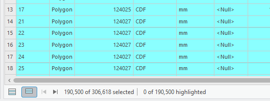
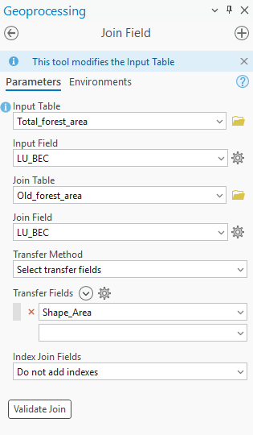

------------------------------------------------------------------------

------------------------------------------------------------------------

```{r echo=FALSE}
yml_content <- yaml::read_yaml("chapterauthors.yml")
author <- yml_content[["cartographic-modelling-with-forest-inventories"]][["author"]]
```

```{r setup, include=FALSE}
knitr::opts_chunk$set(echo = TRUE)
```

# Cartographic Modelling with Forest Inventories {#cartographic-modelling-with-forest-inventories}

## Lab Overview {.unnumbered}

Old growth forests are an important feature found in many types of forested ecosystems. They are characterized not only by their age but also by their complex composition and structure. (LePage & Banner, 2014) Old growth stands boast the highest rates of biodiversity and provide critical habitat for rare, threatened, or endangered species. Additionally, they contribute to soil fertility by supporting intricate soil structures formed by micro-organisms, fungi, and plants.

It is generally assumed that the structural complexity desired in a forest develops over time. As such, a stand is designated as old growth once it has reached a certain age without experiencing major disturbance. The length of time required for this designation varies by Biogeoclimatic Ecosystem Classification ([BEC](https://cfcg.forestry.ubc.ca/resources/cataloguing-in-situ-genetic-resources/about-bec-and-bgc-units/)) zone.

Old growth forests are also highly valued for timber production due to their superior qualities. (Canadian Institute of Forestry, 2022) These trees have had the opportunity to grow slowly over long periods, resulting in denser wood grain and stronger lumber. Furthermore, their tall, straight trunks are ideal for producing a wide range of wood products.

To balance the benefits of both logging and preserving old growth forests, frameworks and guidelines are put in place to manage Old Growth sites. In BC, Old Growth Forests are assessed using the Cumulative Effects Framework (CEF). This framework was put in place to provide guidelines on assessing the effects of human activities and natural processes on the provinces forested ecosystems. The province’s old growth and mature-plus-old targets are outlined in the Biodiversity Guidebook (Province of B.C., 1995).

Vancouver Island, British Columbia, has been an area of highly contentious Old Growth logging. Conflicting interests between logging companies, First Nations, Provincial and Federal Governments, and the general public came into the spotlight during the Fairy Creek protests of 2020. Over two years of protest, more than 1,000 protesters were arrested at the site (CBC, 2022). The events at Fairy Creek, and many others like it, have brought the issues of Old Growth conservation to the forefront of timber production relations.

------------------------------------------------------------------------

## Learning Objectives {.unnumbered}

By the end of this lab, you will be able to:

-   Prepare and clean a forest inventory dataset and related layers for analysis

-   Perform attribute/select-by-expression filtering to isolate old-growth candidate polygons

-   Calculate old-growth area and percentages by polygon using field calculations

-   Produce a cartographic summary (map + table) that communicates old-growth distribution

-   Reflect on limitations and assumptions of VRI-derived old-growth estimates

------------------------------------------------------------------------

## Deliverables {.unnumbered}

<input type="checkbox" unchecked> A map showing the study area and the distribution of difference in calculated old-growth percentage and targets, by polygon (20 points)</input>

<input type="checkbox" unchecked> A table with fields for total area, old-growth area, and percentage old growth (10 points)</input>

<input type="checkbox" unchecked> A screenshot of the python expression created for Task 2 Step 8 (10 points)</input>

<input type="checkbox" unchecked> Responses to the questions posed throughout the lab on the course management system (60 points)</input>

------------------------------------------------------------------------

## Data {.unnumbered}

All data for this lab are accessible via the UBC PostgreSQL server. Instructions for connecting to the server are given in the tasks below. These are very large datasets that come from the BC Data Catalog and are described in the table below. Accessing these data from the UBC PostgreSQL server allows us to extract only the data we need for this lab, which is the extent of Vancouver Island.

| Layer Name | File Name | Reference Link |
|----|----|----|
| Vegetation Resource Inventory 2024 | `veg_comp_lyr_r1_poly_2024` | <https://catalogue.data.gov.bc.ca/dataset/vri-2024-forest-vegetation-composite-layer-1-l1-> |
| Generalized Forest Cover Ownership | `f_own` | <https://catalogue.data.gov.bc.ca/dataset/generalized-forest-cover-ownership> |
| Cumulative Effects Framework: Human Disturbance (current) | `bc_cef_human_disturbance_2023` | <https://catalogue.data.gov.bc.ca/dataset/bc-cumulative-effects-framework-human-disturbance-current> |
| Landscape Units (current) | `landscape_units` | <https://catalogue.data.gov.bc.ca/dataset/landscape-units-of-british-columbia-current> |

------------------------------------------------------------------------

## Task 1: Query and export data from UBC PostgreSQL server

**Step 1:** Ensure that you are authenticated through UBC myVPN. If you are at UBC, use your dedicated ethernet port or connect via the ubcsecure wireless network. If you are away from campus, you will need to first connect to the UBC myVPN service using Cisco AnyConnect Secure Mobility Client. Only authenticated users with a Campus Wide Login (CWL) who are connected to the UBC myVPN may access the UBC PostgreSQL server. However, if you are not a UBC student, then you can just download the data directly from the BC Data Catalogue.

**Step 2:** Start ArcGIS Pro and create a new Map project.

**Step 3:** From the top ribbon, navigate to the "Insert" tab, then click "Connections", and from the drop-down menu, select "New Database Connection". You can name it "UBC PostgreSQL Server" and for the host enter "FRST-PostgreSQL.ead.ubc.ca". The username and password will be provided to students enrolled in the course. Once you have correctly entered the correct credentials, ArcGIS Pro will do a "soft" connection to the server to retrieve the available databases. From the "Database" drop-down menu, select "vri" and then click "OK".

```{r 03-arcgispro-postgres-connection, out.width= "75%", echo = FALSE}
    knitr::include_graphics("images/03-arcgispro-postgres-connection.png")
```

The database connection has now been added to your ArcGIS Pro project, and you can view the tables inside the database from the Catalog Pane ("View" tab \> "Catalog Pane" \> expand "Databases" \> expand "PostgreSQL-FRST-PostgreSQL-vri(student)" \> now you can see all the tables in the `vri` database). You can drag and drop any of the layers of the database directly into your map to visualize them if you want. Though be aware that these are large layers and they may take a while to draw on your map. We do not actually need all of these data, so instead, we are going to use the power of SQL (Structured Query Language) to write a query that will return to us the tiny fraction that we need to use for this lab. First, let us break down what a generic SQL SELECT query looks like:

``` sql
SELECT gid, site_index, species_cd_1, species_pct_1, geom
FROM veg_comp_lyr_r1_poly_2024
WHERE bec_zone_code = 'CWH';
```

The `SELECT` keyword is the most common database operation and the only one that we will use for this lab, but understand that there are keywords for other tasks in the database like creating tables, inserting data, updating data, and deleting data, to name a few. By convention, SQL keywords are capitalized, but most software including ArcGIS Pro do not require this.

What follows the `SELECT` keyword is a comma-separated list of column names that we want to retrieve from the table, `gid, site_index, species_cd_1, species_pct_1, geom`. You could also replace these with `*` to return all of the column names and this is generally the default behavior across ArcGIS Pro, so for most tasks in ArcGIS Pro you generally will not need to specify any column names.

-   `gid` is the primary key of the VRI table, this uniquely identifies all of the polygons from each other. When we select any subset of a table, we always want to grab the primary key because this allows us to keep track of which polygon we are dealing with from the originating table.

-   `site_index` is the estimate of site productivity for tree growth for the polygon; the values are recorded as decimal numbers. - `species_cd_1` is the leading tree species code for the polygon; the values are recorded as text strings.

-   `species_pct_1` is the percentage of the polygon occupied by the leading species represented by the `species_cd_1`; the values are recorded as integers. Note that "occupy" here is defined differently, depending on whether the stand is young or mature.

-   `geom` is the geometry column, which is where the coordinates of the polygons are actually stored. We need this column if we want to map the results of our query.

There are 190 other attributes (columns) in the VRI table for each polygon, so this is just a small subset. You should review the [VRI Relational Data Dictionary](https://www2.gov.bc.ca/assets/gov/farming-natural-resources-and-industry/forestry/stewardship/forest-analysis-inventory/data-management/standards/vegcomp_poly_rank1_data_dictionaryv5_2019.pdf) if you have any doubts about what a particular field refers to.

Next, the statement describes the table name in the database that these columns are being selected from, `FROM veg_comp_lyr_r1_poly_2024`.

The `WHERE bec_zone_code = 'CWH'` clause is a conditional statement, which limits the rows (features) returned from the originating table. Note here that we can refer to any column names from the originating table, even if they do not appear in the list of column names that we want to return, as long as they exist in the originating table. Finally, all SQL queries are always concluded with a semicolon `;`.

You should think of `SELECT` as *subsetting columns of a table* (along the x-axis) and `WHERE` as *subsetting rows of a table* (along the y-axis). When used together, we are reducing both dimensions of the originating table simultaneously, which substantially reduces the total data that we are retrieving. We will use this principle and expand the SQL statement above in the next step in order to retrieve only the tiny fraction of the VRI data that we need.

**Step 4:** From the top ribbon in ArcGIS Pro, navigate to the "Map" tab, then click the down arrow under "Add Data" and select "Query Layer..." from the drop-down menu. In the "New Query Layer" dialogue window that appears, click the "Datasource" drop-down menu at the top and you should see the UBC PostgreSQL server connection to the `vri` database listed there that you added at the beginning of this task. It should look something like "PostgreSQL-FRST-PostgreSQL-vri(student).sde".

If not, then click the little database connection button next to the drop-down menu in the dialogue window to add the database connection. (Note: in this specific case, you will need to add the port number to the path string like `FRST-PostgreSQL.ead.ubc.ca,5432`)

We are going to write a select query to retrieve these data from the server, but we do not need all the columns, nor all the rows. We only need polygons that are managed forests and for those polygons, we only need a few attributes that we are going to use later in the lab ("bec_zone_code", "bec_subzone", and "proj_age_1").

**Step 5:** Toggle on "List of Tables" to see the table names and then click on the VRI table in the list "vri.public.vancouver_island_vri" to show the list of columns. (If you get an error message here, then save your project, restart ArcGIS Pro and try again). We are going to write a SQL query to select the polygons that meet some of our initial criteria and then return the values of the columns (attributes) that we will need later. In the "Name" field, name the new query layer "vancouver_island_vri_select".

```{r 03-arcgispro-query-layer-1, out.width= "75%", echo = FALSE}
    knitr::include_graphics("images/03-arcgispro-query-layer-1.png")
```

The VRI data include descriptions about both forested and non-forested lands in British Columbia. Since we are only concerned with forests, we are going to only find polygons that are managed forests. We can do this simply with `SELECT * FROM vancouver_island_vri WHERE for_mgmt_land_base_ind = 'Y'`. See here that we have not defined any specific column names to return, `SELECT *` means *give me all the columns*, so in this example, we are only subsetting on the rows with `WHERE for_mgmt_land_base_ind = 'Y'`, but not the columns. If instead we used `SELECT for_mgmt_land_base_ind FROM vancouver_island_vri`, then we would get all the polygon values for only the `for_mgmt_land_base_ind` column name (subset columns, but not rows). You can test this SQL query but do not complete it as a new layer.

#### Q1. What does for_mgmt_land_base_ind select for? What parameters are required to receive a "Yes" value? Hint: take a look at the VRI Relational Data Dictionary. (10 points)

**Pro tip:** When a column value stores a text string, we use single quotation marks in SQL `'abc'` around the values that we are searching for, double quotation marks `"abc"` will fail for a SQL query.

**Step 6:** Using what you just learned, draft a select statement that limits the VRI polygons to are managed forests and return only the column names `gid`, `bec_zone_code`, `bec_subzone`, `proj_age_1`, and `geom`. Do not run this just yet in ArcGIS Pro, but have it validated by the instructor then press the "Validate" button on the bottom of the dialogue window. If the statement validates successfully, then the "Next" button will allow you to proceed.

**Pro tip:** If you are working from a laptop, be sure to plug into your power source as your computer power options may significantly slow down your ArcGIS Pro performance to conserve battery.

**Step 7:** In the next dialogue, toggle `gid` as the field that uniquely identifies all features in the table, "Unique Identifier Field(s)" (i.e., the primary key), leave the other fields toggled off. Once you click "Finish", your select statement will be applied and sent to the server. You will see a small dialogue window that indicates that the extent is being calculated, and this should take about 3-5 minutes before you will see a layer appear in your Table of Contents. Read on to understand the next steps while the server processes your query.

**Pro tip:** It will take another 3-5 minutes before you will see any polygons drawn on your map. You can speed some steps up if you "Pause" the map drawing mode by pressing the pause button at the very bottom of your map. In general, try to keep large layers toggled off so that they are not drawing in the background.

Save your ArcGIS Pro project now.

Our goal here is not necessarily to visualize the results, though you should see you map automatically pan to Vancouver Island. You can toggle the layer off and visualize it later. If you open the attribute table, you should see the five columns we requested and there should be 275,246 polygons. (Click the "Load All" button at the bottom of the attribute table to verify, which will take some additional time).

The query layer that you just created is persistent between ArcGIS Pro sessions if you saved and re-open the project later, but the query layer does not actually contain any data because it just provides the instructions to apply the query to the remote database. It will re-run the query each time you re-open your ArcGIS Pro project, which will take some time to retrieve the data. To avoid this, we are going to actually download the data to our local computer.

**Step 8:** Export the selection you have made your ArcGIS Pro project geodatabase by right-clicking the "vancouver_island_vri_select" layer in your Table of Contents, select "Data", then select "Export Features". In the dialogue window that opens, change the output filename to "forest_land_base" (Note: layers stored in geodatabases do not have file extensions), the default location is already the geodatabase for your ArcGIS Pro project. Click "Ok". This should take about 5 minutes to complete.

Next, we are going to export the other layers and download them directly to our ArcGIS Pro project geodatabase.

**Step 9:** From the "Catalog Pane", export the "vancouver_island_own" layer to your ArcGIS Pro project geodatabase by right-clicking the "vancouver_island_own" layer, select "Export", then select "Export Features...". In the dialogue window that opens, change the output filename to "vancouver_island_own" (Note: layers stored in geodatabases do not have file extensions), the default location is already the geodatabase for your ArcGIS Pro project. Click "Ok". This should take a few minutes to complete.

Repeat the last step for "vancouver_island_human_disturbance" and "vancouver_island_landscape_units". Altogether, this is about 600 MB of data, so be sure you have sufficient disk space and be patient as the data transfer completes. When finished, you can drag the layers into ArcGIS Pro to visualize them on the map. If you paused drawing mode earlier, then unpause it now.

The cumulative effects framework only considers forests located on crown land. Next, we will use the forest ownership layer "vancouver_island_own" to select for land ownership types. The `ownership_description` field describes whether the polygon is private or crown land in a text format. There are lots of different types of crown ownership categories, but for our purpose we need all of them. To do this quickly, we can use `LIKE`, which is a pattern-matching operator for strings. We need to use the `%` wildcard to partially-match some pattern. For example, we can search for any row in "vancouver_island_own" with a description of "Crown" using the following statement: `SELECT * FROM vancouver_island_own WHERE ownership_description LIKE 'Crown%'`. Basically `%` is a wildcard for zero or more characters, so when we construct the pattern `'Crown%'`, we are saying *match any string that starts with "Crown" and has any number of characters after it*.

**Step 10:** Open the attribute table of "vancouver_island_own" by right-clicking the layer in the contents pane. Then click the "Select by Attributes" button then toggle the SQL Editor button to show the SQL codeblock. Write a query to select all the polygons that are crown land. Note that in this particular interface, you only need to give the conditions for selection, so you can omit `SELECT * FROM table WHERE`. Export the features to your ArcGIS Pro project geodatabase as you did with the the vancouver_island_vri_select, naming the new layer "crown_land" and ensuring that "Use the selected records" is toggled on.

CEF human disturbance layer reference methodology document: <https://catalogue.data.gov.bc.ca/dataset/7d61ff12-b85f-4aeb-ac8b-7b10e84b046c/resource/7b5789ad-7571-4216-a359-79fd722335f5/download/human-distrubance-description-for-bcdc-archived-and-current.pdf>

**Step 11:** Next, we will select the areas where crown land overlaps with potentially forested areas.

Use the **Pairwise Intersect tool**. You can search for it by clicking the toolbox on the top ribbon ("Analysis" tab \> "Tools").

-   Input: `forest_land_base`, `crown_land`

-   Output: `Crown_Forest`

Once the tool has finished running, open the new Crown_Forest attribute table to ensure that 'bec_zone_code' and 'bec_subzone' attributes have been preserved.

**Step 12:** Turn off visibility for other layers in the contents pane on the left side. If the contents pane has been closed, it can be reopened from the ribbon at the top of the screen. Visualize the `Crown_Forest` layer by `BEC_ZONE_CODE` or `BEC_SUBZONE`. To do this, right-click the layer in the contents pane and select 'Symbology'. Change the primary symbology to 'Unique Values' and 'field 1' to the attribute of your choice.

**Pro tip:** Polygon outlines can be removed by clicking the symbol of each row in the 'Classes' table of the symbology layer. When given the option, select a symbol that does not have an outline. This makes it easier to see the area of many smaller polygons combined.

```{r 03-VRI_BecSubZones, out.width= "75%", echo = FALSE}
    knitr::include_graphics("images/03-VRI_BecSubZones.png")
```

**Step 13:** In BC forestry standards, the age of a forest stand is categorized by "Seral Stage." Since the required ages for mature or old growth forests varies depending on the BEC zone, seral stages are used to denote the relative age class of a stand; "Early", "Mid", "Mature", and "Old". We will create a new field and classify each polygon depending on it's estimated age.

Open the `Crown_Forest` attribute table and select ‘Add’ in the table ribbon. This will take you to the field view. At the bottom, create a new field using:

-   Name: 'Seral_Stage'
-   Data Type: Text

To save this new field, click ‘Save’ on the Ribbon at the top of the window. Once it is saved you can close the field view and return to the `Crown_Forest` attribute table. Once it is saved you can close the field view and return to the `Crown_Forest` attribute table.

**Step 14:** Right-click the new field and select `Calculate Field`. The age categories for each seral stage depend on which BEC zone the stand falls within. These age categories correspond with the growth rate and productivity of different eco-zones. The provided code defines the breakdown of Early, Mid, Mature and Old for the three BEC zones found on Vancouver Island.

In the expression field paste the following code. This take the BEC zone code and estimated age as inputs into a function that we will define.

In the code block under 'Seral_stage =', paste:

``` python
getSeralStage(!BEC_ZONE_CODE!, !PROJ_AGE_1!)
```

In the 'Code Block' paste:

``` python

def getSeralStage(bec, age): 
  
  if bec == 'CWH': 
    if age <= 40: 
      return 'Early' 
    elif age <= 80: 
      return 'Mid' 
    elif age <= 250: 
      return 'Mature' 
    else: return 'Old' 
  
  elif bec == 'MH': 
    if age <= 40: 
      return 'Early' 
    elif age <= 120: 
      return 'Mid' 
    elif age <= 250: 
      return 'Mature' 
    else: return 'Old' 
  
  elif bec == 'CDF': 
    if age <= 40: 
      return 'Early' 
    elif age <= 80: 
      return 'Mid' 
    elif age <= 250: 
      return 'Mature' 
    else: return 'Old' 
  
  else: 
    return None
```

-   *Note: Ignore the warning message that appears.*

To better understand what is being done in this code chunk, the syntax is described below.

```{r 03-PythonSyntax, out.width= "75%", echo = FALSE}
    
```

Review that all the rows have been populated in the `Seral_stage` field.

#### Q2. Define "old growth" and cite at least one primary source. What characteristics might be overlooked by a definition of "old growth" that only accounts for stand age? (10 points)

**Step 15:** Our current layers only depict where crown forests could possibly be. In this step we will remove any areas that have experienced human disturbance in the forms of roads, buildings, and logging. We will use `vancouver_island_human_disturbance` to do so. Select by attribute where `cef_human_disturb_flag` is equal to `Human Disturb Current 20yr`. Export the selected attributes as a new feature named `Disturbed_areas`.

Then, use `Select By Location` in the top ribbon to identify areas of overlap between potential crown forest stands and areas of disturbance.

-   **Input Feature**: Crown_Forest

-   **Selecting Feature**: Disturbed_areas

-   **Relationship**: Intersect - Leave the rest at default

-   This may take a few moments to run

**Step 16:** In the Crown_Forest attribute table:

-   Click 'Show Selected Records'

```{r 03-VRI_ShowSelected, out.width= "75%", echo = FALSE}
    
```

-   Right-click `Seral_Stage` field \> Calculate Field

-   Expression: `"Early"`

-   Ensure that `Use the selected records` is toggled on

-   Remove your previous code text if it still remains. Type "Early" (with quotes) into the expression box and leave the Code Block empty.

-   Click Apply

-   Click ‘Clear’ to remove selection

**Step 17:** Old growth forest quantities are assessed in terms of Land Units and BEC Subzones. Land Units are land parcels pre-determined by the BC Government for ease of land management and assessment. We will need to divide our current Crown Forest Landbase by the pre-determined Landscape Units.

Open the **Pairwise Intersect** tool again:

-   Input: `Crown_Forest`, `vancouver_island_landscape_units`
-   Output Name: `CrownForest_LU`

## Task 2: Calculate Percentage of Old Growth Forests {.unnumbered}

**Step 1:** Now that we have prepared our layers, we will calculate the percentage of old growth forest within each land unit. To do this we’ll create a key that uniquely identifies each Landscape Unit + BEC zone + BEC subzone combination. This is a good opportunity to close any unneeded attribute tables or turn off layer visibility.

Add a new field to CrownForest_LU attribute table:

-   Add a new field to `CrownForest_LU`
-   Name: LU_BEC
-   Type: Text

In the `LU_BEC =` textbox, paste:

``` python
str(!landscape_unit_code!) + "_" + str(bec_zone_c!) + str(!bec_subzone!)
```

The str() function ensures that the attribute values are treated as text strings rather than numeric values for addition. The result should be a new string of landscape unit, bec zone and subzone.

**Step 2:** We will now calculate the total amount of forested area in each of these landscape unit/bec zone combination. With the **Dissolve** tool, we can create new polygons from the landscape identifier:

-   Input Table: `CrownForest_LU`
-   Dissolve Fields: LU_BEC
-   Statistics Fields: `Shape_Area` → SUM, `BEC_SUBZON` → FIRST
-   Output Table: `Total_Forest_Area`
-   Check "Create Multipart Features"

This creates a polygon layer where each feature is one LU_BEC area with total crown forest area as an attribute.

**Step 3:** To identify areas of assumed old growth, we will calculate the area of only forests with “Seral_stage” = old. We can select for old forest by using **Select by Attributes on CrownForest_LU** before using the **Dissolve** tool. Ensure that the “use the selected records” option is switched on.

-   Select by Attribute: `Seral_Stage = 'Old'`
-   Dissolve Fields: LU_BEC
-   Statistics Fields: `Shape_Area` → SUM
-   Output Table: `Old_Forest_Area`
-   Ensure `Use the selected records` is on
-   Check "Create Multipart Features"

Now we have created a table of total crown forest area and a table of old growth crown forest area, each by landscape unit.

**Step 4:** We can join these tables back together using a

Use **Join Field** with the following expression:

-   Input Table: Total_Forest_Area
-   Input Field: LU_BEC
-   Join Table: Old_Forest_Area
-   Join Field: LU_BEC
-   Transfer Field: Shape_Area (from Old_Forest_Area)

```{r 03-VRI_FieldJoin, out.width= "75%", echo = FALSE}
    
```

We now have two fields in `Total_forest_area` named `Shape_Area` which could lead to some confusion. We can assume that the column with the smaller numbers is the old growth forest area. This should be the last column in the attribute table. Right-click the attribute name to open the field view. Rename the alias of `Shape_Area` to `Total_Area` and the alias of `Shape_Area_1` to `Old_Area`. Save your changes.

**Step 5:** Calculate Percent Old Growth

Add a new field to `Total_Forest_Area`:

-   **Name**: `PercentOld`
-   **Type**: Double

Use **Calculate Field** with:

-   **Expression**:

``` python
calcPercent(!Shape_Area_1!, !Shape_Area!)
```

**Note:** the expression still uses the column name rather than the alias.

-   **Code Block**:

``` python
def calcPercent(old, total):
    if old is None or total is None or total == 0:
        return 0
    return (old / total) * 100
```

**Step 7:** Classify Percent Compared to Provincial Targets.

The target percentages of old growth forests are dependent on the BEC subzone. Instead of assigning each LU–BEC to a discrete class (Low / Intermediate / High), in this step you will create a numeric field representing the difference between the calculated percent old growth and the subzone-specific “high” threshold. You will do this by writing your own python expression to calculate the difference. Refer to the code in step 10 for a guideline on how to build the function. This difference (PercentOld - HighThreshold) is what you will visualize as a continuous gradient:

-   Positive → exceeds the high target,

-   Negative → falls short of the high target,

-   Zero → meets the high target exactly.

Begin by adding a new field to `Total_Forest_Area`:

-   Name: DiffFromHigh

-   Type: Double

The percentage thresholds for each class is as follows:

| Subzone Code | Name | Low (less than): | High (greater than): |
|----|----|----|----|
| CDFmm | Coastal Douglas-fir | 9 | 13 |
| CWHmm | Coastal Western Hemlock Moist Maritime | 9 | 13 |
| CWHvh | Coastal Western Hemlock Very Wet Hypermaritime | 13 | 19 |
| CWHvm | Coastal Western Hemlock Wet Hypermaritime | 13 | 19 |
| CWHxm | Coastal Western Hemlock Very dry maritime | 9 | 13 |
| MHmm | Mountain Hemlock Moist Maritime | 19 | 28 |

Use **Calculate Field** with:

-   Expression:

``` python
diff_from_high(!LU_BEC!, !PercentOld!)
```

Now write your own expression to calculate the difference between the old growth target and the calculate old growth percentage.

**Pro Tip:** The subzone code can be isolated by removing the first 5 characters with a slice. This would look something like this:

``` python
bec = lu_bec[5:] 
```

**Step 8:**. Visualize Results

In the **Contents** pane, right-click the `Total_Forest_Area` layer and select **Symbology**. In the Symbology panel, set the **Field** to `DiffFromHigh`. This will display the data based on the values in that field. Under **Primary symbology**, choose **Graduated Colors** (a gradient).

Select a **color ramp** that makes sense for your data. For values that represent *low to high* differences, use a single-hue light-to-dark ramp (e.g., light yellow → dark green). Avoid using colors that are difficult to interpret (e.g., bright rainbow colors). - Think about your audience—pick colors that clearly show the trend and are readable to someone with color-vision deficiencies.Adjust the **classification method and number of classes** if needed (e.g., Natural Breaks, Quantile). This determines how your data values are grouped into color ranges.

------------------------------------------------------------------------

**Step 9:**. Create the Layout Map

From the top ribbon, go to the **Insert** tab and select **New Layout**. Choose an appropriate page size (e.g., Letter 8.5x11 or A4). Use the **Map Frame** tool to insert your map view into the layout. Resize and position it so it fills most of the page. - Add essential map elements: - **Title**: Insert a descriptive map title (e.g., *“Difference from High Threshold in Total Forest Area”*).

-   **North Arrow**: Insert → North Arrow. Place it in a corner where it does not overlap important data.

-   **Legend**: Insert → Legend. This should explain the symbology of your `DiffFromHigh` values.

-   **Scale Bar**: Insert → Scale Bar. A useful addition if map distance matters.

-   **Author/Date/Text**: Add your name and date for documentation.

Rearrange and resize elements so the layout looks clean, balanced, and easy to read. Avoid cluttering the map with overlapping items.

------------------------------------------------------------------------

**Step 10:**. Create the Layout Map

When you are satisfied with the layout, go to **Share → Export Layout**. Choose **PNG** as the file format. Insert this exported map into your final report.

#### Q3. Describe the results of your final output. What is the distribution of old growth targets met across Vancouver Island? (10 points)

#### Q4. Select 3 other fields in the VRI layer and briefly discuss how they could provide further insight into current old growth status. (10 points)

#### Q5. How is VRI data collected and what limitations does it pose? (10 points)

#### Q6. How might the scale and resolution of GIS data affect the accuracy of old growth assessments? (10 points)

------------------------------------------------------------------------

## References {.unnumbered}

British Columbia & BC Environment (Eds.). (1995). *Biodiversity guidebook*. Forest Service, British Columbia: BC Environment.

Canadian Institute of Forestry (2022). *Old Growth Information bulletin*. March, 2022

CBC. (2022, February 11). Fairy Creek protesters' bid to have charges stayed is 'simply not the way justice is done': Crown lawyer. *CBC News*. <https://www.cbc.ca/news/canada/british-columbia/protest-court-proceedings-1.6348014>

Forest Analysis and Inventory Branch (2024). VRI - 2024 - Forest Vegetation Composite Rank 1 Layer (R1). British Columbia Data Catalogue.<https://catalogue.data.gov.bc.ca/dataset/2ebb35d8-c82f-4a17-9c96-612ac3532d55>

LePage, P., & Banner, A. (2014). Long-term recovery of forest structure and composition after harvesting in the coastal temperate rainforests of northern British Columbia. *Forest Ecology and Management*, *318*, 250–260. <https://doi.org/10.1016/j.foreco.2014.01.031>

Ministry of Water, Land and Resource Stewardship (WLRS). (2024). Old Growth Forests in British Columbia: Cumulative Effects Assessment Backgrounder. Victoria, British Columbia.

Ministry of Water, Land and Resource Stewardship. 2024. Old Growth Forest Management in British Columbia: Provincial Backgrounder. Victoria, British Columbia.

------------------------------------------------------------------------

## Summary {.unnumbered}

In this lab you standardized VRI layers, filtered the Forest Management Landbase, calculated old-growth areas, and derived percentages to compare across polygons. You then produced a map and exportable table to communicate your findings. The key skills reinforced were: consistent data preparation, careful attribute logic for inventory fields, transparent calculation workflows, and interpreting results within an ecological and management context.
