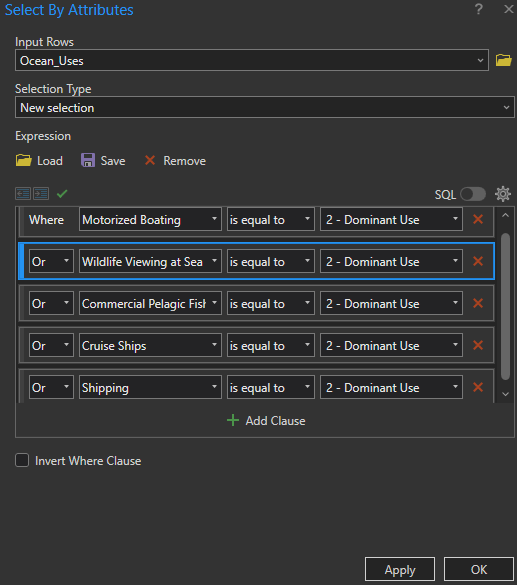
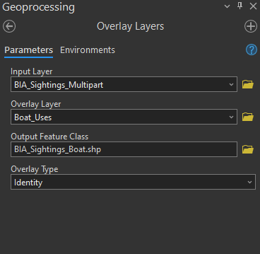
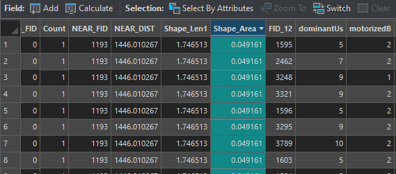
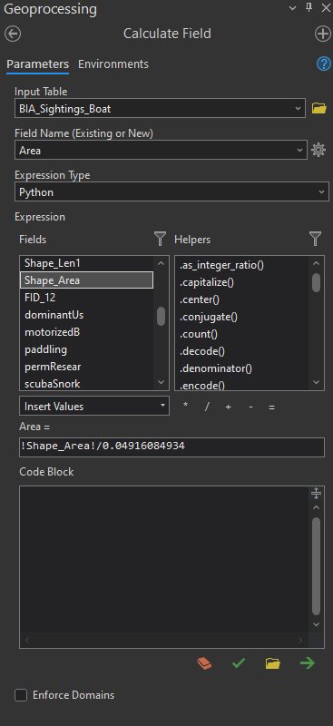

```{r echo=FALSE}
yml_content <- yaml::read_yaml("chapterauthors.yml")
author <- yml_content[["suitability-overlay-analysis"]][["author"]]
```
# Suitability and Overlay Analysis {#suitability-overlay-analysis} 

Written by
```{r results='asis', echo=FALSE}
cat(author)
```

## Lab Overview {.unnumbered}

Oftentimes, what we consider to be GIS analysis in the natural resources domain is related to suitability analysis. This analysis typically involves identifying areas/features that could support a given activity, use, or process and eliminating areas/features that would not be able to fulfill the required needs. Suitability analysis typically refers to an ordinal classification of the capable areas/features to denote the relative abilities of these areas/features to fulfill these needs. This number is mostly likely represented as an index that ranges from 0 to 1 where 1 = the most suitability possible for a given area/feature and 0 = no suitability. Typically, there will be no 0 values present in this index as all incapable areas should have already been eliminated in previous steps.

In order to perform a suitability analysis, geospatial operations, such as vector polygon overlay and database table intersection are not only the distinguishing functional characteristics of a geographic information system, but are also the most common aspects of this process. In order to gain an understanding of the potential of cartographic modeling using a GIS, this lab has been constructed to take you through an exercise that closely mirrors a prototypical GIS analysis related to conservation values. 

Marine spatial planning is “a collaborative and transparent approach to managing ocean spaces that helps to balance the increased demand for human activities with the need to protect marine ecosystems. It takes into consideration all activities and partners in an area to help make informed decisions about the management of our oceans in a more open and practical way. 

Marine Spatial Planning is internationally recognized as an effective tool for transparent, inclusive and sustainable oceans planning and management. Approximately 65 countries are currently using this approach. Marine Spatial Plans are tailored to each unique area to help manage human activities and their impacts on our oceans. Depending on the area, these plans may include areas for potential resource development and areas that require special protection” (Fisheries and Oceans Canada).

The State of Hawai’i defines Marine Protected Areas as “a subset of MMAs, and focus on protection, enhancement, and conservation of habitat and ecosystems. Some MPAs have very few fishing restrictions and allow sustainable fishing, while others restrict all fishing and are “no take” areas. In Hawai‘i, forms of MPAs have been in use for over 40 years.”	-Division of Aquatic Resources 

Within this lab, we will utilize existing and new geospatial tools to conduct a marine spatial planning exercise in Hawaii, USA. You will complete tasks based on a scenario related to the critical habitat of cetaceans in Hawaii and conflicting uses. 

Considered one of the world’s most important humpback whale habitats, the Hawaiian Islands Humpback Whale National Marine Sanctuary was established in 1992 to protect humpback whales (_Megaptera novaeangliae_) and their habitat in Hawai‘i. Humpback whales commonly give birth and raise their young in the state’s warm and shallow waters. Yet, there is increasing conflict between the whales and vessels, including recreational and whale watching boats, as well as cargo ships. Thus, national and state government agencies would like to expand the marine sanctuary to reduce the whales strikes, further protecting the whales and their calves. The government agencies are searching for the largest suitable areas to include as part of the sanctuary. 

------------------------------------------------------------------------

## Learning Objectives {.unnumbered}

- Practice good data management principles
- Distinguish overlay tools and recognize when to apply them
- Calculate a weighted suitability index
- Identify and map the most suitable locations for new marine sanctuaries

------------------------------------------------------------------------

## Deliverables {#lab3-deliverables .unnumbered}
 
<input type="checkbox" unchecked> Scenario 1: </input>

-   An output table of the top 5 ranked features
-   Map of the final product
-   answers to the questions submitted to the Lab 4 section on Canvas

<input type="checkbox" unchecked> Report should satisfy the following requirements:</input>

-   place maps and tables at the end of the document 
-   1" margins 
-   12 point font 
-   single spaced
-   maximum of four pages (including figures & tables)
-   use headings as needed
-   omit your name, student number, date

In addition to including relevant maps, please answer the following questions in your report:

-   Describe the characteristics of the "top 5 suitable" marine sanctuaries. Based on your analysis recommend one new sanctuary location. What factors make this location the most suitable?
-   What other factors could you consider in this suitability analysis?
-   Why is it important to consider multiple dimensions in a suitability analysis?

------------------------------------------------------------------------

## Data {.unnumbered}

The relevant data is located in your Canvas folder. You will be expected to practice proper data management by updating the existing file geodatabase with new shapefiles that are produced. Utilize what you have learnt in the past labs regarding the geodatabase creation, including using best practices regarding naming conventions. 

### Data Organization {.unnumbered}

You will find this lab much easier if you keep your data in a structure that makes sense for you -- and others (as much as possible!) -- by using meaningful names. As you progress through each step, we recommend that you also take a look at your data and use tools to delete unnecessary fields in your attribute tables so that they are not overpopulated and confusing.  

### Files to Create {.unnumbered}

Here is a table of files you will be creating:

```{r 03-data-table, echo=FALSE, message=FALSE, warnings=FALSE, results='asis'}
files <- c("Humpback_BIA","Humpback_Hawaii_BIA","BIA_Sanctuary_Erase","BIA_Sightings","BIA_Multipart","BIA_Sightings_Multipart","Boat_Uses","BIA_Sightings_Boat","Top_Five_Sanctuary","Sanctuary_Buffer")
tasks <- c("1","1","2","3","3","3","4","5","5","5")
df <- data.frame(File=files,Task=tasks)
names(df) <- c("File Name","Created in Task")
knitr::kable(
  df, booktabs = TRUE, row.names = FALSE
)
```

------------------------------------------------------------------------

## Scenario 1 {.unnumbered}

## Task 1: Export Relevant Data from Biologically Important Areas Shapefile {.unnumbered}

**Step 1:** Create a New Project and Download Data

1. Open ArcGIS Pro and create a new project.
2. Go to Canvas and download the **Suitability-and-overlay-analysis-Data.zip** file for your project.


**Step 2:** Connect the geodatabase to your project

Once you have started your new project, open the Catalog panel. Look for the folder where you downloaded your data. If you don’t see it in the Catalog, go to Computer and navigate to the folder where you saved the Canvas (Suitability-and-overlay-analysis-Data) data.

```{r 03-catalog, out.width= "50%", echo = FALSE}
    knitr::include_graphics("images/03-catalog.png")
```

**Note:** If it still doesn’t appear, select the Refresh option in the Catalog to ensure your folder is displayed correctly.

**Step 3:** Add the **Cetaceans_BIA** to your map

Once you find your data in the Catalog, you will see four data sets. Select Cetaceans_BIA, right click, and choose **Add to Current Map**.

```{r 03-add-to-current-map, out.width= "50%", echo = FALSE}
    knitr::include_graphics("images/03-add-to-current-map.png")
```


**Step 4:** Open Cetaceans_BIA attribute table 

Right click on the layer Cetaceans_BIA and select Attribute Table. A table will open containing all the information from the layer. Understand the information: In the table, you will see columns like OBJECTID_1, Shape, BIA_Id, region, etc. These columns indicate what type of information is in each cell. Note that there are several species of whales listed, along with their scientific names and common names. 

To extract Humpback Whale, we need to use a SQL query. Once your attribute table is open, click on the **Select By Attributes** tab at the top of your table. 

```{r 03-select-by-attributes, out.width= "50%", echo = FALSE}
    knitr::include_graphics("images/03-select-by-attributes.png")
```

This will open a dialog where you can enter the query needed to extract the data. Leave the input data as **Cetaceans_BIA**, and select **New Selection** under Selection type. 
Now,where it says **Where**, look for the Field that contains the **Humpback Whale** data. Write the SQL query to extract the attribute needed and select **OK**.

```{r 03-select-by-attributes-box, out.width= "50%", echo = FALSE}
    knitr::include_graphics("images/03-select-by-attributes-box.png")
```


**Step 5:** Export the features

Once you have applied a SQL query and selected only the Humpback Whale data, right click again on Cetaceans_BIA layer, select **Data**, and then choose **Export Features**. Save the output in your data folder within your ArcGIS Pro project, and name it as **Humpback_BIA**.

```{r 03-export-feature, out.width= "50%", echo = FALSE}
    knitr::include_graphics("images/03-export-feature.png")
```

Make sure that the exported file is added to your map in ArcGIS Pro. Then, explore the new layer and its attribute table to verify that the information has been extracted correctly.

**Step 6:** Extract and Export Hawaii Data

Now that the Humpback Whale data has been extracted, we will export the data that belongs to the area of Hawaii. To do this, repeat steps 4 and 5 to extract from your Humpback Whale dataset the features that correspond to Hawaii. Name it as **Humpback_Hawaii_BIA**.


##### Q1. What was the SQL expression that you used to export only the humpback whale BIA? {.unnumbered}

##### Q2. Apart from Hawaii, does the humpback whale have any other locations with a BIA for reproduction? (1 point) {.unnumbered}


------------------------------------------------------------------------

## Task 2: Identify the BIA of the Humpback Whale that is not within the established Marine Sanctuary {.unnumbered}

Now that we have extracted the Humpback_Hawaii_BIA layer, we will perform a visual comparison between the Marine Sanctuary (Humpback_Marine_Sanctuary) and the BIA of the humpback whale population in Hawaii. We will use the Overlay tool for this task.

**Step 1:** Go to the Geoprocessing tab and open the **Overlay Layers** tool.

**Step 2:** In the tool window, set the Input Layer to be the **Humpback_Hawaii_BIA**. The Overlay Layer should be **Humpback_Marine_Sanctuary**.

**Note:** You can find the Humpback_Marine_Sanctuary dataset in the file you downloaded from Canvas (Suitability-and-overlay-analysis-Data.zip).


For Overlay Type, select **Erase**. This will remove the areas of overlap, allowing you to see where the BIA of the humpback whale population in Hawaii lies outside the sanctuary.

**Step 3:** Name the output file **BIA_Sanctuary_Erase** and click **Run**.

```{r 03-overlay-layers, out.width= "50%", echo = FALSE}
    knitr::include_graphics("images/03-overlay-layers.png")
```


##### Q3. What percentage of the BIA is outside of the marine sancuary? Hint: Use the attribute tables. {.unnumbered}


------------------------------------------------------------------------

## Task 3: Calculate the Density of Cetacean Sightings using the BIA for Humpback Whales {.unnumbered}

Next, we have a point layer named **Humpback_Sightings** that is curated based on where cetaceans have been located or identified in Hawaiian waters. We want to understand the density of the sightings within the remaining BIA layer to understand which polygons should be prioritized.

**Step 1:** Go to the Geoprocessing tab and open the **Spatial Join** tool. 

Spatial Join is a valuable tool that joins attributes from one feature to another based on a spatial relationship. The target feature defines the spatial boundary, while the input feature is molded to the target feature.

**Step 2:** Within the tool window, set the Target Features to **BIA_Sanctuary_Erase**, and the Join Features to **Humpback_Sightings**. For Join Operation, select **Join one to one**, and the Match Option select **Contains**.

**Step 3:** Name the output file **BIA_Sightings** and click Run.

```{r 03-spatial-join, out.width= "50%", echo = FALSE}
    knitr::include_graphics("images/03-spatial-join.png")
```

**Step 4:** Open the attribute table. Do you see anything that went wrong with this analysis?

Take a moment to review the attribute table. You might observe that some polygons behave strangely. This occurs because, even though the features appear spatially separated after using the **Overlay Layers** tool to erase parts of the BIA for humpback whales, ArcGIS Pro may still treat these separated areas as a single feature.

This situation arises when the polygons are part of a multipart feature—a single feature composed of multiple distinct parts. For example, when you click on one polygon, you may notice that several other polygons are highlighted as well. These are considered multipart features (refer to the help page for [Multipart to Singlepart tool](https://pro.arcgis.com/en/pro-app/latest/tool-reference/data-management/multipart-to-singlepart.htm)).

Before you can continue, you must break these multipart polygons into individual polygons so that each can be treated as a separate feature.
  
To solve this, we will use **Multipart to Singlepart** tool. This tool will split multipart polygons into separate individual polygons.
 
**Step 5:**  Go to the Geoprocessing tab and open the **Multipart to Singlepart** tool. 
 
**Step 6:** Set the Input Layer to **BIA_Sanctuary_Erase** and name the output file **BIA_Multipart** and click **Run**.

```{r 03-multi-sinlge, out.width= "50%", echo = FALSE}
    knitr::include_graphics("images/03-multi-sinlge.png")
```


##### Q4. How many individual polygons now exist? {.unnumbered}

**Step 7**: Now, repeat the **Spatial Join** process from Steps 1-3. But in stead using **BIA_Sanctuary_Erase** use **BIA_Multipart** in Target Features. 

**Note:** Uncheck the option **Keep all Target Features**. This will remove any polygons that do not contain cetacean sightings within their boundaries. 

Name the output file **BIA_Sightings_Multipart** and click **Run**.

```{r 03-spatial-join-keep-all-target, out.width= "50%", echo = FALSE}
    knitr::include_graphics("images/03-spatial-join-keep-all-target.png")
```

**Step 8:** Use symbology to display the BIA polygons and by number of cetacean sightings.


##### Q5. What is the Target_FID of the polygon with the most cetacean sightings? {.unnumbered}

------------------------------------------------------------------------

## Task 4: Extract the Boats from Ocean Uses and Identity the Vessels within the BIA Polygons {.unnumbered}

The **Ocean_Uses** layer contains a wide range of human activities that occur at the coast or in the ocean. We would like to extract ‘Motorized Boating’, ‘Wildlife Viewing at Sea’, ‘Commercial Pelagic Fishing’, ‘Cruise Ships’, and ‘Shipping’. These human activities pose the most threat to humpback whales, and, so, we would like to expand the sanctuary to protect humpback whales where their current risk of collision with a vessel is the highest. 

**Step 1:** Add the **Ocean_Uses** dataset to your project.

**Note:** You can find the Ocean_Uses dataset in the file you downloaded from Canvas **(Suitability-and-overlay-analysis-Data.zip)**.

**Step 2:** Open the attribute table from the **Ocean_Uses** layer. Click on the **Select By Attributes** option. In the Select By Attribute window, set the Input Rows to **Ocean_Use**s and leave the Selection Type as **New Selection**.

**Step 3:** Now, we will select the classes mentioned above and classify them as **2 - Dominant Use**. For each classification, add a clause —there will be a total of 5 features. Once classified, click **OK**.

Take a moment to observe what changes have occurred.

```{r 03-feature-class, out.width= "50%", echo = FALSE}
    
```

**Step 4:** Once the features are selected, we will export them by right clicking on the **Ocean_Uses** layer, selecting **Data**, and then **Export Features**.

In the pop-up window, leave Input Features set to your **Ocean_Uses** layer, and for the Output Feature Class, name it **Boat_Uses** and click **OK**.

```{r images/03-boat-uses, out.width= "50%", echo = FALSE}
    knitr::include_graphics("images/03-boat-uses.png")
```


Now, we would like to combine the data on vessel usage with the BIA polygons using the Overlay Layers tool. This is important to visualize the spatial overlap between areas where humpback whales reproduce and rear their young, and locations where vessels are classified as Dominant Use, indicating a higher risk of boat strikes in these areas. 

For this process we will use again the **Overlay Layer** tool.

**Step 5:** Go to the Geoprocessing tab and open the **Overlay Layers** tool.

**Step 6:** In the tool window, set the Input Layer to be the **BIA_Sightings_Multipart**. The Overlay Layer should be **Boat_Uses**. For Overlay Type, select **Identity**. 

**Step 7:** Name the output file **BIA_Sightings_Boat** and click **Run**.

```{r 03-overlay-layers-identity, out.width= "50%", echo = FALSE}
    
```


##### Q6. Open the attribute table for the output. What does the 0, 1, and 2 represent in the swimming column? {.unnumbered}


------------------------------------------------------------------------

## Task 5: Calculate Suitability and Identify Most Suitable Locations for the Marine Sanctuary {.unnumbered}

Now, we will determine where is the most suitable location to expand the marine sanctuary for humpback whales. The suitability value will be a new field between the value of 0 and 1 with 1 being the most suitable, and 0 being not suitable. It will be based on 3 characteristics (suitability factors):

-	The larger the **area** the higher the suitability score
-	The more cetacean **sightings** per area, within an area the higher the suitability score
-	The more dominant **ocean uses** the higher the suitability score

Before calculating the final suitability score, you need to add new fields to the **BIA_Sightings_Boat** layer within the attribute table and make some calculations.

**Step 1:** Open the attribute table, select **Add Field**, and create the following fields: Area (float), Sightings (float), and Vessels (float), using Float as the data type.

Once you add these fields and make the changes, close the table and save it. Open the attribute table again, and you will see your new fields at the end of the table.

**Note:** If you do not see the new fields you added in the **BIA_Sightings_Boat** layher, refresh your map and check the attribute table again.

For each of the three fields you just added, you will need to calculate $[F /Fmax]$ for each record (row):

-	$F$ is the value of the attribute for that record 
-	$Fmax$ is the maximum record value for the field


To calculate the values for your new fields (Area, Sightings, and Vessels), you first need to determine the Fmax for each one.

**Step 2:** Find the maximum value for the **Area** by using the **Shape_Area** column. Sort the column to locate the maximum value. 

```{r 03-shape-area, out.width= "50%", echo = FALSE}
    
```


Once you have it, open the field calculator. Set the **BIA_Sightings_Boats** layer as the Input. Then, for the **Field Name**, select your **Area** field that you just added. Choose Python as the Expression Type. Now, in the Expression field, find Area, double click on it, and write the following expression:

Shape_Area / Maximum value of **Shape_Area**


```{r images/03-calculate-field-area, out.width= "50%", echo = FALSE}
    
```


Repeat this for Sightings, but instead of using Shape_Area, use the **Join_Count** field.

Now that you have the **Area** and **Sightings** values, to calculate Vessels Fmax, you first need to calculate **Vessel_F**, which is the sum of values from five columns representing different types of vessel activities (Motorized Boating, Wildlife Viewing at Sea, Commercial Pelagic Fishing, Cruise Ships, and Shipping).


Open the Field Calculator, select the Vessel field, and in the Expression field, enter the sum of all the Vessel class columns. The result will be your **Vessel_F**.

**_Hint:_** You'll need to create a new field to store these calculated values.

Once you have obtained Vessel_F, you will proceed to calculate **Vessel_Fmax**. To do this, sum the maximum values of each Vessel type.

Explore the statistics of each column and sum the maximum values. After obtaining the total sum of the maximum values for each class, reopen the attribute table and, using the field calculator, divide Vessel_F by the total sum of these values. The result will be your **Vessel_Fmax**.


**Step 3:** Finally, use a weighted suitability calculation by creating a new field, Suitability, and writing the following expression:
 [Area] * 0.4 + [Sightings] * 0.2 + [Vessels_Fmax] * 0.4.

##### Q7. Write down the $Fmax$ value you used for area to four decimal places.{.unnumbered}

##### Q8: Write down the $Fmax$ value you used for sightings to four decimal places. {.unnumbered}

##### Q9: Write down the $Fmax$ value you used for vessels to four decimal places {.unnumbered}

To provide a buffer zone protecting the humpback whales within the newly formed sanctuary, we will select the five BIA areas with the highest suitability score and create a five kilometer buffer.

**Step 4:** Sort the Suitability field by right-clicking on the field title and selecting **Sort Descending**.

**Step 5:** Select and export the top five features to a new layer named **Top_Five_Sanctuary**. Clean up the attribute table, so that it only has relevant columns. **This is the output table that is a deliverable for the lab.**

**Step 6:** Open the tool **Buffer**. Input features will be **Top_Five_Sanctuary**. Name the output **Sanctuary_Buffer**. Set the distance as 5 kilometers. For dissolve type, select **Dissolve all output features into a single feature**.

You just conducted a suitability analysis and produced a map of how to potentially expand the humpback whale sanctuary!

Now is the time for your cartographic skills to shine. To design a map of the highest quality you will need to draw on all of you GIS skills. Ensure you include all the standard components of a map along with your artistic flair. 

Also, be sure to include important data, but also make sure the map is not too cluttered. Remember that you can use inset maps to demonstrate additional detail for the most suitable habits. 

The physical requirements are as follows: 

*   Map should be 11”x17” either as a landscape or portrait layout 
*   You should export the map as a PDF document
*   All features on the map should appear in the legend
*   Your map should have all the necessary elements of a map

------------------------------------------------------------------------

## Summary {.unnumbered}

Suitability modeling is a very common type of analysis that usually integrates multiple factors as geospatial layers using overlay and proximity tools. As you can imagine, there are many ways to structure this analysis and different weightings in the suitability calculation will yield entirely different results. Therefore, it is always important to maintain good justification and rationale for the weightings that you choose and any limitations in the analysis (e.g., missing data/information, incomplete or unavailable attributes, etc.) are clearly communicated in any recommendations that you make from your analysis. In this lab, you were also exposed to significant data manipulation and management. Using good data organization and naming conventions helps others understand your analysis and output data, including your future self if you ever need to return to your old work.

Return to the **[Deliverables](#lab3-deliverables)** section to check off everything you need to submit for credit in the course management system.
