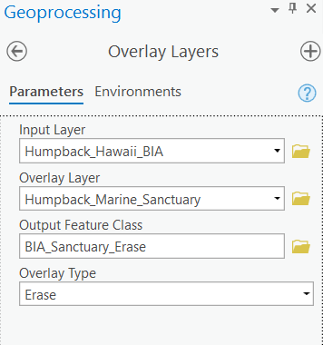
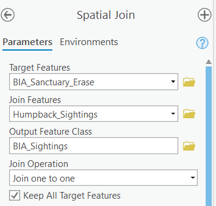
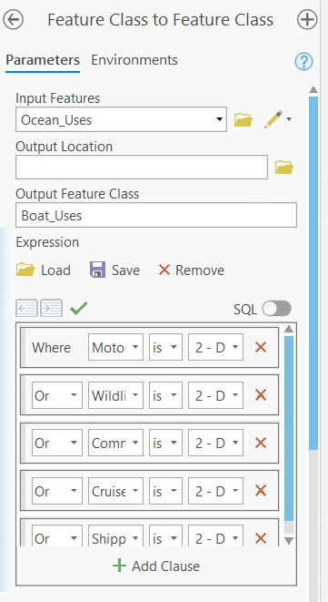

```{r echo=FALSE}
yml_content <- yaml::read_yaml("chapterauthors.yml")
author <- yml_content[["suitability-overlay-analysis"]][["author"]]
```
# Suitability and Overlay Analysis {#suitability-overlay-analysis}

Written by
```{r results='asis', echo=FALSE}
cat(author)
```

## Lab Overview {-}

Oftentimes, what we consider to be GIS analysis in the natural resources domain is related to suitability analysis. This analysis typically involves identifying areas/features that could support a given activity, use, or process and eliminating areas/features that would not be able to fulfill the required needs. Suitability analysis typically refers to an ordinal classification of the capable areas/features to denote the relative abilities of these areas/features to fulfill these needs. This number is mostly likely represented as an index that ranges from 0 to 1 where 1 = the most suitability possible for a given area/feature and 0 = no suitability. Typically, there will be no 0 values present in this index as all incapable areas should have already been eliminated in previous steps.

In order to perform a suitability analysis, geospatial operations, such as vector polygon overlay and database table intersection are not only the distinguishing functional characteristics of a geographic information system, but are also the most common aspects of this process. In order to gain an understanding of the potential of cartographic modeling using a GIS, this lab has been constructed to take you through an exercise that closely mirrors a prototypical GIS analysis related to conservation values. 

Marine spatial planning is “a collaborative and transparent approach to managing ocean spaces that helps to balance the increased demand for human activities with the need to protect marine ecosystems. It takes into consideration all activities and partners in an area to help make informed decisions about the management of our oceans in a more open and practical way. 

Marine Spatial Planning is internationally recognized as an effective tool for transparent, inclusive and sustainable oceans planning and management. Approximately 65 countries are currently using this approach. Marine Spatial Plans are tailored to each unique area to help manage human activities and their impacts on our oceans. Depending on the area, these plans may include areas for potential resource development and areas that require special protection” (Fisheries and Oceans Canada).

The State of Hawai’i defines Marine Protected Areas as “a subset of MMAs, and focus on protection, enhancement, and conservation of habitat and ecosystems. Some MPAs have very few fishing restrictions and allow sustainable fishing, while others restrict all fishing and are “no take” areas. In Hawai‘i, forms of MPAs have been in use for over 40 years.”	-Division of Aquatic Resources 

Within this lab, we will utilize existing and new geospatial tools to conduct a marine spatial planning exercise in Hawaii, USA. You will complete tasks based on two scenarios related to the critical habitat of cetaceans in Hawaii and conflicting uses. You will learn tools and processes while completing the first scenario that you can apply to complete the second scenario more independently. 

### Scenario 1 {-}

Considered one of the world’s most important humpback whale habitats, the Hawaiian Islands Humpback Whale National Marine Sanctuary was established in 1992 to protect humpback whales (__Megaptera novaeangliae__) and their habitat in Hawai‘i. Humpback whales commonly give birth and raise their young in the state’s warm and shallow waters. Yet, there is increasing conflict between the whales and vessels, including recreational and whale watching boats, as well as cargo ships. Thus, national and state government agencies would like to expand the marine sanctuary to reduce the whales strikes, further protecting the whales and their calves. The government agencies are searching for the largest suitable areas to include as part of the sanctuary.  

### Scenario 2 {-}

False killer whales, an endangered resident species in Hawaiian waters, are long-lived and only reproduce one calf every 6 or 7 years. So, the species is heavily impacted by human activities, taking a long time to recover. The false killer whales are often caught in fishing gear as bycatch, which is defined as the incidental or unintentional capture of a non-target species. Not only is this severely hurting the false killer whale population, in addition, Hawaiian fisheries have been forced to close their fishing season early, by reaching their bycatch limit. As there is a resource conflict at play, you will need to redefine the fishing grounds to limit the bycatch, as well as discuss the placement of a marine sanctuary for false killer whales. 

------------------------------------------------------------------------

## Learning Objectives {-}

-   Lorem ipsum

-   Lorem ipsum 

-   Lorem ipsum 

------------------------------------------------------------------------

## Deliverables {-}

For Scenario 1: 

- An output table of the top 5 ranked features (see Task7)  
- Map of the final product 
- A screenshot of the geodatabase 
- A data dictionary (an example is located in the Canvas folder) – include all files in the gdb 
- Answers to the questions submitted to the course management system

For Scenario 2:
- A two-page report including your findings, which should also include at least one table and two maps 

------------------------------------------------------------------------

## Data {-}

All data for this lab are accessible via the UBC PostgreSQL server. Instructions for connecting to the server are given in prior labs. We will be using data from the `whale` database. You will be expected to practice proper data management by copying the data into your own database and then managing the many new datasets that are produced.

### Data Organization {-}

You will find this lab much easier if you keep your data in a structure that makes sense for you -- and others (as much as possible!) -- by using meaningful names. As you progress through each step, we recommend that you also take a look at your data and use tools to delete unnecessary fields in your attribute tables so that they are not overpopulated and confusing.  

### Files to Create {-}

Here is a table of files you will be creating and expected to include in your data dictionary, along with the existing files in the initial database.

------------------------------------------------------------------------

## Task 1: Export Relevant Data from Biologically Important Areas Shapefile {-}

A biologically important area (BIA) identifies where cetaceans concentrate for specific behaviours.

**Step 1:** Start a new project in ArcGIS Pro.

**Step 2:** Connect to the `whale` database on the UBC PostgreSQL server in ArcGIS Pro. Add **Cetaceans_BIA** to your map in ArcGIS Pro.

**Step 3:** Right-click on the layer and select ‘Attribute Table’. Explore the attribute table and understand what field you will need to use to extract ‘Humpback Whale’.

**Step 4:** Right-click on the layer again, select ‘Data’, and then select ‘Export Features’. Write a SQL query to extract the BIA for the humpback whales from the other species and save the output to your local geodatabase in your ArcGIS Pro project. Ensure the file is added to your map in ArcGIS Pro and then explore the new layer and attribute table. 

##### Q1. What was the SQL expression that you used to export only the humpback whale BIA?  {-}

##### Q2. Apart from Hawaii, does the humpback whale have any other locations with a BIA for reproduction? {-}

**Step 5:** Repeat Step 4, but this time only export the humpback whale BIA for Hawaii and name the file **Humpback_Hawaii_BIA**.

------------------------------------------------------------------------

## Task 2: Identify the BIA of the Humpback Whale that is not within the established Marine Sanctuary {-}

Visually compare the Marine Sanctuary (**Humpback_Marine_Sanctuary**) to the BIA of the humpback whale population.

**Step 1:** Open the tool ‘Overlay Layers’. 

**Step 2:** Within the tool, the input layer should be the BIA, the overlay layer is the sanctuary. For ‘Overlay Type’, select Erase. Name the output **BIA_Sanctuary_Erase**.

```{r 03-overlay-layers, out.width= "75%", echo = FALSE}
    
```

##### Q3. What percentage of the BIA is outside of the marine sancuary? Hint: Use the attribute tables. {-}

```{r 03-bia-sanctuary-erase-attribute-table, out.width= "75%", echo = FALSE}
    knitr::include_graphics("images/03-bia-sanctuary-erase-attribute-table.png")
```

------------------------------------------------------------------------

## Task 3: Calculate the Density of Cetacean Sightings using the BIA for Humpback Whales {-}

Next, we have a point layer named **Humpback_Sightings** that is curated based on where cetaceans have been located or identified in Hawaiian waters. We want to understand the density of the sightings within the remaining BIA layer to understand which polygons should be prioritized.

**Step 1:** Open the tool ‘Spatial Join’. Spatial Join is a valuable tool that joins attributes from one feature to another based on a spatial relationship. The target feature defines the spatial boundary, while the input feature is molded to the target feature.

**Step 2:** Within the tool, the target features are **BIA_Sanctuary_Erase**, the input feature is **Humpback_Sightings**, and the join operation is ‘Join one to one’. The match option is ‘Contains’. Name the output **BIA_Sightings**.

```{r 03-spatial-join, out.width= "75%", echo = FALSE}
    
```

**Step 3:** Open the attribute table. What do you see went wrong with this analysis?

We need to introduce a new tool, ‘Multipart to Singlepart’ to fix this problem. After you have used the ‘Overlay Layers’ to erase features from the BIA for humpback whales, you will be left with several polygons that are still considered the same polygon by ArcGIS Pro, but are now spatially separated (refer to the help page for Multipart to Singlepart tool). Try finding one and selecting it. You will know it is multipart when a number of additional polygons are outlined when you click one polygon. You will need to separate those parts into unique polygons before continuing on to the next step. What this is allowing you to do is to recommend placement of the expanded marine sanctuary into a portion of a BIA.

**Step 4:** Open the ‘Multipart to Singlepart’ tool and select the input layer as the layer **BIA_Sanctuary_Erase**.

##### Q4. How many individual polygons now exist? {-}

**Step 5**: Now re-do ‘Spatial Join’ from Steps 1-2. There are many polygons that have a minimal area, so, unselect ‘Keep all Target Features’, which will remove polygons that do not have any cetacean sightings within its boundaries.

**Step 6:** Use symbology to display the BIA polygons by number of cetacean sightings.

```{r 03-bia-polygons, out.width= "75%", echo = FALSE}
    knitr::include_graphics("images/03-bia-polygons.png")
```

##### Q5. What is the Target_FID of the polygon with the most cetacean sightings? {-}

------------------------------------------------------------------------

## Task 4: Extract the Boats from Ocean Uses and Identity the Vessels within the BIA Polygons

The **Ocean_Uses** layer contains a wide range of human activities that occur at the coast or in the ocean. We would like to extract ‘Motorized Boating’, ‘Wildlife Viewing at Sea’, ‘Commercial Pelagic Fishing’, ‘Cruise Ships’, and ‘Shipping’. These human activities pose the most threat to humpback whales, and, so, we would like to expand the sanctuary to protect humpback whales where their current risk of collision with a vessel is the highest. 

**Step 1:** Export features where Motorized Boating or any of the other human activities mentioned above is equal to ‘Dominant Use’. Be sure to set the output location to your local ArcGIS Pro project geodatabase and name the output feature class **Boat_Uses**.

```{r 03-feature-class-to-feature-class, out.width= "75%", echo = FALSE}
    
```

Now, we would like to bring the data on vessel usage and the BIA polygons together using the Overlay Layers tool. This is important to be able to see the spatial overlap between where humpback whales reproduce and rear their young and where vessels are labeled as a Dominant Use, indicating that there is a higher chance of boat strikes in these locations.

**Step 2:** Open the tool ‘Overlay Layers’. The input layer should be **BIA_Sightings_Multipart** and the overlay layer is **Boat_Uses**. For ‘Overlay Type’, select Identity.

##### Q6. Open the attribute table for the output. What does the 0, 1, and 2 represent in the swimming column? {-}
