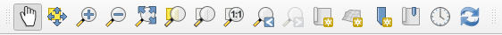
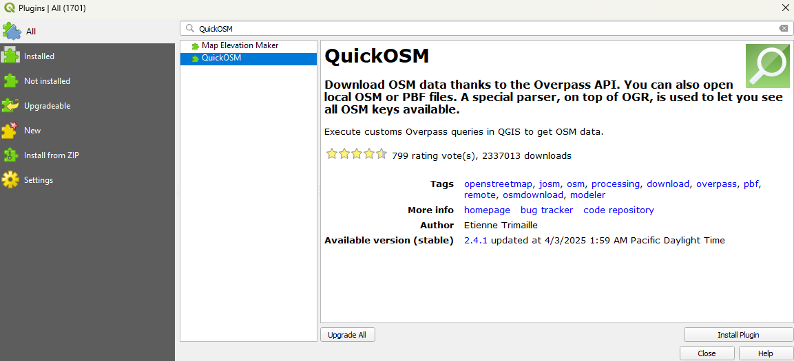
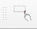
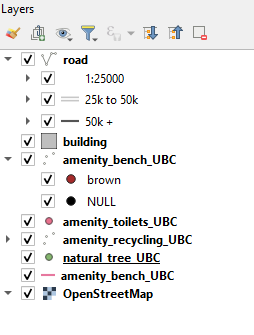
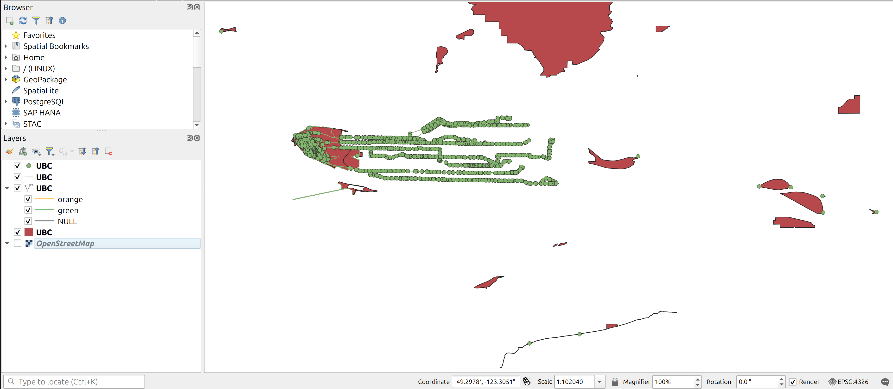
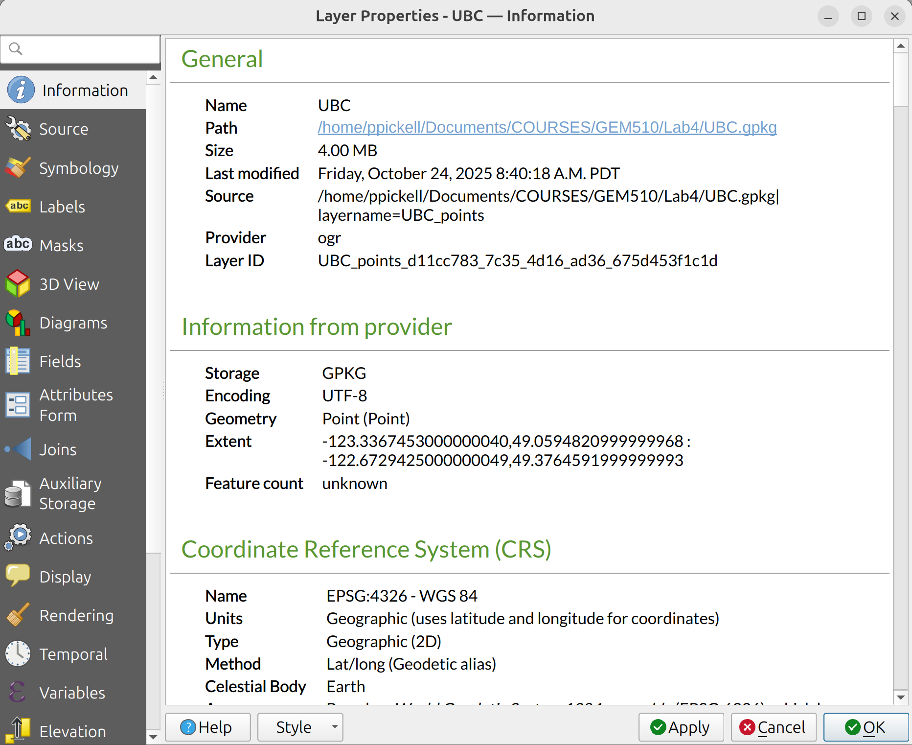
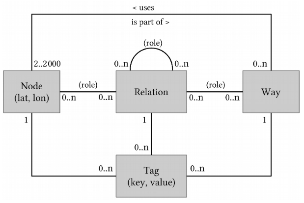
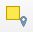
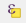
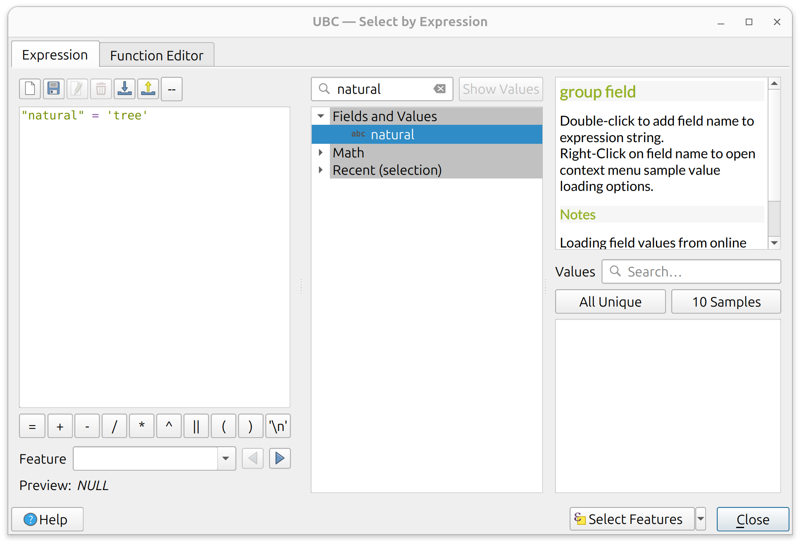

---
output:
  pdf_document: default
  html_document: default
---
```{r echo=FALSE}
yml_content <- yaml::read_yaml("chapterauthors.yml")
author <- yml_content[["qgis-openstreetmap"]][["author"]]
```
# Exploring QGIS and OpenStreetMap {#qgis-openstreetmap}

Written by
```{r results='asis', echo=FALSE}
cat(author)
```

## Lab Overview {.unnumbered}

In this lab you will learn some basic functionality of handling data with the QGIS software and learn how to extract and import an important source of Volunteered Geographic Information (VGI): [OpenStreetMap](https://www.openstreetmap.org/) (OSM). [QGIS](https://www.qgis.org/en/site/) (Quantum GIS) is a Free and Open Source Software (FOSS) that is a flagship project maintained by the [Open Source Geospatial Foundation](https://www.osgeo.org/) (OSGeo). QGIS features much of the same functionality as other proprietary software like ESRI’s ArcGIS and navigating the interface will be the primary purpose of this lab. OpenStreetMap is one of the most popular and comprehensive VGI datasets available for the planet and contains geographic information that is crowd-sourced. The spatial data model of OpenStreetMap data is significantly different from other vector models and therefore requires some special handling and consideration. At the end of this lab, you will produce a map of some OpenStreetMap data using QGIS. 

------------------------------------------------------------------------

## Learning Objectives {.unnumbered}

- Import and export various types of geospatial data in QGIS
- Practice spatial and attribute queries
- Calculate fields with new values
- Install plugins and extensions for QGIS
- Create map layouts and modify layer symbologies

------------------------------------------------------------------------

## Deliverables {#lab4-deliverables .unnumbered}

<input type="checkbox" unchecked> Answers to the questions posed throughout the lab (15 points)</input>

<input type="checkbox" unchecked> Your final symbolized map (15 points)</input>

------------------------------------------------------------------------

## Data {.unnumbered}

Data for this lab will be downloaded directly from OpenStreetMap following the tasks below.

------------------------------------------------------------------------

## Task 1: Downloading OpenStreetMap data to QGIS {.unnumbered}

**Step 1:** Start QGIS and click **New Empty Project** from the Project Templates on your screen.

```{r 04-qgis-project-templatee, out.width= "50%", echo = FALSE}
    knitr::include_graphics("images/04-qgis-project-template.png")
```

The Project Templates prompt will disappear to a white canvas, which is where you are able to view mapped data. On the left of your screen you will see two panes: **Browser** and **Layers**. These are where you can find data sources on your computer or network and the layers that are currently loaded into your map view. Currently, we do not have any data to view, so the Layers pane will be blank. But we do have many sources for data, so let us look at those. Depending on your computer and networking connections, your Browser pane may look different than what is shown below.

```{r 04-qgis-add-tiles, out.width= "50%", echo = FALSE}
    knitr::include_graphics("images/04-qgis-add-tiles.png")
```

**Step 2:** Save your project. In the top menu, select **Project** then click **Save As…** and navigate to a location on your computer where you want to store your project and related files. You should create a directory specifically for this purpose.

**Step 3:** Expand **XYZ Tiles** and then either double-click **OpenStreetMap** or right-click and select **Add Layer to Project**.

```{r 04-qgis-osm-layers, out.width= "50%", echo = FALSE}
    knitr::include_graphics("images/04-qgis-osm-layers.png")
```

This will add the OpenStreetMap base map to your map view, so you should now see your first layer in the Layer pane and the map view should automatically display the new base map. 

```{r 04-qgis-navigation-bar, out.width= "75%", echo = FALSE}
    
```

**Step 4:** Locate the Map Navigation Toolbar at the top. Use the magnifying glass to zoom into the area for Metro Vancouver. Once you find Metro Vancouver, change the scale of the map to 1:250000 at the bottom of your QGIS interface. 

```{r 04-qgis-osm-basemap-vancouver, out.width= "75%", echo = FALSE}
    knitr::include_graphics("images/04-qgis-osm-basemap-vancouver.png")
```

This current view does not directly show you the OpenStreetMap data. Instead, you are looking at a tile service provided by OpenStreetMap, which symbolizes the OpenStreetMap data and then, depending on your zoom level and location, sends the necessary information to your computer in the form of a tile like the one pictured below showing a 256x256 pixel tile at zoom level 10 (zoom level 1 is the smallest scale world map).

```{r 04-qgis-tile, out.width="256px", echo = FALSE}
    knitr::include_graphics("images/04-qgis-tile.png")
```

In order to get the OpenStreetMap data, we need to install a plugin for QGIS. Plugins are written by a community of volunteer developers, some from organizations that pay for the plugin to be developed and then released as FOSS, and others just volunteer their time. Plugins are incredibly important for QGIS, because only basic features end up in the core GIS software. If there is ever something you want to do that is not a basic feature of QGIS, you probably need to search for a plugin or write one yourself!

**Step 5:** From the menu bar at the top, click **Plugins** and then select **Manage and Install Plugins…** to open the **Plugin Manager**. Since these plugins are fetched from a server, you need to be connected to the internet to see plugins available for download. In the search bar, search for the **OSMDownloader** plugin. Click **Install Plugin**.

```{r 04-qgis-osm-downloader-plugin, out.width= "75%", echo = FALSE}
    
```

Once the plugin is installed, you can click **Close** to dismiss the Plugin Manager. Most plugins will automatically add an icon to your toolbar at the top, so search for and click the OSMDownloader icon that looks like this:

```{r 04-qgis-osm-downloader-icon, out.width= "30px", echo = FALSE}
    
```

Your cursor should now appear as a crosshair on your map and now you can select a rectangular area to fetch the OpenStreetMap data from.

**Step 6:** Click and drag your cursor on the base map to select the UBC campus. A dialogue box will open showing you the extent of your selection. Save the file to the project folder your created earlier. Name the file **UBC.osm** and toggle on **Load layer after download**. Your coordinates need not be exactly the same as the image below, but you can modify your selection if you want by either manually editing the extent values (in decimal degrees) or clicking **Cancel** and then selecting again with your cursor.

```{r 04-qgis-osm-downloader-extent, out.width= "50%", echo = FALSE}
    knitr::include_graphics("images/04-qgis-osm-downloader-extent.png")
```

```{r 04-qgis-osm-downloader-success, out.width= "25%", echo = FALSE}
    knitr::include_graphics("images/04-qgis-osm-downloader-success.png")
```

A progress bar will appear at the top and then a message will be displayed that the download was successful. You should now see an updated list of layers available in your Layers pane. 

```{r 04-qgis-osm-layers-toggle, out.width= "25%", echo = FALSE}
    
```

**Step 7:** Toggle off the OpenStreetMap base map and depending on how you made your selection in the last step, you should see something like this in your map view:

```{r 04-qgis-osm-map, out.width= "75%", echo = FALSE}
    
```

You can also download OpenStreetMap data directly from the OpenStreetMap website and then drag and drop the .osm file directly into the QGIS map view or the Layers pane.

------------------------------------------------------------------------

## Task 2: Inspecting and processing OpenStreetMap data {.unnumbered}

**Step 1:** Right-click the osm point layer in the Layers pane, select **Properties…** and then select the **Information** tab on the left navigation menu of the **Layer Properties** dialogue box. 

```{r 04-qgis-layer-properties, out.width= "75%", echo = FALSE}
    
```

You should notice under **Information from provider** the **Storage** type is **OSM** and the **Coordinate Reference System (CRS)** is **EPSG:4326 – WGS 84**. OpenStreetMap data will always be distributed with these characteristics. At this point, it is important to recognize how different the OSM spatial data model is from other data structures like an ESRI Shapefile.

OSM files are comprised of **nodes**, **ways**, and **relations**. These generally correspond to points, lines, and polygons, but not exactly. Each of these feature types are described by **tags** or attributes. Nodes are a pair of latitude/longitude coordinates and can either be a building block for another type of feature (e.g., a way or relation) or they can have attributes of their own or both. A way is a list of two or more nodes that connect and form a line. Ways can be open (lines) or closed (areas). It is important to recognize that a node can participate in multiple ways simultaneously, while also describing itself as a discrete point feature. Relations are just that: they allow us to model relationships between existing nodes, ways, and even other relations. For example, individual islands might be represented by a closed way, but an archipelago would be represented by a relation that contains the closed ways for all the islands. In this way, the OSM data model is flexible and eliminates redundancies of spatial information such that nodes and ways can be recycled into all kinds of relationships.

##### Q1. Interpret the OSM entity-relationship data model shown below. In a brief sentence, describe each of the seven connections between nodes, ways, relations, and tags. (1 point each for 7 points total) {.unnumbered}

```{r 04-osm-data-model, out.width= "75%", echo = FALSE, fig.cap=fig_cap}
    fig_cap <- "Figure Credit: <a href='https://media.jochentopf.com/media/2018-07-30-talk-sotm2018-data-model-en-slides.pdf'>Jochen Topf</a>"
    
```

**Step 2:** Dismiss the **Layer Properties** dialogue box and then right-click the OSM point layer again in the Layers pane, but this time select **Open Attribute Table**. Your table might have a different number of features and different values for the attributes than what is shown below.

```{r 04-osm-attribute-table, out.width= "75%", echo = FALSE}
    knitr::include_graphics("images/04-osm-attribute-table.png")
```

The first field **osm_id** is the primary key of the node for the data you have downloaded. This is the primary key of all nodes in the planetary database of OpenStreetMap data (not just your file), which is why it starts from a very large number, 9,653,108,813 in the image above.

The remaining attributes are the tags, which might look random, and that is because OpenStreetMap was originally designed to store street information, but then evolved into a larger participatory community mapping project. Thus, we see there are some initial keys that relate to streets: **barrier**, **highway**, **address**, etc. But not all OpenStreetMap nodes are related to streets, so over time, the community has added many new tags, and most of these will not apply to every node, which is why we see so many **NULL** values. 

**Step 3:** Click and drag the **other_tags** attribute column to expand it so that you can see the other tags for each node. You might need to also scroll to the right to view it or maximize the attribute table view.

```{r 04-osm-other-tags, out.width= "75%", echo = FALSE}
    knitr::include_graphics("images/04-osm-other-tags.png")
```

Notice how the **other_tags** are encoded as a comma-separated string list. These tags are structured as key-value pairs. For example, $“amenity” => “bench”$ indicates the key $“amenity”$ has a value $“bench”$. All the keys and values are always strings, even numerical values. On the one hand, this data scheme allows for many tags to be stored for any given node and irrelevant tags or attributes need not be stored at all. This type of data encoding is known as **Hstore** and is an alternative way to store information and reduces the size of an attribute table.

##### Q2. How could an Hstore data encoding affect how you can interact with and query the data in a relational database? (3 points) {.unnumbered}

In order to actually access any of the attributes in the other_tags field, we need to explode the Hstore. Exploding the Hstore means to parse all the tags for each tuple/node and create a new dataset that contains an attribute table with all the unique attribute fields in the way that we are normally accustomed to with the relational database model.

**Step 3:** From the top navigation menu, click **Processing**, then select **Toolbox**. This opens the **Processing Toolbox** pane for QGIS where you can find all available tools.

**Step 4:** In the search bar, search for the tool **Explode HStore field** and then double click the tool to open it. For the **Input Layer**, select the osm point layer from the drop-down menu and for **HStore field** select **other_tags**. For **Exploded**, enter **osm_points_exploded.gpkg** for the output file name geopackage and optionally the path to the directory where your project is located. You can click the icon to the right of the field and select **Save to File…** to navigate to your project directory.

```{r 04-qgis-explode-hstore, out.width= "50%", echo = FALSE}
    knitr::include_graphics("images/04-qgis-explode-hstore.png")
```

You should now find a new copy of your osm points in your **Layers** pane. It is also possible to achieve these results by using another popular plugin called **QuickOSM**, which allows you to refine your query based on available tags and it can also parse local .osm and .pbf files (the planetary OpenStreetMap dataset is distributed as a .pbf).

**Step 5:** Repeat the last step again for the other OpenStreetMap layers, ensuring that you name the outputs to correspond to the data type (e.g., polygon, LineString, MultiLineString). You may need to inspect the layer properties to distinguish the two line layers.

**Step 6:** Inspect the attribute table for the MultiLineString layer. 

##### Q3. What do these features all have in common? (1 point) {.unnumbered}

MultiLineString is a multipart line feature that is represented as a single tuple in the attribute table with multiple line parts. The line parts need not be connected or continuous, so this feature type allows for multiple line segments to be represented as a single tuple in the attribute table.

```{r 04-qgis-identify-tool, out.width= "30px", echo = FALSE}
    
```

**Step 7:** Toggle on the osm_polygons_exploded layer in the map view and then use the **Identify tool** to explore the polygon data and find a key that identifies the UBC campus boundary. Select and export that polygon to a new geopackage file in your project called **osm_ubc_campus_boundary**. Make sure you toggle on **Save only selected features** when you do the export. There might be several options, so you will need to sort through them until you get the proper boundary shown below.

```{r 04-qgis-osm-ubcv-boundary, out.width= "75%", echo = FALSE}
    knitr::include_graphics("images/04-qgis-osm-ubcv-boundary.png")
```

**Step 8:** Use the **Select by Location** tool to select the osm_points_exploded by the campus polygon you just exported. Toggle on Intersect for the selection. Export the selected points to a new geopackage in your project called **osm_points_exploded_campus**. Ensure that **Save only selected features** is toggled on when you do the export. 

```{r 04-qgis-select-by-location-tool, out.width= "30px", echo = FALSE}
    
```

Once you are satisfied with the export, return to the attribute table and click the **Deselect all features** from the layer button at the top. This is an important step, because if you leave the selection, then all future geoprocessing may only occur on the features that you have selected!

```{r 04-qgis-deselect-all-features-tool, out.width= "30px", echo = FALSE}
    knitr::include_graphics("images/04-qgis-deselect-all-features-tool.png")
```

**Step 9:** Open the attribute table for the **osm_points_exploded_campus** layer and click the **Select features using an expression** icon. 

```{r 04-qgis-select-features-using-expression-tool, out.width= "30px", echo = FALSE}
    
```

This displays the Select by Expression dialogue and you can enter in a query to subset the data. The expression goes into the blank left side of the dialogue, the center of the dialogue gives you options for constructing your query, and the right-side displays help information based on what is selected from the center. From the center, expand the **Fields and Values** item. There are a ton of tags! Let us search for a tag instead. Using the search bar above, type **natural**, then under Fields and Values double-click **natural**. This will add the field name to your statement on the left. On the right, click the **All Unique** button to see what values are available for this tag. We will select all trees, so double-click **tree**. Add an equal sign to your statement so that it reads $“natural” = ‘tree’$, as shown below. Notice how the key is in “double quotes” and the value is in ‘single quotes’. Click **Select Features** to execute the statement then close the dialogue and inspect the result.

```{r 04-qgis-select-by-expression, out.width= "75%", echo = FALSE}
    
```

**Step 10:** With the selection active from the last step, right-click the osm_points_exploded_campus layer in the Layers pane and select **Export** and then **Save Selected Features As…** and name the output **osm_campus_trees**. Ensure that **Save only selected features** is toggled on then click **OK**. Inspect the output in the map. Remember to deselect the attribute table!

Notice that a lot of street trees are missing on campus? You can rectify this if you want, just sign up for an account at [OpenStreetMap.org](https://www.openstreetmap.org/) and start digitizing! You can also use [any of a number of free apps on iOS and Android](https://wiki.openstreetmap.org/wiki/IOS) to start mapping from your phone or to record GPS tracks.

**Step 11:** Open the attribute table and use the Identify tool to find a key in the osm_polygons_exploded that you can use to identify buildings. Once you have identified the key, select all the buildings with an expression. Hint: statements involving $NULL$ values for keys need to use the $IS$ and $NOT$ operators, rather than $=$ (equal to) and $!=$ (not equal to).

**Step 12:** We are now going to modify the selection from the last step to only include buildings that are located on campus. Open the **Select by Location** tool and change **Select features** from to the **osm_polygons_exploded** layer. Toggle on **are within** for the geometric predicate and then **By comparing to the features from** should be set to the osm_ubc_campus_boundary polygon. Change **Modify current selection by** to **selecting within current selection**. This last part is important as we are basically taking what we select in the last step and selecting from that selection the buildings that are geographically within the UBC boundary. Click Run and then inspect the output to make sure only buildings within the UBC boundary are selected. When you are satisfied, export the selection to a new geopackage in your project called **osm_campus_buildings**. Again, make sure you toggle on **Save only selected features** and then deselect the layer when you are done.

##### Q4. How could a value of "YES" for a key impact your analysis of that key instead of a more specific value? (1 point) {.unnumbered}

------------------------------------------------------------------------

## Task 3: Simple spatial analysis with QGIS {.unnumbered}

**Step 1:** From the top menu, select **Vector**, then **Geometry Tools**, then **Voronoi Polygons…** For the **Input layer**, select **osm_points_exploded_campus** and change the **Buffer region** to **100**.

```{r 04-qgis-ellipse-icon, out.width= "30px", echo = FALSE}
    knitr::include_graphics("images/04-qgis-ellipse-icon.png")
```

Click the ellipse button next to the blank field for **Voronoi polygons** and select **Save to GeoPackage…** Name the output **osm_campus_voronoi** and then click **Run**. Inspect the output in the map. You should now have a Voronoi diagram that is a little larger than campus.

**Step 2:** From the main menu, click **Processing** and then **Toolbox** to open the **Processing toolbox** pane (if it is not already open). Search for the **Clip** tool and then clip the Voronoi polygons by the UBC campus boundary and name the output **osm_campus_voronoi_clip** then click **Run**. Inspect the output in the map. You should now see Voronoi polygons within the campus boundary as shown below.

```{r 04-qgis-voronoi-polygons, out.width= "75%", echo = FALSE}
    knitr::include_graphics("images/04-qgis-voronoi-polygons.png")
```

```{r 04-qgis-field-calculator-icon, out.width= "30px", echo = FALSE}
    knitr::include_graphics("images/04-qgis-field-calculator-icon.png")
```

**Step 3:** Open the attribute table for the clipped Voronoi polygons and click the **Open field calculator** button that looks like an abacus. This will display the **Field Calculator** dialogue. We are going to calculate the polygon areas and save those values to a new field.

**Step 4:** Ensure that **Create a new field** is toggled on. In **Output field name**, the new field is going to be called **Area**. Then type $\$area$ into the **Expression** box on the left and click **OK**. The units of this new Area field are square meters because your QGIS project properties default to the WGS 84 ellipsoid with square meters as the unit for area measurements. You can change this if you want by navigating to **Project** in the main menu, selecting **Properties**, and then changing the units and ellipsoid to whatever you want.

**Step 5:** Open the osm_campus_voronoi_clip layer properties. On the left, select **Symbology**. By default, all features are symbolized the same, called **Single Symbol**. At the top drop-down menu, select **Graduated**.

**Step 6:** For **Value**, select the **Area** field that you calculated earlier. The **Symbol** determines how the features will be filled and should be a solid color. Leave the Symbol as-is. 

**Step 7:** The **Legend format** is used to programmatically modify the legend text entry in the final map. Because we have selected a Graduated symbology, we will have values that range from $\%1$ to the next value for that color $\%2$. You can add additional text here to indicate units. For example, $\%1 m² - \%2 m²$ will yield a legend entry that looks like “2425 m2 – 3425 m2”. Add units of square meters to the legend format.

**Step 8:** The **Color Ramp** controls the range of hues (H) and their saturation (S) and value (V). If you click directly on the default color ramp icon, it will open the Select Color Ramp dialogue window where you can modify both discrete and continuous color ramps. You can even control opacity of these values to get some interesting effects on your map. If you opened the Select Color Ramp dialogue, close it. Another option, is to choose a pre-defined color ramp using the downward pointing triangle just to the right of the color ramp. Select **Spectral**.

**Step 9:** You should now see values and colors appear below in the **Classes** tab. If you do not see anything, then look for the **Mode** drop-down menu towards the bottom of the dialogue window and select **Equal Count (Quantile)**. Click **Apply** and inspect how the Voronoi polygons are now symbolized in your map. Try the other modes and increase or decrease the number of **Classes**, applying the changes each time so that you can inspect the map. Return the Mode to **Equal Count (Quantile)**.

```{r 04-qgis-symbology, out.width= "75%", echo = FALSE}
    knitr::include_graphics("images/04-qgis-symbology.png")
```

**Step 10:** If you closed it, open the symbology of the Voronoi polygons again, and then expand the **Layer Rendering** at the bottom of the dialogue window. Change the **Opacity** of the layer to $50\%$ then click **Apply**. Make sure you have other layers toggled off and the OpenStreetMap base map toggled on. Use the Voronoi diagram and the newly created symbology to interpret the density of OpenStreetMap nodes across campus.

##### Q5. Which areas of campus have a high density of nodes in OpenStreetMap on UBC Campus? What are some possible reasons why there might be low node density in the other areas? (3 points) {.unnumbered}

------------------------------------------------------------------------

## Summary {.unnumbered}

Return to the **[Deliverables](#lab4-deliverables)** section to check off everything you need to submit for credit in the course management system.
