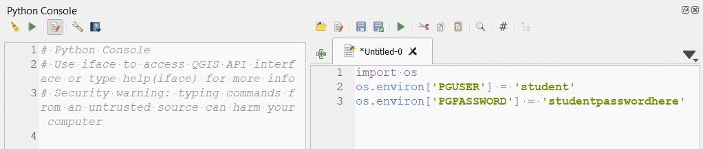
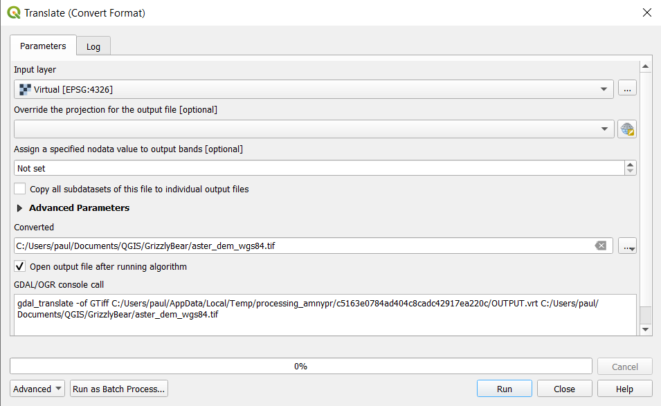
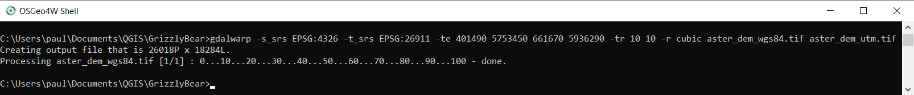

```{r echo=FALSE}
yml_content <- yaml::read_yaml("chapterauthors.yml")
author <- yml_content[["raster-analysis-gdal"]][["author"]]
```
# Raster analysis with GDAL {#raster-analysis-gdal}

Written by
```{r results='asis', echo=FALSE}
cat(author)
```

## Lab Overview {.unnumbered}

In this lab, you will explore many of the different raster operations using the Geospatial Data Abstraction Library (GDAL). GDAL is implemented in most popular GIS software, but we will practice using these utilities directly from the command line. You will create

------------------------------------------------------------------------

## Learning Objectives {.unnumbered}

- Describe the raster data model

- Convert vector data to raster and vice-versa

- Distinguish bit depths in rasters and identify appropriate encoding of sampled values for different phenomena

- Evaluate expressions on rasters using arithmetic, relational, and boolean operators

- Calculate cumulative viewsheds

- Combine rasters and calculate weighted overlays

- Calculate least cost paths and corridors of a landscape indicator species

------------------------------------------------------------------------

## Deliverables {#lab5-deliverables .unnumbered}

-   Lorem ipsum

-   Lorem ipsum

-   Lorem ipsum

------------------------------------------------------------------------

## Data {.unnumbered}

All data for this lab are accessible via the UBC PostgreSQL server. Instructions for connecting to the server are given in prior labs.

------------------------------------------------------------------------

## Task 1: Define a raster area of interest {.unnumbered}

Our first task is to define an Area of Interest (AOI) that will represent the extent of all of our raster processing.

**Step 1:** Open QGIS and create a new project named "GrizzlyBear". 

**Step 2:** Connect to the `bear` database on the UBC PostgreSQL server and load the "grizzlybearmanagementareas" layer into your map. These polygons represent the Grizzly Bear population units or Bear Management Areas (BMA) in the Rocky Mountain foothills of Alberta ([Alberta Open Government License](https://open.alberta.ca/licence)). For this lab, we will be focusing on the Yellowhead BMA for our AOI.

**Step 3:** Write an SQL query to select the Yellowhead BMA and then export it to your local QGIS project folder as a shapefile named "yellowhead_bma.shp", and change the "CRS" to NAD83 / UTM zone 11N (EPSG:26911).

We are going to rasterize this layer and do the basic raster processing outside of QGIS/ArcGIS Pro for a couple of reasons. First, setting the options and raster processing environments in QGIS/ArcGIS Pro is overly complicated and prone to error and unexpected behaviour. Second, you will learn how to use some valuable raster processing utilities of GDAL that can be easily batched and run in chain sequence (i.e., you can batch process large research datasets from a command line).

**Step 4:** Open the OSGeo4W shell and navigate to your QGIS project folder using the change directory `cd` command. To do this, first copy the path of your project folder, usually something like `C:\Users\paul\Documents\QGIS\GrizzlyBear`. Then in the console type `cd C:\Users\paul\Documents\QGIS\GrizzlyBear` to change to that directory. 

The first GDAL utility we are going to use is `gdal_rasterize` ((link to documentation)[https://gdal.org/programs/gdal_rasterize.html]). This utility takes a vector input datasource and converts it to a raster in the output. The simplest usage is `gdal_rasterize <src_datasource> <dst_filename>`. All of the flags preceded by `-` are indicated as optional by the square brackets `[]`. If you do not use any of the flags when you run the utility, then the utility will use the default values/settings for those flags that are indicated in the documentation. The AOI raster we are going to create will specify a few conditions of all the other raster processing we will do:

- raster extent (number of rows/columns and geographic coordinates)
- pixel/cell resolution
- spatial reference system

**Step 5:** In the OSGeo4W shell, enter the following command `gdal_rasterize -burn 1 -tr 10 10 -ot "Byte" -tap yellowhead_bma_utm.shp yellowhead_bma_utm.tif`. 

`-burn` flag indicates we want to assign a value of `1` to the output raster where the features intersect the new raster grid. 
`-tr` flag indicates we want the output cell resolution to be 10 m (we know its meters because those are the units of the coordinate system) and this is specified twice `10 10`, once for the x-axis and again for the y-axis. 
`-ot` flag indicates that we want the output data type of the raster to be `"Byte"`, which translates to a storage cost of 8 bits per pixel (bits per pixel × rows × columns = size of raster on disk).
`-tap` flag (target aligned pixels) indicates that we want the new raster extent to be calculated using floor and ceiling functions:

```
ymax (top) = y_resolution × ceiling(ymax / y_resolution) = 10 × ceiling(5,936,280.447609 / 10) = 10 × 593,629 = 5,936,290
ymin (bottom) = y_resolution × floor(ymin / y_resolution) = 10 × floor(5,753,454.574941 / 10) = 10 × 575,345 = 5,753,450
xmin (left) = x_resolution × floor(xmin / x_resolution) = 10 × floor(401,496.997149 / 10) = 10 × 40,149 = 401,490
xmax (right) = x_resolution × ceiling(xmax / x_resolution) = 10 × ceiling(661,663.194125 / 10) = 10 × 66,167 = 661,670
```

The above calculations are probably not immediately intuitive, but the idea is that we want to create a raster grid that is aligned to the ceiling and floor of our x- and y-resolution. The overall size of the raster is the same whether we do this alignment or not (same number of rows and columns), the only difference is that we are shifting the grid so that the extent coordinates are whole numbers (integers), which makes it easier for us to compute new grids. Bring "yellowhead_bma_utm.tif" into QGIS to inspect it. Check that the values, extent, cell size, and coordinate system are correct. You can also run the `gdalinfo` utility to check the metadata from the command line like `gdalinfo yellowhead_bma_utm.tif`.

------------------------------------------------------------------------

## Task 2: Seamless mosaicking {.unnumbered}

A common task in raster analysis is mosaicking multiple rasters together to perform analysis on a single file over a larger extent. We will practice doing this with some ASTER Digital Elevation Models (DEM) that are distributed as non-overlapping tiles in WGS 1984 (EPSG:4326). The source for these data can be found at (NASA's Earth Science Data Systems portal)[https://search.earthdata.nasa.gov], but we will be retrieving these data from the UBC PostgreSQL server instead.

**Step 1:** Open your QGIS project and from the "Data Source Manager" connect to the `bear` database of the UBC PostgreSQL server. You should see a listing of 15 rasters there, which have names prefixed with "astgtmv003". Select all 15 and then click "Add". It is very important that you add the rasters using this method rather than from the "Browser" pane, otherwise you might have unexpected errors.

```{r 05-qgis-data-source-manager, out.width= "75%", echo = FALSE}
    knitr::include_graphics("images/05-qgis-data-source-manager.png")
```

**Step 2:** Open the "Layer Properties" for "astgtmv003_n51w115" and inspect the extent values and the pixel size. 

##### Q1. What units are the extent and pixel size in? (1 point) {-}

If you are wondering why the y pixel size is negative, it is to facilitate the conversion between image coordinates and geographic/projected coordinates. Image coordinates are the unique combination of rows `i` and columns `j` representing each pixel in the image. By convention, the origin `(0,0)` for image coordinates is the upper left corner of the image. Image coordinates are always positive and increase as you move down the image to the lower right corner at `(n,m)`, where `n` is the number of columns in the image (think x-axis) and `m` is the number of rows in the image (think y-axis). Most geographic and projected coordinate systems decrease along the y-axis (as you move south), which is the inverse of image coordinates that are increasing. Thus, the y pixel size is usually stored as a negative number in order to convert image coordinates into geographic/projected coordinates.

For example, to convert pixel `(i,j)` from image coordinates to geographic coordinates where the image origin `(0,0)` corresponds to geographic coordinates `(-115.0001388888889977,52.0001388888888982)` as is the case for "astgtmv003_n51w115" and the x pixel size is `0.000277778` and the y pixel size is `-0.000277778`:

```
Longitude(i) = -115.0001388888889977 + i × 0.000277778
Latitude(j) = 52.0001388888888982 + j × -0.000277778
```

##### Q2. Given the equations above, what is the exact latitude and longtiude of the pixel with image coordinates (1907,1918)? Show your work for full credit. (4 points) {-} 

**Step 4:** Copy the coordinates from Q2 and paste them into the "Coordinate" field at the bottom of your QGIS screen (see image below) in the format `latitude, longitude` and press "Enter". Change the scale to `1:500` and hit "Enter". You should now be able to distinguish individual pixels. Click the coordinate reference system at the bottom right of the screen and change it from the default value of `EPSG:4326` (WGS 1984) to `EPSG:26911` (NAD 1983 UTM Zone 11N).

```{r 05-qgis-project-srs, out.width= "75%", echo = FALSE}
    knitr::include_graphics("images/05-qgis-project-srs.png")
```

##### Q3. Why do the pixels now appear to be elongated along the y-axis? (2 points) {-} 

**Step 4:** Save your PostgreSQL credential to your QGIS environment variables by opening the Python console in QGIS, click the small "Show editor" button, and then paste the following into the editor and click the "Run" button:

```
import os

os.environ['PGUSER'] = 'student'
os.environ['PGPASSWORD'] = 'studentpasswordhere'

```

```{r 05-qgis-python-environment-variables, out.width= "75%", echo = FALSE}
    
```

This step will automatically authenticate you each time you need to transact with the PostgreSQL server through the GDAL utilities. Your credential is only saved for the duration of your QGIS session, so once you close QGIS and re-open your project, you will need to come back to this step to save your environment variables. Close the python console and editor when you are done.

**Step 5:** From the QGIS processing toolbox, search for the "Build virtual raster" tool. This tool takes a set of rasters as input and essentially creates a catalog of those data for later processing. Click the ellipse "..." next to the "Input Layers" field and then click "Select All" to toggle on all the ASTER DEMs currently in your project. Click "Run". The tool does not actually create a new raster file, but what you will see is that you can now manipulate this catalog of rasters as if it were a single file, which is very handy for mosaicking. Notice when you run these GDAL tools, the log shows you the exact GDAL command that you can run in the command line, like we did in Task 1.

**Step 6:** The GDAL utility that will actually make the mosaic is `gdal_translate`, which is really just a utility for converting between different raster formats. We are going to use it to read in the virtual raster and write out a GeoTiff. Search for the tool in the processing toolbox, "Translate", make sure you are using the tool under "Raster Conversion". Make sure the virtual raster is selected for "Input layer" and then click the ellipse "..." next to the "Converted" field, "Save to file...", and then name the output "aster_dem_wgs84.tif". Click "Run" and then inspect the output in QGIS. Notice that we did not download any of the raster data to our local machine until this very last step.

```{r 05-qgis-translate, out.width= "75%", echo = FALSE}
    
```

The mosaic still needs to be reprojected and clipped to the same extent as our AOI, which is what we will do in the next step using the `gdalwarp` utility. The QGIS tool, "Warp", does not expose all the options that we need, so we will do this next step in the OSGeo4W shell.

**Step 7:** Open the OSGeo4W shell and navigate to your project folder where you saved "aster_dem_wgs84.tif". Type the following command into the console and then hit "Enter": `gdalwarp -s_srs EPSG:4326 -t_srs EPSG:26911 -te 401490 5753450 661670 5936290 -tr 10 10 -r cubic aster_dem_wgs84.tif aster_dem_utm.tif`.

```{r 05-osgeo4w-gdalwarp, out.width= "75%", echo = FALSE}
    
```

`-s_srs` flag defines the input spatial reference system (coordinate system), which is WGS 1984 or `EPSG:4326`.
`-t_srs` flag defines our target SRS, which is NAD 1983 UTM Zone 11N or `EPSG:26911`.
`-te` flag defines our target extent `xmin ymin xmax ymax`, which is the calculation we did in Task 1 `401490 5753450 661670 5936290`.
`-tr` flag defines the target resolution, again specified twice for both axes `10 10`.
`-r` flag defines the re-sampling method. This is an important flag for `gdalwarp` because any time that you re-project a raster, you are resampling that raster. The term "resampling" comes from the fact that a raster is "sampled" to begin with. Each cell in a raster is a sample of some random variable over the extent of the raster, and the value of that sample is correct for the center of the cell. When we re-project a raster, the locations of the cells change, therefore we need to recalculate the samples or "resample" the raster. Our selected method of resampling in this case is `cubic`, which is a smoothing algorithm and well-suited for continuous data like elevation.
`aster_dem_wgs84.tif` is the input raster and `aster_dem_utm.tif` is the output (resampled) raster. Inpsect the output in QGIS.

Note that we did not use the `-ot` output data type flag, so `gdalwarp` used the `Int16` data type of our input raster. If you set `-ot Float32`, then you would see that the cubic resampling algorithm actually yields decimals instead of the integers that you see in the current output, but for our purposes that sub-meter level of precision is not needed.

##### Q Describe the relationship between resampling method and pixel size {-}


gdal_rasterize - clip and rasterize some roads and reproject
gdal_proximity.py - calculate distance to a road
gdaldem slope
gdaldem aspect
gdal_viewshed - calculate several viewsheds and produce cumulative viewshed heat map
gdal_calc.py - reclassify
least cost path in QGIS


------------------------------------------------------------------------

## Summary {.unnumbered}

Return to the **[Deliverables](#lab5-deliverables)** section to check off everything you need to submit for credit in the course management system.
