```{r echo=FALSE}
yml_content <- yaml::read_yaml("chapterauthors.yml")
author <- yml_content[["digitization-editing-kart"]][["author"]]
```
# Digitization and Editing with Kart {#digitization-editing-kart}

Written by
```{r results='asis', echo=FALSE}
cat(author)
```

## Lab Overview {-}

Version control is an important concept to software development that has recently been adopted and adapted for use in GIS. The ability to track data changes, manage versions, and collaborate on data editing are significant advances for managing geospatial data assets in an enterprise environment. 

In this lab, you will learn about version control using both Git and Kart software. Git is a widely used distributed version control software system for tracking changes to files. Kart simply extends this distributed version control to geospatial vector data including points, lines, polygons, and point cloud datasets. You will also practice digitizing and editing datasets in QGIS and ArcGIS Pro.

------------------------------------------------------------------------

## Learning Objectives {-}

- Practice using distributed version control software systems Git and Kart
- Digitize and edit geospatial features in QGIS and ArcGIS Pro
- Commit edits to a local repository
- Push edits to a local repository
- Manage merge conflicts and diffs between working copies of a repository

------------------------------------------------------------------------

## Deliverables {#lab6-deliverables .unnumbered}

<input type="checkbox" unchecked> Answers to the questions posed throughout the lab (20 points)</input>

<input type="checkbox" unchecked> Map response to the question posed at the end of Task 4 (10 points)</input>

------------------------------------------------------------------------

## Data {-}

All data for this lab are accessible via the UBC PostgreSQL server, the public MGEM Data Store, and the public MGEM Geoserver. Instructions for connecting to the server and data store are given in the tasks below and prior labs.

------------------------------------------------------------------------

## Task 1: Install Kart and create your first repository {-}

**Step 1:** Open QGIS and install the Kart plugin using the Plugin Manager from the top toolbar. If you have not already installed the latest version of Kart on your computer, then you will be prompted to download and install the latest version.

```{r 06-kart-qgis-plugin, out.width= "75%", echo = FALSE}
    knitr::include_graphics("images/06-kart-qgis-plugin.png")
```

**Step 2:** Create a directory on your computer where you can store your first Kart repository, which we will call `ubcv`. For example, `C:\Kart\ubcv`.

**Step 3:** From the QGIS navigation bar at the top, select "Plugins" > "Kart" > "Repositories...". This opens the Kart repositories pane.

```{r 06-kart-repository-options, out.width= "75%", echo = FALSE}
    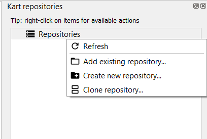
```

**Step 4:** From the Kart repositories pane, right-click "Repositories" and select "Create new repository...". Add the path to the directory you created in Step 2, ensure "Storage Type" is set to Geopackage and click "OK" to initiate the Kart repository.

```{r 06-new-kart-repository, out.width= "75%", echo = FALSE}
    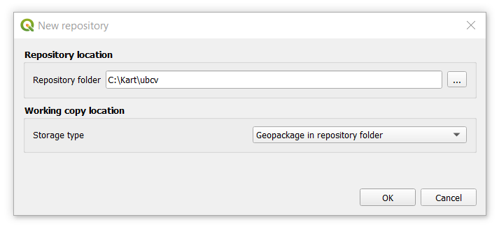
```

Expand your repositories list and you should see your new repostiory. If you expand "Datasets", you will see nothing there. What we have done is basically told Kart to watch this directory for any changes to the files. If you navigate to the folder in your file system, you will see some new files `KART_README.txt`, `.git`, and `.kart` that Kart has added, which enables version control in this new repository. Now let us add some data and visualize it in QGIS.

**Step 5:** Right-click the repository `C:\Kart\ubcv [main]` and then select "Import dataset from database...". We are going to connect to the ubcv database on the UBC PostgreSQL server.

```{r 06-import-data-kart-repository, out.width= "75%", echo = FALSE}
    knitr::include_graphics("images/06-import-data-kart-repository.png")
```

**Step 6:** Add the parameters to connect to the UBC PostgreSQL server. Be sure to switch to the "Basic" tab for credentials and add the student credential that was provided to the class. Once you have added the credential, click the "Load Tables" button to so a soft connection to the database. If the connection was successful, then select "ubcv_campus_trees" from the drop-down menu and then click "OK" to add the table to your Kart repository.

```{r 06-import-postgres-database-kart, out.width= "75%", echo = FALSE}
    knitr::include_graphics("images/06-import-postgres-database-kart.png")
```

We will be comparing this point dataset to a recent orthophoto of UBC Vancouver campus and then making some edits.

**Step 7:** Add the most recent UBC orthophoto to your QGIS project. Navigate to the [MGEM Orthophoto Data Store](https://206-12-122-94.cloud.computecanada.ca/UBC_ORTHOPHOTOS/) and then right-click the most recently dated "UBC_ORTHOPHOTO_YEAR_COG.tif" file listed there and then select "Copy Link". Return to your QGIS project, open the Data Source Manager, select "Raster" from the left navigation bar, change "Source Type" to "Protocol: HTTP(S), cloud, etc.", and then paste the link that you copied into the "URI" field and press "Add".

```{r 06-add-ubc-orthophoto, out.width= "75%", echo = FALSE}
    knitr::include_graphics("images/06-add-ubc-orthophoto.png")
```

UBC orthophotos are publicly available datasets that are also encoded as Cloud Optimized Geotiffs (COG), which enables fast retrieval and zoom levels for cloud-hosted raster datasets. If you find that the file hosted on the server is not very responsive, you can also download the geotiff to your computer and add it as a regular file. Note that these orthophotos are large files (~7 GB) and ensure you have enough disk space in the location you want to save it.

**Step 8:** Drag and drop the "ubcv_campus_trees" dataset into your map from the Kart repository pane. Your QGIS project should look something like what is shown below.

```{r 06-ubcv-campus-trees-orthophoto-qgis, out.width= "75%", echo = FALSE}
    knitr::include_graphics("images/06-ubcv-campus-trees-orthophoto-qgis.png")
```

**Step 9:** Zoom in to inspect the trees and the orthophoto.

##### Q1. What time of year do you think the orthophoto was collected? How do you know?  (1 point) {-}

##### Q2. Discuss three reasons why the campus trees do not perfectly match the locations in the orthpohot. (3 points) {-}

------------------------------------------------------------------------

## Task 2: Edit a layer in QGIS with version control {-}

Since the campus trees do not perfectly align with the locations in the orthophoto, we will practice editing some of them and then use the version control capabilities of Kart to inspect and manage the changes.

**Step 1:** From your QGIS toolbar, click the "Toggle Editing" icon to start an editing session.

```{r 06-qgis-toggle-editing, out.width= "30pt", echo = FALSE}
    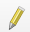
```

**Step 2:** Once an editing session is started, you will be given the option to add new points or edit the vertices of existing points. Click the "Vertex Tool" icon to edit the existing point dataset.

```{r 06-qgis-vertex-editor, out.width= "30pt", echo = FALSE}
    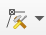
```

**Step 3:** Zoom into an area where you can easily see where some points are not perfectly intersecting with the bottom of the tree trunk in the orthophoto. In the example below, we are looking at some trees just outside the Forest Sciences Centre at UBC on Agronomy Road. Right-click on the point you want to edit to show its current coordinate and it will highlight red in the map. Then left-click the same point and your cursor will now have a red "x" to indicate you are ready to place the new coordinate. Left-click again to move the point to the location of your cursor at the base of the tree in the orthophoto. If you are not satisfied with the location, just left-click the point and then left-click again to place it where you want. Repeat this step for 3-5 more points.

**Step 4:** Add a missing tree by clicking the "Add Point Feature" icon. Your cursor will now have a cross-hair and you simply left-click again anywhere on the map canvas to add the new point.

```{r 06-qgis-add-point-icon, out.width= "30pt", echo = FALSE}
    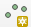
```

**Step 5:** A dialogue window should appear that prompts you to add values for the attributes. Since we do not really know any of these values, just let Kart autopopulate most of the values. Scroll down to "notes" and add a short message to this field then click "OK". Add at least one point this way and then click the "Save Layer Edits" on the toolbar.

```{r 06-qgis-save-edits-icon, out.width= "30pt", echo = FALSE}
    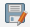
```

**Step 6:** Right-click the repository from the Kart repositories pane and select "Show working copy changes...". This will open the Diff viewer that allows you to inspect the changes you just made to the layer. In the screenshot below, you can see that we added one point and modified four others. You can click the "Geometries" tab to view the change you made to the geometry of the feature, which is really handy. 

```{r 06-qgis-diff-viewer, out.width= "75%", echo = FALSE}
    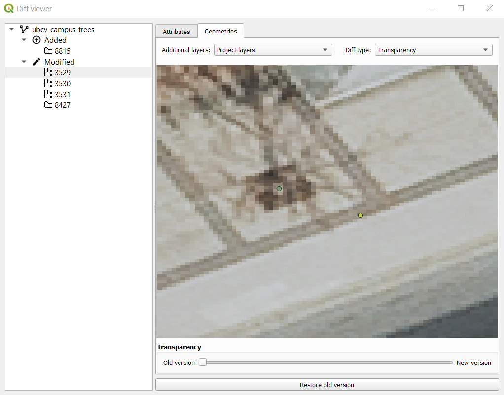
```

**Step 7:** Right-click the repository again and this time select "Commit working copy changes...". You will be prompted to enter a commit message. Commit messages help you and your collaborators understand what is happening in the changes that you just made. For this commit message, we are going to indicate that we edited four point locations and added one point. 

You can think of committing as a way of saving your work progress in your repository. Every commit can be inspected and/or reverted if needed, so it is good practice to commit changes that are related to each other so that the commit messages can be concise and informative. Avoid committing every single edit separately as this can make navigating and interpreting the commit history difficult.

**Step 8:** Right-click the repository again and this time select "Show log...". This will open the commit history for the repository and you should see the most recent commit you just made at the top along with the commit message you just entered in the last step. You can right-click any of the commits and select "Show changes introduced by this commit...", which is another way to inspect the changes to attributes and geometries of the features with the diff viewer.

------------------------------------------------------------------------

## Task 3: Working on and merging different branches

**Step 1:** Right-click the repository and select "Show log..." to display the commit history.

**Step 2:** Right-click the commit you made in Task 2 and select "Create branch at this commit...". You will be prompted to enter a branch name, name it "mybranch". You should now see both "main" and "mybranch" noted on the top commit.

```{r 06-qgis-kart-create-branch, out.width= "75%", echo = FALSE}
    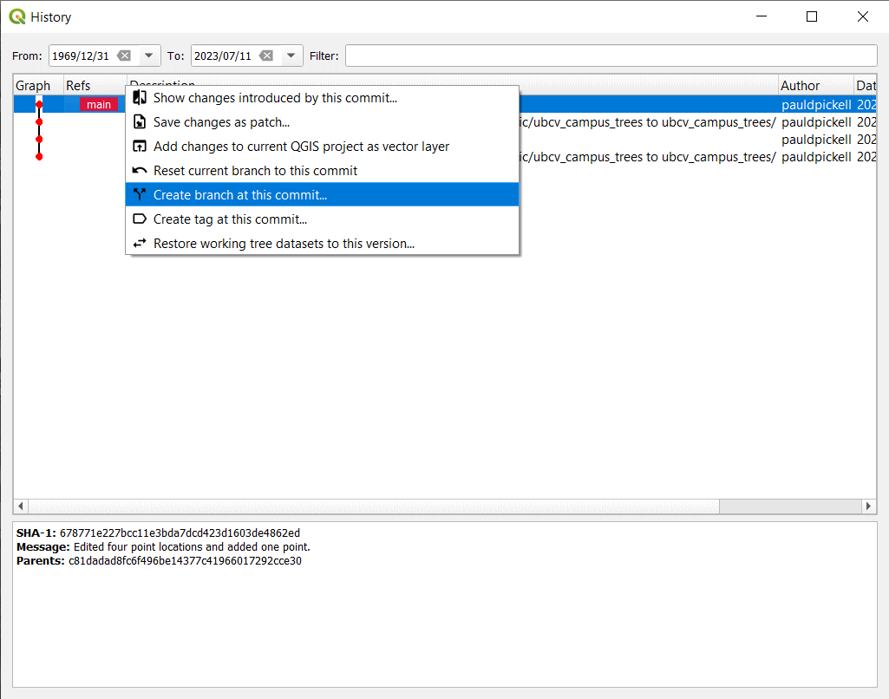
```

**Step 3:** Right-click the top commit again and select "Switch to branch 'mybranch'...".

**Step 4:** Now working on "mybranch", start an editing session, pan around the orthophoto and add 5-10 more missing tree points. Do not change anything about the attributes, just click "OK" to dismiss after creating the point. Be sure to save your edits to the layer and then commit the change.

**Step 5:** Open the commit history of the repository. You will see now that "mybranch" is ahead of "main" by the commit you just made.

**Step 6:** Switch the branch back to "main" by right-clicking the commit tagged with "main" and then digitize 5-10 different tree points. Do not change anything about the attributes, just click "OK" to dismiss after creating the point. Commit your edits to the repository.

**Step 7:** Right-click the repository and select "Merge into current branch...". In the dialogue window that appears, select "mybranch" from the drop-down menu for "Branch" and click "OK". Since we are currently on the "main" branch, this will merge the edits/commits in "mybranch" into "main".

```{r 06-qgis-kart-merge-branch, out.width= "50%", echo = FALSE}
    knitr::include_graphics("images/06-qgis-kart-merge-branch.png")
```

**Step 8:** You should see an error message appear warning you about a merge conflict between the two branches. Inspect the merge conflict by right-clicking the repository and selecting "Resolve conflicts...". Inspect the conflicting commits then answer the question below. You may need to close the Merge Conflicts window and inspect the ubcv_campus_trees attribute table to really appreciate what is going on here.

```{r 06-qgis-kart-merge-conflict, out.width= "50%", echo = FALSE}
    knitr::include_graphics("images/06-qgis-kart-merge-conflict.png")
```

##### Q3. Describe why the merge conflict occurred. (3 points) {-}

**Step 9:** Once you have answered the question above, open the Merge Conflicts window again. Click each feature one-at-a-time listed in the left then click "Use modified feature". This is going to force Kart to recognize the most recent edits we made in "mybranch" and overwrite the conflicts in the "main" branch (our current branch). Once you have accepted all the modified feature edits, the Merge Conflict window will automatically close.

##### Q4. What is the difference between the "modified feature" and "ancestor feature"? (1 point) {-}

```{r 06-qgis-kart-merge-conflicts, out.width= "75%", echo = FALSE}
    knitr::include_graphics("images/06-qgis-kart-merge-conflicts.png")
```

**Step 10:** Open the commit history for the repository. You should now see the commit history between both branches, and we are now back to a single up-to-date branch ("main").

```{r 06-qgis-kart-merge-history, out.width= "75%", echo = FALSE}
    knitr::include_graphics("images/06-qgis-kart-merge-history.png")
```

In this example, we simulated two different branches to explore these tools. We generally try to avoid merge conflicts rather than produce them intentionally! Branches are really helpful for managing collaborative work on different aspects of the same project.

For example, we can allocate specific work to a specific branch, like a "digitizetrees" branch might be for digitizing trees only and a "identifytrees" branch might be for changing the attribute values for the tree species of the points that are made from the other branch. Then that leaves the "main" branch as the merge point for all the work. In this way, it is possible to collaboratively edit a large dataset with multiple people without causing merge conflicts between branches.

------------------------------------------------------------------------

## Task 4: Digitize some buildings in ArcGIS Pro

**Step 1:** Start a new ArcGIS Pro project. This time, we are going to show you how to add the UBC orthophoto as a Web Map Service (WMS) from the MGEM Geoserver. A WMS is a protocol for exchanging map tiles over the internet and is especially good for serving image data like the UBC orthophoto. Both ArcGIS and QGIS support the WMS protocol, though we will illustrate how to do this with ArcGIS Pro in this section.

**Step 2:** Navigate to the MGEM Geoserver in your preferred web browser at the following URL: [https://206-12-122-94.cloud.computecanada.ca/geoserver/web/](https://206-12-122-94.cloud.computecanada.ca/geoserver/web/). From the home page, select "Layer Preview" on the left panel under "Data". Navigate through the pages until you find the UBC orthophoto series listed. Find the most recently published orthophoto, then click the "OpenLayers" link to the right of it to show a preview of the data in your browser. You should be able to zoom in and out with exceptional speed because these are encoded as COGs.

```{r 06-geoserver-preview, out.width= "50%", echo = FALSE}
    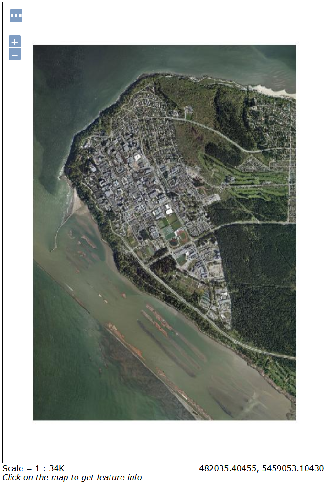
```

**Step 3:** Return to the Geoserver homepage and on the right you will see a bunch of acronyms listed with different version numbers under "Service Capabilities". Find "WMS", right-click "1.3.0", and copy the link to your clip board.

**Step 4:** Return to ArcGIS Pro, click the "Insert" tab, then click the "Connections" icon, and finally select "New WMS Server". In the dialogue window that appears, paste the link you just copied for the WMS into the "Server URL" field, leave everything else as default and click "OK".

**Step 5:** There are a few different ways to access the WMS resources in ArcGIS Pro. You can open a Catalog pane or window, expand "Servers", and continue expanding all the elements until you see the individual layers. Alternatively, you can click the "Add Data" icon on the "Map" tab, expand "Servers", and do the same. Add the most recent UBC orthophoto to your map as a WMS. If the orthophoto that you selected is unresponsive, try another year.

In the following steps, we are going to digitize a building on campus. To do so in ArcGIS Pro, we need to first create a new feature class that will hold the polygon we are going to digitize.

**Step 6:** In a Catalog window pane, expand "Databases" and then right-click the geodatabase for your project. Select "New" and then "Feature Class". Name it "my_ubc_buildings" and make sure the type is set to "Polygon". Click "Next" to view fields. Add two fields: "Name" (data type is text) and "Vertices" (data type is double). Click "Next" to view the spatial reference. Probably the default is set to WGS 1984. Under "Projected Coordinate System" find NAD 1983 UTM Zone 10N. You can continue clicking "Next" to view more properties that you can set, but we will leave these as the defaults, so you can click "Finish" when you are done. You should now have an empty polygon feature class in you map.

**Step 7:** Click the "Edit" tab and click the "Create" button to start creating new features. The "Create Features" pane will open. Click on "my_ubc_buildings" to highlight it and start the editing session. Now pick a building and zoom in so that you can clearly see its borders, then start left-clicking to add vertices along the building perimeter. Be sure to work either in a clockwise or counter-clockwise pattern otherwise you will criss-cross the boundary. Once you are happy, you can simply double left-click in the last position to finish the edit or press F2. Ta-da! You have now digitized your first building.

```{r 06-arcgis-pro-editing, out.width= "75%", echo = FALSE}
    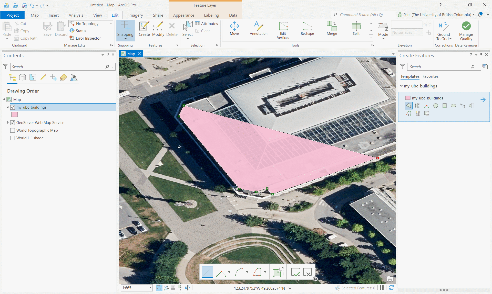
```

**Step 8:** At the top ribbon on the "Edit" tab, click "Attributes" to open the attribute editor for the selected feature. Change the name to the name of the building and click "Apply".

**Step 9:** Digitize four more buildings on campus and add the building name to the attribute table. Once you are done, be sure to click "Save" on the top ribbon under the "Edit" tab to save your work to the feature class in the geodatabase.

Next, we are going to validate and compare your digitized buildings against the official building dataset that is produced by UBC Campus + Community Planning.

**Step 10:** Add the official "ubcv_buildings" data to your map from the `ubcv` database on the PostgreSQL server. For information about connecting to the server, refer to Lab 1. Since these data are read-only from the PostgreSQL server, we need to export the feature class to our local geodatabase so that we can make some calculations. We also need to change the coordinate system from WGS 1984 to our preferred projected coordinate system of NAD 1983 UTM Zone 10N. To do this, we can use a single tool "Project". Save the output with a name of "ubcv_buildings_utm" to your geodatabase.

**Step 11:** Add the local copy of "ubcv_buildings_utm" to your map and compare your digitization to the official record. Make some observations and answer the questions below.

##### Q5. Describe why your boundary does not align with the official dataset? Give three possible sources of error. (3 points) {-}

##### Q6. What do you observe about the location of the official building dataset compared with the apparent location of the buildings in the orthophoto? (3 points) {-}

##### Q7. How could relief displacement have impacted your digitization? (2 points) {-}

**Step 12:** Open the attribute table of the "ubcv_buildings_utm" layer and add a field called "Vertices" with double data type. Save the change then return to the attribute table, find the new field, right-click it, select "Calculate Geometry" and then under the "Property" drop-down, select "Number of vertices" and click "OK". Repeat this step for "my_ubc_buildings".

```{r 06-arcgis-pro-calculate-geometry, out.width= "50%", echo = FALSE}
    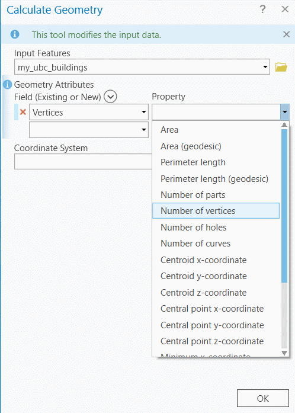
```

**Step 13:** Inspect the attribute tables of "ubcv_buildings_utm" and "my_ubc_buildings" and compare the "Shape_Area", "Shape_Length", and "Vertices" fields then answer the questions below.

##### Q8. Which building that you digitized had the largest devitation of Shape_Area compared with the official buildings dataset? Give the value difference in square meters and discuss why you think this building had the worst area error. (2 points) {-}

##### Q9. Which building that you digitized had the largest devitation of Shape_Length compared with the official buildings dataset? Give the value difference in square meters and discuss why you think this building had the worst perimeter error. (2 points) {-}

Your last deliverable for the lab will be a mapped response to the following question: Did you digitize more or fewer vertices than the official UBC dataset? Discuss the implications of more or fewer vertices on positional accuracy, area accuracy, and perimeter accuracy. Your map should show a single building exemplar and should be annotated with supporting text and other elements (e.g., arrows, text boxes, etc.) to answer the question and illustrate your understanding of the relationship between digitization and accuracy measures.

------------------------------------------------------------------------

## Summary {.unnumbered}

By now, you should appreciate that digitization is an imperfect process. There are many sources of errors that can accumulate, especially when you are working on a crowd-sourced or collaborative editing project. It takes time to develop and practice good digitization skills. You might want to take a moment to reflect on the question, "which data set is right?" Invariably, the answer is the one with "authority".

Return to the **[Deliverables](#lab6-deliverables)** section to check off everything you need to submit for credit in the course management system.
