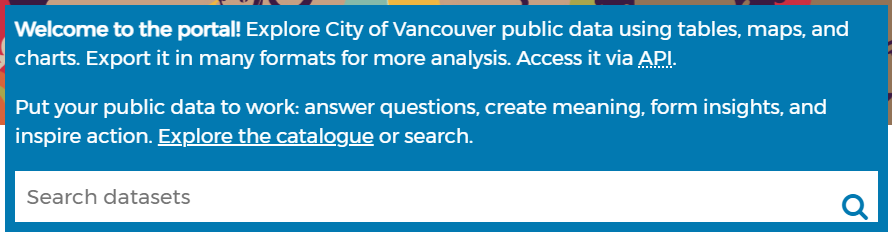
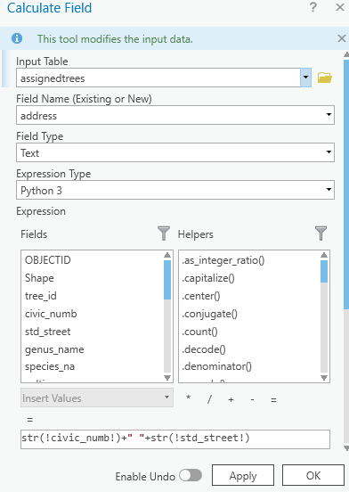
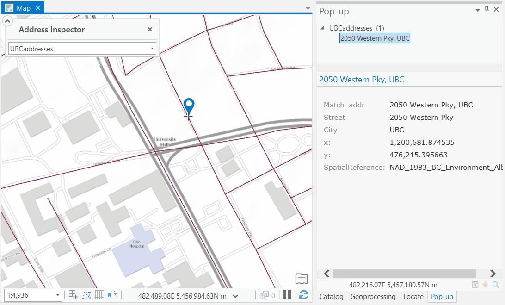

---
editor_options:
  markdown:
    wrap: 72
---

```{r echo=FALSE}
yml_content <- yaml::read_yaml("chapterauthors.yml")
author <- yml_content[["geocoding"]][["author"]]
```

# Geocoding {#geocoding}

Written by
```{r results='asis', echo=FALSE}
cat(author)
```

## Lab Overview {.unnumbered}

Working with and manipulating your own geospatial data is essential for many geomatics tasks. Often in urban forestry, you will come across datasets with addresses or coordinates. In this lab, you will learn how to import tabular data into ArcGIS Pro, and how to create an address locator and geocode addresses. You will work from data within Vancouver to create several new geospatial datasets and practice geocoding addresses.

------------------------------------------------------------------------

## Learning Objectives {.unnumbered}

-   Import and convert tabular tdata to spatial data in ArcGIS Pro
-   Query and extract geospatial data from an online portal
-   Build a custom address locator using geospatial data
-   Geocode addresses and assess quality

------------------------------------------------------------------------

## Deliverables {#lab7-deliverables .unnumbered}

<input type="checkbox" unchecked> Answers to the questions posed throughout the lab (20 points)</input>

<input type="checkbox" unchecked> Final map (10 points)</input>

- The map should show the neighbourhood for which you downloaded street
tree data for
- Parks symbolized by tree density 
- Coordinate-created points and address-created points (symbolized differently from each
other) 
- Roads symbolized
- An appropriate basemap

------------------------------------------------------------------------

## Data {.unnumbered}

You will be downloading some of your data from the [City of Vancouver Open Data Portal](https://opendata.vancouver.ca/pages/home/).

```{r 07-cov-data-portal, out.width= "75%", echo = FALSE}
    
```

The remaining data for this lab are accessible via the UBC PostgreSQL server. Instructions for connecting to the server and data store are given in the tasks below and prior labs.

------------------------------------------------------------------------

## Task 1: Download and Prepare Data {.unnumbered}

**Step 1:** The first dataset you will download is "street trees" data. Search for it with the search bar, then click the link for the dataset. You are going to want to export the data as a shapefile; click on the Export tab and look over the geographic file formats. You will notice that the download button for Shapefile is greyed out because there are too many records in the dataset. Keep the webpage open so you have
access to the Metadata.

##### Q1. What is the maximum number of records you can export from the City of Vancouver open data portal as a shapefile? (1 point) {.unnumbered}

**Step 2:** Instead of working with the entirety of the dataset, you will focus on one neighbourhood. To the left, there are filtering options. Scroll down to NEIGHBOURHOOD_NAME and choose the neighborhood with the highest number of trees. Now you should have the option to download street tree data.

**Step 3:** The second dataset you will download is public parks. There should be a point and a polygon dataset. Make sure you download the polygon dataset.

------------------------------------------------------------------------

## Task 2: Prepare Data {.unnumbered}

In this task, you will export a filtered table from a shapefile, and then you will add a field so the table can be used in the next task.

**Step 1:** Open up the metadata for the street trees file. It should be under the "Information" tab on the City of Vancouver data portal website. Look through the metadata and familiarize yourself with what each column means. For example, one column designates when a tree was planted.

##### Q2. What is the name of the column that designates when a tree was planted? (1 point) {.unnumbered}

Sometimes, lots in cities are exceptionally large or are adjacent to more than one street. Because these lots only have one "true" address, urban foresters may make up addresses to designate more specific areas. Find the name of the column that designates whether or not the address for a tree was made up to associate the tree with a nearby lot. You are going to export just the data for trees that are assigned "Yes" in this column.

**Step 2:** Right-click street-trees and select "Export Features."

- Input Rows: street-trees 
- Output Location: Where you want the table to be saved 
- Output Name: AssignedTrees 
- Expression: + New expression Where `Assigned` is equal to Y.

**Step 3:** Open the attribute table for "AssignedTrees" and add a new text field to the data. On the top of the attribute table, there is a button that says "Add". The table will switch to field view. Name the field "Address" and select "Text" as the data type. Click "Save" in the top bar. Close "Field View" and return to the attribute table. Your new field should appear as the very last column in the dataset. Right-click the field and select "Calculate Field."

The address locator you create in Task 3 requires addresses to be written in a specific way---street numbers and names must be in the same column. You will need to specify to ArcGIS that you are combining two strings (another designation for text data). Within the Fields menu under "Expression," double-click civic_numb. You will notice that the field below the equal sign is now populated with !civic_numb!.

To combine the two columns together, type the following code into the box: `str(!civic_numb!)+" "+str(!std_street!)`

```{r 07-calculate-field, out.width= "50%", echo = FALSE}
    
```

Click "Apply". The Address field should now have street numbers and street names.

------------------------------------------------------------------------

## Task 3: Geocoding a Table of Addresses {.unnumbered}

Many localities label their trees by address rather than by coordinates. In the street-trees file, all of the trees have addresses and coordinates. However, the trees with a value of "Y" for "Assigned" have addresses that were effectively made up for ease of finding the trees again. In this section of the lab, you will use a roads network layer for the Greater Vancouver Regional District (GVRD) to create an address locator for Vancouver. Then you will geocode the addresses from "AssignedTrees" to examine the differences between collecting data with addresses versus coordinates. An address locator allows you to look up addresses either manually or by uploading a table of addresses. This is helpful when you are searching for specific trees!

**Step 1:** Connect to the `geocode` database on the UBC PostgreSQL server and load the "gvrd_roads" layer into your map.

**Step 2:** Create an address locator, which is located in Analysis \> Tools \> Toolboxes \> Geocoding Tools \> Create Locator. You can also use the search bar to search for the tool by name.

For the tool's parameters:

-   **Country or Region:** Canada
-   **Primary Table(s):** gvrd_roads
-   **Role:** Street Address
-   **Field Map:**
    -   **Feature ID:** OBJECTID
    -   **Left House Number From:** FROM_LEFT_HOUSE_NUMBER
    -   **Left House Number To:** TO_LEFT_HOUSE_NUMBER
    -   **Right House Number From:** FROM_RIGHT_HOUSE_NUMBER
    -   **Right House Number To:** TO_RIGHT_HOUSE_NUMBER
    -   **Street Name:** STRUCTURED_NAME_1
    -   **Left City/Municipality:** LEFT_LOC_1
    -   **Right City/Municipality:** RIGHT_LOC_1
-   All other fields leave as <NONE>
-   Language Code: English

Save the file as "GVRDaddresses".

**Step 3:** Select "Locate" underneath the "Map" tab, and then click on "Address Inspector". Use your newly created address locator to click around Vancouver. You may need to double-click on your map in order to force the pop-up to stay visible and docked as a tab (see right pane below).

```{r 07-address-inspector, out.width= "75%", echo = FALSE}
    
```

Choose "GVRDaddresses" in the dropdown.

You can also use the "Locate" tool to search an address using the ArcGIS World Geocoding Service. Type in the address of Queen Elizabeth Park (4600 Cambie St, Vancouver) and notice the map highlights near the park! The ArcGIS World Geocoding Service will consume credits through your ArcGIS account, so it is not the most cost-effective way to geocode many addresses.

```{r 07-locate, out.width= "50%", echo = FALSE}
    knitr::include_graphics("images/07-locate.png")
```

**Step 3:** Geocode a table of addresses using "GVRDaddresses". The table of addresses you will be geocoding is the "AssignedTrees" dataset. To access the geocoding tool, you can search for "Geocode Addresses".

Below are the tool's parameters: 

- **Input Table:** AssignedTrees 
- **Input Address Locator:** GVRDaddresses 
- **Input Address Fields:** Single Field 
- **Field Name:** Full Address 
- **Alias Name:** Address

Save the file as "geocoded".

**Step 4:** Look at the attribute table. The score column shows from 0-100 based on how close the address in the address locator was able to match the input table. The mailbox icon with the arrows in the geocoding toolbar allows you to investigate the matches more in-depth. With a messy dataset, this becomes invaluable.

##### Q3. Are all of the addresses a 100% match? why or why not? (2 points) {.unnumbered}

**Step 5:** Toggle the "AssignedTrees" and "geocoded" datasets on and off to look for similarities and differences.

##### Q4. How do they visually compare to each other? Use specific examples in your explanation and make inferences about why you are seeing differences/similarities. (4 points) {.unnumbered}

------------------------------------------------------------------------

## Task 4: Create a shapefile from tabular data {.unnumbered}

Oftentimes, you will encounter geospatial data in Comma Separated Format (CSV) or tabular format. For example, if you collect field data and enter it into a spreadsheet. Although each value in the dataset may have geographic or projected coordinates, the data may not be immediately accessible in a spatial data format. In this portion of the lab, you will practice converting tabular data into shapefiles. Then, you will work with the shapefiles you have created.

**Step 1:** Connect to the `geocode` database on the UBC PostgreSQL server and load the "parktrees" table into your map. There should be six columns and many rows. Each row represents a tree in a Vancouver Park.

##### Q5. How many trees are represented in this file? (1 point) {.unnumbered}

##### Q6. Look at the columns with the coordinates. Which units are the coordinates likely in? (1 point) {.unnumbered}

##### Q7. Does ArcGIS Pro consider these data to be spatial? (1 point) {.unnumbered}

**Step 2:** Right-click on the "parktrees" table in your Contents Pane and then select "Display XY Data". Choose the appropriate column names for the X and Y fields. Leave the Z field blank. This is very important, if you choose the wrong columns the points will be nowhere near Vancouver!

##### Q8. What does the z field represent? (1 point) {.unnumbered}

##### Q9. Which column did you choose for x, which column for y? (2 points) {.unnumbered}

Specify the coordinate system by clicking on the Globe icon to the right-hand side of Coordinate System and locating NAD 1983 UTM Zone 10N under Projected Coordinate System \> UTM \> NAD 1983. You have now created an "Event Layer." Export the Events layer as a shapefile (right-click the layer \> Data \> Export Features). Save it in your output folder as "parktrees". Add "parktrees" to your display.

Event layers are temporary layers, and without Object-ID fields they are not editable or selectable.

**Step 3:** View "parktrees" in ArcGIS Pro. The trees should all be in Vancouver. If they are not, something was input incorrectly and you will have to repeat Step 2. Once the tree points are properly mapped, change the symbology. Right-click "parktrees" in the Contents Pane and choose "Symbology." A Symbology pop-up should appear. Click the symbol---and choose "Circle 3" from Gallery. Click the Properties Tab. Make the symbol smaller and change its colour.

**Step 4:** Add "parks_polygon_representation" and a satellite basemap to your map (Map \> Basemap \> Imagery). In the Contents Pane, drag the basemap to the bottom so that it does not cover anything. Symbolize "parks_polygon_representation" so that you can clearly the basemap for each park. You can do this in the Contents Pane by right-clicking the coloured rectangle beneath "parks_polygon_representation" and choosing "Color Properties..." at the bottom. Adjust the colours and transparency as you see fit.

##### Q10. What sort of discrepancies do you see between the number of trees in the satellite image versus the number of trees shown in the dataset? Do any specific parks stand out? Why might this be the case? (4 points) {.unnumbered}

Now that all of the park trees are input, we will investigate tree density per park to get an idea about which parks in Vancouver have the highest tree density and which have the lowest. To answer this question, you will need to know the area of each park and the number of trees within them. Park area and name are in the "parks_polygon_representation" layer, but not in the "parktrees" shapefile. This information can be added to "parktrees" through a spatial join.

**Step 5:** Right-click "parktrees", mouse down to Joins and Relates \> Spatial Join:

- **Target Features:** parktrees 
- **Join Features:** parks_polygon_representation 
- **Output Feature Class:** parks_numtrees 
- **Join Operation:** Join one to one 
- **Match Option:** Intersect

Expand the Fields option and remove all of the output fields except for area_ha, park_id, park_name, and park_url. Click "OK".

You should now have a park file with the number of trees (represented by JOIN_COUNT), along with the other park information.Add a new field called "treedensity". Be sure to select the correct data type--the data in this field will be continuous values and include decimals. Tree density is the ratio of trees to park area. We will do this calculation only for parks greater than or equal to one acre in size.

**Step 6:** Using "Select By Attributes," select all of the parks with an area greater than or equal to 1 ha. Then, use calculate field to get the tree density for each selected park.

##### Q11. How many parks in Vancouver are greater than 1 ha in size? (1 point) {.unnumbered}

##### Q12. From the selected data, which park has the highest tree density? (1 point) {.unnumbered}

**Step 7:** Change the symbology of "parks_numtrees" from single symbol to unclassed colors displaying the tree density field.

------------------------------------------------------------------------

## Summary {.unnumbered}

Spatial is special, but not all data are explicitly spatial. Some data may contain attributes or information that is encoded in a way that GIS software may not immediately recognize as spatial. As well, a lot of information can be associated with addresses, which are not related to any coordinate system. Geocoding is a powerful method that can unlock information associated with addresses for use in other spatial analyses.

Return to the **[Deliverables](#lab7-deliverables)** section to check off everything you need to submit for credit in the course management system.
